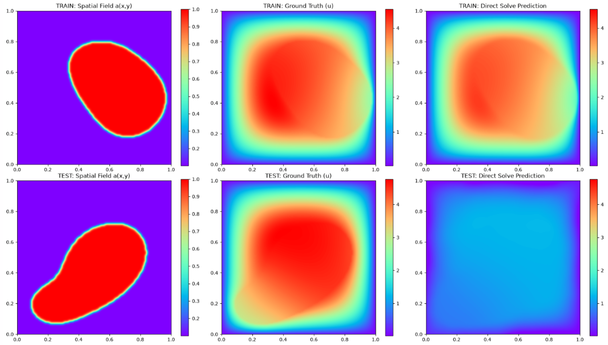
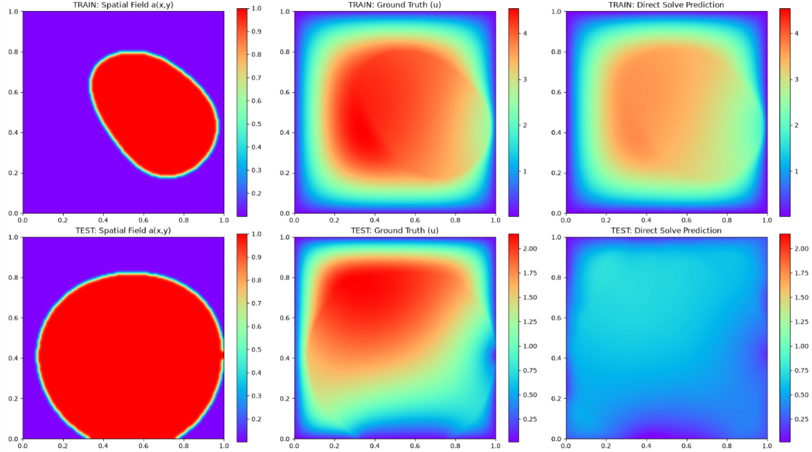
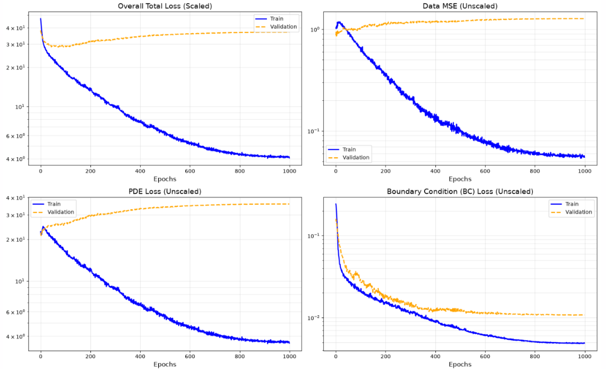
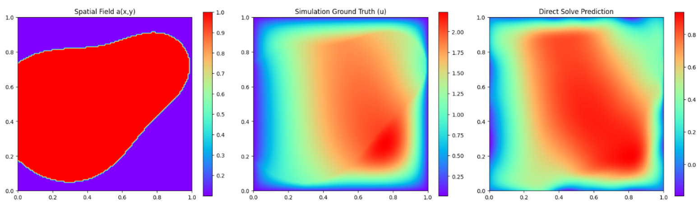

# Darcy Flow
This document contains experimental information for the Darcy Flow equation. The steady-state Darcy flow equation models 2D fluid flow through a porous medium over a unit square, where the permeability of the medium, $a(x)$, is a dynamic, spatially dependent input. **The results for this dataset are not ideal, where the model is unable to generalize to unseen samples and unable to memorize over 16 training samples with only pde and bc loss.**

* **Equation:** $-\nabla \cdot (a(x)\nabla u(x)) = f(x)$
* **Grid Resolution:** $128 \times 128$
* **Boundary Conditions:**
    * Homogeneous Dirichlet condition ($u = 0$) is enforced on all boundaries.
* **Hyperparameters:** 
    * `sigma`: 1
    * `M`: 512
    * `tik_reg`: 1e-5
    * `matrix_bc_weight`: 1e2
    * `pde_loss_weight`: 1.0
    * `bc_loss_weight`: 1e2
* **Training Details:** 
    * `epochs`: 1000
    * `hidden_layers`: `[512, 512, 512, 512]`
    * `spatial_batch_size`: 5000

### Additional Information
* This dataset is evaluated at cell centers instead of the usual nodal grids, where all the cells in the dataset provided are for the pde (no boundary condition cells).
* The raw $a(x,y)$ data contains sharp 0 to 1 boundaries. These inputs need to be smoothed using a Gaussian filter. However, this smearing modifies the underlying physics by making the medium artificially more permeable, causing the network's predicted amplitude scale to consistently fall slightly lower than the ground truth simulation.
* The network requires exposure to a massive number of samples to generalize to unseen $a(x,y)$ fields. However, a standard MLP (e.g., `[512, 512, 512, 512]`) lacks the capacity to even elevate the predicted wave amplitudes to the correct scale when trained on 128 samples.
* Attempting to solve the capacity issue by increasing the network size (e.g., `[1024, 1024, 1024, 1024]` or `[2048, 2048, 2048, 2048]`) somehow causes the training to collapse, yielding completely degraded predictions. 
* Because $a(x,y)$ varies heavily across samples, splitting the dataset into mini-batches (e.g., a batch size of 16 for 128 total samples) *might* be causing the wild training loss fluctuations compared to passing all samples in a single full batch.
* A *Concat* version of the architecture, where the output of each layer is concatenated at the output, is able to perfectly memorize a single sample but fails catastrophically when attempting to learn multiple samples. Therefore, a standard MLP is preferred.

### Equation Expansion

The steady-state Darcy flow equation is defined as:

$$
-\nabla \cdot (a(x)\nabla u(x)) = f(x)
$$

The Left Hand Side can be expanded as:
$$
\nabla \cdot (a \nabla u) = \frac{\partial a}{\partial x} \frac{\partial u}{\partial x} + \frac{\partial a}{\partial y} \frac{\partial u}{\partial y} + a \left( \frac{\partial^2 u}{\partial x^2} + \frac{\partial^2 u}{\partial y^2} \right)
$$

Hence, we use this version in the code for the left hand side of the equation:

$$
-\left[ a_x H_x + a_y H_y + a(H_{xx} + H_{yy}) \right]
$$

### Relevant Notebooks
* `darcy_flow_direct.ipynb` - Notebook for solving entire PDEBench Darcy Flow dataset.
* `darcy_flow_smoothing_data_gen.ipynb` - Script for smoothing the a(x,y) boundary in PDEBench Darcy Flow.
* `darcy_flow_solver_single.ipynb` - Notebook for solving a single sample of PDEBench Darcy Flow.

### Results (16 Samples)

### Results (32 Samples)
TRAIN Relative L2 Error: 1.5593e-01 (or 15.59%)
TEST  Relative L2 Error: 6.3152e-01 (or 63.15%)

### Results (Full Dataset)

*Take note of the colorscale of the plots.*

## General Hyperparameters Terminology
* **`n_train`**: The number of training samples for the run.
* **`sigma`**: Determines the variance of the sampled frequencies for the Random Fourier Features matrix.
* **`M`**: The number of random frequency components generated for the Fourier feature mapping.
* **`tik_reg`**: Added to the Gram matrix to ensure it remains invertible and numerically stable during pseudoinverse.
* **`matrix_bc_weight`**: Scaling factor for boundary condition equation matrices. Note: A square root is taken before applied. 
* **`pde_loss_weight`**: A scaling factor applied to the PDE residual.
* **`bc_loss_weight`**: A scaling factor applied to the boundary residual.
* **`spatial_batch_size`**: The number of points sampled from the PDE interior domain per training epoch.
* **`bc_batch_size`**: The number of points sampled from the boundaries per epoch.