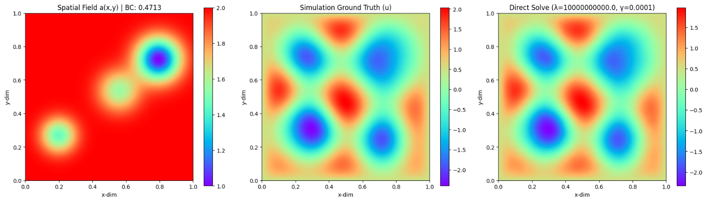
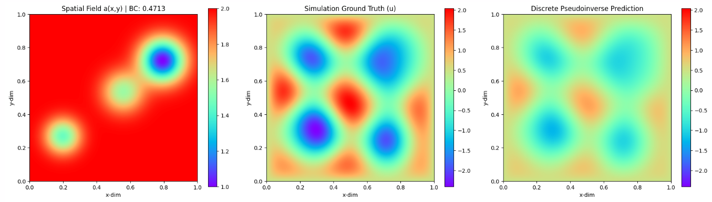
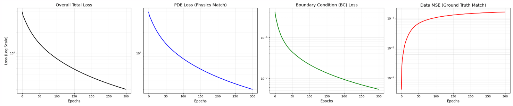
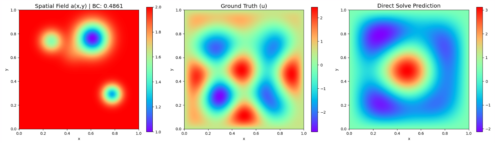

# Helmholtz
This document contains experimental information for the 2D Helmholtz equation. The Helmholtz equation models wave propagation in the frequency domain. In this specific variant, it represents a steady-state problem detailing how waves travel through a medium with spatially dependent physical properties. **The results for this dataset are not ideal, where the model is not even able to memorize a single training sample.**

* **Equation:** $-\Delta u - \omega^2 a(x, y)u = 0$
* **Grid Resolution:** $128 \times 128$
* **Boundary Conditions:**
    * Dirichlet boundary conditions ($u(x, y) = b$) are enforced on all boundaries, where $b \sim \mathcal{U}_{[0.25, 0.5]}$.
* **Suggested Hyperparameters:** 
    * `sigma`: 3.0
    * `tik_reg_fixed`: 1e-4
    * `matrix_bc_weight`: 1e11
    * `pde_loss_weight`: 1e-6
    * `bc_loss_weight`: 1e4
    * `data_loss_weight`: 1.0 (or 0.0 when training without data loss)
* **Training Details:** 
    * `epochs`: 1000 (for debugging single sample)
    * `hidden_layers`: `[256, 256, 256, 256]`
    * `spatial_batch_size`: 5000

### Additional Information
* The parameter $\omega$ represents the frequency and is analytically defined as $5\pi/2$.
* The spatially dependent function $a(x, y)$ represents the physical properties of the medium the wave is traveling through, which has been normalized and shifted to range from 1.0 to 2.
* The reference paper's stated $\omega^2$ value (61.6850) appears to be missing a factor of 2; the correct expected $\omega^2$ required to compute the PDE loss is approximately 123.3701. This caused high errors and poor training convergence until the correct value was applied.
* Including boundary coordinates within the interior spatial batch sampling caused optimization instability; explicitly filtering out boundary points to evaluate only the $126 \times 126$ interior grid significantly improved performance. 
* For pseudoinverse training, it is necessary to first establish stable settings with the data loss included before fine-tuning the model without the data loss. Here, we found that the ideal `matrix_bc_weight` is 1e11, which is surprisingly large. It could be due to the fact that the equation is homogenous, meaning the least-squares solver tends to drive the linear weights to zero to minimize the PDE residual, causing the network to rely heavily on boundary conditions to for predictions. 
* Removing data loss from the training loop, whether in a frozen weight setup or full training, causes the data MSE to spike and diverge rather than decrease.
* During early multi-sample tests, the network predictings the similar output for any given sample, resulting in near-zero PDE and BC losses but with massive data loss. This suggests that the model could not learn the underlying physics independently, and needs stronger data anchors such has possibly including ground truth data points in the domain during training.
* Driving the raw PDE loss down to low (like $10^{-2}$) *might* be mathematically impossible for this specific problem because the natural magnitude of the Laplacian itself is around $1000$. The primary guideline for success should not be the absolute PDE loss value, but rather achieving a low data relative L2 error and ensuring the predictions look visually accurate compared to the simulation
* Using a *Concat* version of the architecture, where the output of each layer is concatenated at the output for some unknown reason, does not work well for both single and full dataset training. Hence, in the code, we use a simple MLP.

### Relevant Notebooks
* `helmholtz_debug.ipynb` - Notebook where network is trained by only data loss, then,  prediction layer is replaced with psudoinverse for testing convergence. For debugging poor results from camlab-ethz Helmholtz dataset.
* `helmholtz_direct.ipynb` - Notebook for solving entire camlab-ethz Helmholtz dataset. 

### Results (Single Sample)
#### Pure Data Loss Memorization
Data MSE: 7.8067e-04

#### Pseudoinverse Tuning
Data MSE: 1.5984e-01

### Results (Entire Dataset)
Epoch 001 | Train Loss: 1.2106e+04 | Val MSE: 1.1554e+00

*Take note of the colorscale of the plots.*

## General Hyperparameters Terminology
* **`sigma`**: Determines the variance of the sampled frequencies for the Random Fourier Features matrix.
* **`tik_reg`**: Added to the Gram matrix to ensure it remains invertible and numerically stable during pseudoinverse.
* **`matrix_bc_weight`**: Scaling factor for boundary condition equation matrices. Note: A square root is taken before applied. 
* **`pde_loss_weight`**: A scaling factor applied to the PDE residual.
* **`bc_loss_weight`**: A scaling factor applied to the boundary residual.
* **`data_loss_weight`**: A scaling factor applied to the data MSE loss.
* **`spatial_batch_size`**: The number of points sampled from the PDE interior domain per training epoch.
* **`bc_batch_size`**: The number of points sampled from the boundaries per training epoch.