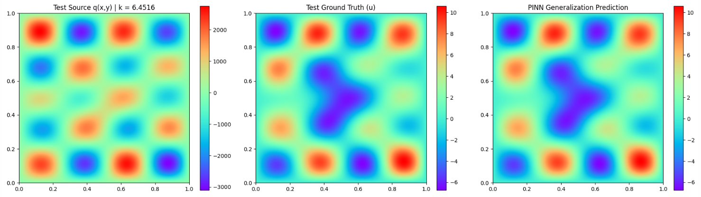

# Helmholtz Analytical
This document contains  experimental information for the analytical 2D Helmholtz equation. The script `helmholtz_analytical_data_generation` generated 10,000 unique, exact solutions evaluated on a 128x128 nodal grid within the domain $x, y \in [0, 1]$. To vary the complexity of the superimposed wave without altering array dimensions, a fixed maximum number of sinusoidal wave modes ($N_{max}$) is defined, and a random subset of continuous amplitudes is masked to zero.

* **Equation:** $(\nabla^2 + k)u = q$
    * **Exact Solution ($u$):** $u(x, y) = \sum_{i=1}^{N_{max}} A_i \sin(f_{1,i} \pi x) \sin(f_{2,i} \pi y)$
    * **Analytical Forcing Term ($q$):** $q(x, y) = \sum_{i=1}^{N_{max}} A_i \left( k - (f_{1,i} \pi)^2 - (f_{2,i} \pi)^2 \right) \sin(f_{1,i} \pi x) \sin(f_{2,i} \pi y)$
* **Grid Resolution:** $128 \times 128$
* **Boundary Conditions:**
    * Homogeneous Dirichlet condition ($u = 0$) is enforced on all boundaries.
* **Hyperparameters:** 
    * `sigma`: 0.5
    * `M`: 512
    * `tik_reg`: 1e-6
    * `matrix_bc_weight`: 1e4
    * `pde_loss_weight`: 1.0
    * `bc_loss_weight`: 1e4
* **Training Details:** 
    * `epochs`: 1 
    * `hidden_layers`: `[256, 256, 256, 256]`
    * `spatial_batch_size`: 5000

### Additional Information
The dataset generation utilizes $N_{max} = 5$ maximum wave modes. For each sample, the wave parameters are randomized within specific bounds:
* The continuous amplitudes ($A_i$) are drawn uniformly from $[-5.0, 5.0]$.
* The integer frequencies ($f_1, f_2$) are selected randomly between $1$ and $5$.
* The wave number ($k$) is drawn uniformly from $[1.0, 10.0]$.

### Relevant Notebooks
* `helmholtz_analytical_data_generation.ipynb` - Script for generating dataset using analytical Helmholz equation.
* `helmholtz_analytical_direct.ipynb` - Notebook for solving entire generated Helmholtz dataset.
* `multi_pde_poisson_helmholtz_sketch_and_project.ipynb` - Notebook for solving both poisson-gauss and helmholtz analytical dataset simultaneously with sketch-and-project. 
* `multi_pde_poisson_helmholtz.ipynb` - Notebook for solving both poisson-gauss and helmholtz analytical dataset simultaneously. 

### Results
Relative L2 Error : 1.44e-06 | Data Loss: 2.86e-11 | BC Loss: 5.03e-10 | PDE Loss: 2.43e-05

## General Hyperparameters Terminology
* **`n_train`**: The number of training samples for the run.
* **`sigma`**: Determines the variance of the sampled frequencies for the Random Fourier Features matrix.
* **`M`**: The number of random frequency components generated for the Fourier feature mapping.
* **`tik_reg`**: Added to the Gram matrix to ensure it remains invertible and numerically stable during pseudoinverse.
* **`matrix_bc_weight`**: Scaling factor for boundary condition equation matrices. Note: A square root is taken before applied. 
* **`pde_loss_weight`**: A scaling factor applied to the PDE residual.
* **`bc_loss_weight`**: A scaling factor applied to the boundary residual.
* **`spatial_batch_size`**: The number of points sampled from the PDE interior domain per training epoch.
* **`bc_batch_size`**: The number of points sampled from the boundaries per training epoch.

concat dont work well