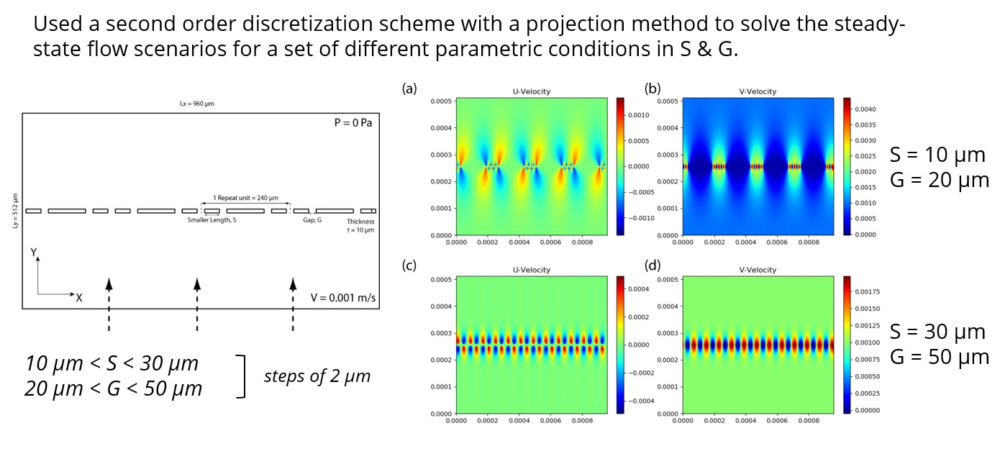
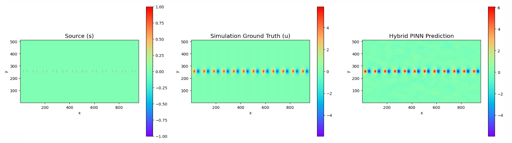
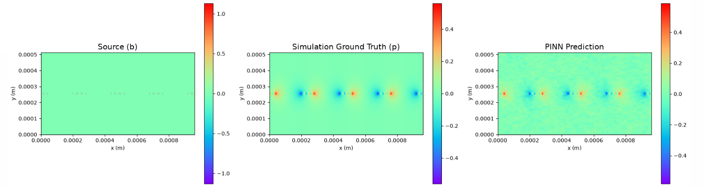

# Poisson
This document contains experimental information for solving the Poisson equation. While both datasets shown evaluate variations of $\nabla^2 u = f$, their physical contexts differ slightly. The T20 dataset is a simple, direct mapping of a localized source to a solution field. In contrast, the T10 dataset is derived from fluid dynamics simulations and involves solving a Pressure Poisson Equation around geometric obstacles to enforce flow incompressibility.

#### Explanation of T, S and G for T10 Dataset

## T20_S30_G50_reduced
The purpose of the reduced dataset is so that original domain of 512x960 is reduced, which helps the training to become easier.

## T20_S30_G50
* **Equation:** $\nabla^2 u = s$
* **Grid Resolution:** $512 \times 960$
* **Boundary Conditions:** 
    * Neumann boundaries are enforced on the top and bottom edges.
    * Periodic boundaries are enforced on the upper and lower edges.
* **Hyperparameters:** 
    * `sigma`: 2.0 to 3.0 (recommended 2.8931)
    * `M`: 256
    * `tik_reg`: below 1e-5 (recommended 7.9e-6)
    * `matrix_bc_weight`: 1/1e2
    * `pde_loss_weight`: 1/1e4
    * `bc_loss_weight`: 1
* **Training Details:** 
    * `epochs`: 2000
    * `hidden_layers`: `[128, 128, 128, 128]`
    * `architecture`: Both noconcat / concat works.
    * `spatial_batch_size`: 2000
    * `bc_batch_size`: 250

### Additional Information
Random sampling across a large grid often misses sparse source points. To prevent a PDE loss of zero, training batches of 2000 spatial points explicitly include all active source pixels (e.g., all 480 sources) in every pass, padding the rest of the batch with empty space coordinates.

### Results
Epoch 1950 | Total: 4.3457e-02 | Data: 4.3437e-02 | PDE: 1.9329e-05

MSE: 3.79e-02 | MAE: 1.26e-01 | RL2: 3.08e-01

## T10_S10_G20
This dataset solves the Pressure Poisson Equation to enforce incompressibility ($\nabla \cdot \mathbf{u} = 0$) in fluid dynamics. It is a simplified version of a larger Stokes flow dataset where the velocity components ($u$ and $v$) have been removed. The network learns the mapping $(b, \eta) \rightarrow p$ in a single forward pass, where $b$ is the physical source term quantifying the divergence error, and $\eta$ is the geometric boundary mask representing solid obstacles. 

* **Equation:** $\nabla^2 p = \frac{\rho}{\Delta t} \nabla \cdot \mathbf{u}^*$
* **Grid Resolution:** $512 \times 960$
* **Boundary Conditions:**
  * **Outer Walls:** Homogeneous Dirichlet condition ($p = 0$) is applied to the 4 outer perimeter walls.
  * **Sifter Obstacles:** Neumann conditions are applied to the geometric boundaries where the fluid contacts the obstacles ($\eta = 1.0$).
* **Physics Constraints:** While the boundary conditions apply to the fluid-obstacle interfaces, the Poisson equation ($\nabla^2 p = b$) is enforced universally across all sampled points, meaning the pressure natively learns non-zero values inside the solid obstacles. 
* **Hyperparameters:** 
    * `sigma`: 7.0
    * `M`: 1024
    * `tik_reg`: 1e-4
    * `W_PDE`: 1.0
    * `W_SIFTER`: 1.0
    * `W_WALL`: 100.0
* **Training Details:** 
    * `epochs`: 3000
    * `hidden_layers`: `[512, 512, 512, 512]`
    * `spatial_batch_size`: 2000
    * `wall_batch_size`: 400
    * `sifter_batch_size`: 200

### Additional Information
While boundary conditions apply only to the fluid-obstacle interfaces, the Poisson equation ($\nabla^2 p = b$) is enforced universally across all sampled points, meaning the network natively learns non-zero pressures inside the solid obstacles.

### Relevant Notebooks
* `t10_poisson_direct.ipynb` - Notebook for solving single sample T10_S10_G20 dataset.
* `t20_poisson_direct.ipynb` - Notebook for solving single sample T20_S30_G50 dataset.

### Results
Epoch 1900 | Tot: 5.83e-04 | Sim: 5.06e-04 | PDE: 4.92e-05 | Wall: 2.57e-10 | Sift: 2.80e-05 | Tik: 1.00e-04
MSE: 4.64e-04 | MAE: 1.69e-02 | RL2: 4.35e-01

## General Hyperparameters Terminology
* **`sigma`**: Determines the variance of the sampled frequencies for the Random Fourier Features matrix.
* **`M`**: The number of random frequency components generated for the Fourier feature mapping.
* **`tik_reg`**: Added to the Gram matrix to ensure it remains invertible and numerically stable during pseudoinverse.
* **`matrix_bc_weight`**: Scaling factor for boundary condition equation matrices. Note: A square root is taken before applied. 
* **`W_PDE`**: The base scaling weight applied to the interior PDE constraint matrix prior to the linear solve.
* **`W_WALL`**: A weight for outer wall boundary condition matrix to enforce Dirichlet boundary conditions.
* **`W_SIFTER`**: The weight applied to the internal obstacle (Neumann) boundary conditions matrix.
* **`pde_loss_weight`**: A scaling factor applied to the PDE residual.
* **`bc_loss_weight`**: A scaling factor applied to the boundary residual.
* **`spatial_batch_size`**: The number of points sampled from the PDE interior domain per training epoch.
* **`bc_batch_size`**: The number of points sampled from the boundaries per training epoch.
* **`wall_batch_size`**: The number of points sampled from the outer Dirichlet walls per epoch.
* **`sifter_batch_size`**: The number of points sampled from the internal Neumann obstacles per epoch.
