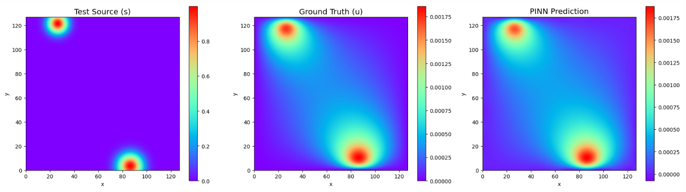
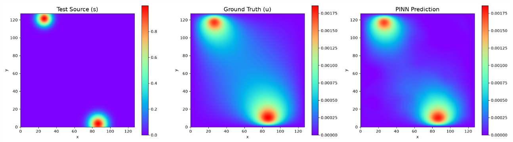

# Poisson-Gauss
This document contains experimental information for the Poisson-Gauss problem, which describes a potential field behaving in the presence of a known source defined by a sum of randomized 2D Gaussians. The source is mathematically defined by:

$$
f(x,y) = \sum_{i=1}^{N} \exp\left(-\frac{(x-\mu_{x,i})^2 + (y-\mu_{y,i})^2}{2\sigma_i^2}\right)
$$

* **Equation:** $-\Delta u = f$, in $(0,1)^2$,
* **Grid Resolution:** $128 \times 128$
* **Boundary Conditions:**
    * Homogeneous Dirichlet condition ($u = 0$) is enforced on all boundaries.
* **Hyperparameters:** 
    * `sigma`: 0.5
    * `M`: 256
    * `tik_reg`: 1e-5
    * `kaczmarz_tik_reg`: 2e-6 *(for Sketch-and-Project)*
    * `kaczmarz_alpha`: 0.3 *(for Sketch-and-Project)*
    * `kaczmarz_sweeps`: 20 *(for Sketch-and-Project)*
    * `matrix_bc_weight`: 1e4
    * `pde_loss_weight`: 1.0
    * `bc_loss_weight`: 1e4
* **Training Details:** 
    * `epochs`: 1 *(direct solve)*, 10 *(Sketch-and-Project)*
    * `hidden_layers`: `[128, 128, 128, 128]`
    * `spatial_batch_size`: 1000
    * `spatial_chunk_size`: 250 *(for Sketch-and-Project)*
    * `bc_batch_size`: 500
    * `bc_chunk_size`: 250 *(for Sketch-and-Project)*
    * `batch_size_samples`: 32
    * `chunk_size`: 256

### Additional Information
Results are equally good for both direct pseudoinverse and Sketch-and-Project, but the latter requires more epochs.

### Relevant Notebooks
* `poisson_gauss_direct.ipynb` - Notebook for solving entire camlab-ethz Poisson-Gauss dataset. 
* `poisson_gauss_solver_sketch-and-project.ipynb` -  Notebook for solving entire camlab-ethz Poisson-Gauss dataset with sketch-and-project.
* `multi_pde_poisson_helmholtz_sketch_and_project.ipynb` - Notebook for solving both poisson-gauss and helmholtz analytical dataset simultaneously with sketch-and-project. 
* `multi_pde_poisson_helmholtz.ipynb` - Notebook for solving both poisson-gauss and helmholtz analytical dataset simultaneously. 

### Results Direct Solve
Epoch 001 | Train Loss: 3.1975e-06 | Val MSE: 2.9114e-09

### Results Sketch-and-Project
Epoch 003 | Train Loss: 6.8537e-04 | Val MSE: 1.3382e-08 | TikReg: 1.03e-05

## General Hyperparameters Terminology
* **`sigma`**: Determines the variance of the sampled frequencies for the Random Fourier Features matrix.
* **`M`**: The number of random frequency components generated for the Fourier feature mapping.
* **`tik_reg`**: Added to the Gram matrix to ensure it remains invertible and numerically stable during pseudoinverse.
* **`matrix_bc_weight`**: Scaling factor for boundary condition equation matrices. Note: A square root is taken before applied. 
* **`pde_loss_weight`**: A scaling factor applied to the PDE residual.
* **`bc_loss_weight`**: A scaling factor applied to the boundary residual.
* **`spatial_batch_size`**: The number of points sampled from the PDE interior domain per training epoch.
* **`bc_batch_size`**: The number of points sampled from the boundaries per training epoch.
* **`kaczmarz_sweeps`**: The number of full passes over a batch of points to iteratively update the linear weights.
* **`kaczmarz_alpha`**: The step size used to update the linear weights in each iteration of the algorithm.
* **`kaczmarz_tik_reg`**: The Tikhonov regularization term added to the local sketched Gram matrix for numerical stability.