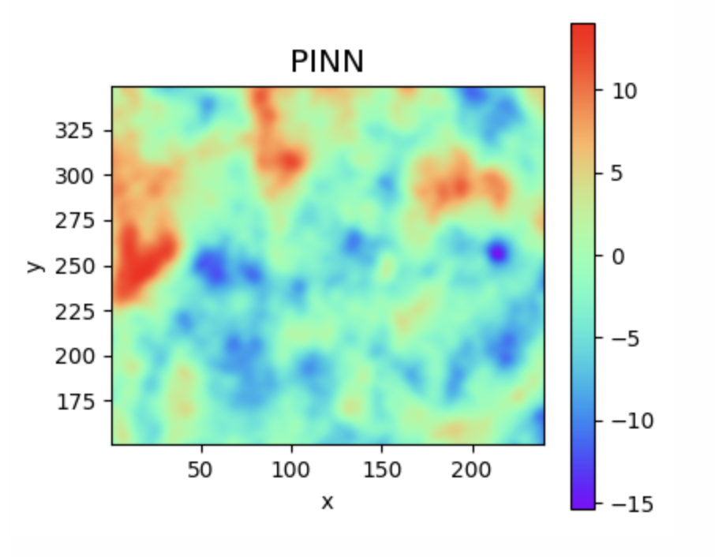
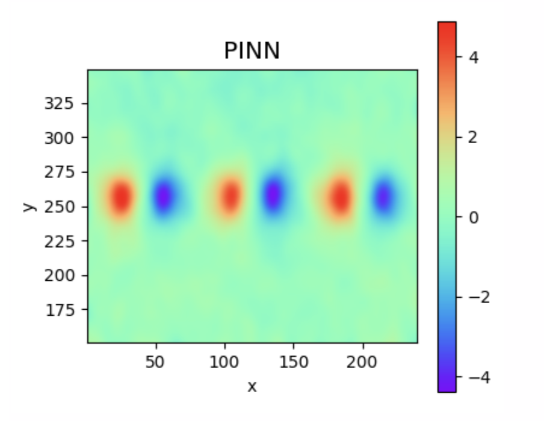

# Solving the Poisson equation with PINNs

### Todo
- [x] Implement numerical differentiation
- [x] Implement Block Kaczmarz 
- [x] Implement Block Coordinate Descent 

## Background
**The Poisson Equation**
The system models the equation:
$$\nabla^2 \phi = f$$

Where $\phi$ is the unknown potential field and $f$ is the known source term.

**Solving it with PINNs**
Unlike traditional numerical solvers that only yield discrete values at fixed grid points, PINNs learn a continuous, differentiable function that can be evaluated anywhere in the domain. 

To do this efficiently, we use a random feature model where hidden layer weights are randomly initialized and frozen. Since we are solving the Poisson equation, we compute the Laplacian of the network's generated features ($\nabla^2\phi$) to form the columns of matrix $A$, and map the known source term $f$ to vector $b$. This creates the linear system $Aw = b$, allowing us to solve directly for the final linear layer weights ($w$), making our network the solution of the Poisson equation.

**Problem**
Typically, when we solve the linear system with least squares optimization, the Gram Matrix $A^T A$ formed can easily cause out-of-memory problems as the time complexity for computation is $O(Nd^2)$. We can bypass that with sketch-and-project methods.

**Optimizing matrix solver with Sketch-and-Project**
To optimize the linear system $Aw = b$ generated by the network, we try two different methods:
1. Block Coordinate Descent 
Recommended if no. of weights is large ($d≫N$). Iteratively updates blocks of the network weights while freezing the rest.
2. Randomized Block Kaczmarz
Great for overdetermined linear systems $(N≫d)$. Operates on small row slices of the data ($A_B$): Solves a smaller Gram system $(A_B A_B^T)$ at each iteration, so we can scale the dataset size N to infinity while keeping memory usage low at $O(b_{size} \times d)$

**Implementation of Block Kaczmarz:**
1. Apply L2 Regularization first by building the Augmented Matrix.
$$
A_{\mathrm{aug}} = \begin{bmatrix} A \\ \sqrt{\lambda} I \end{bmatrix}, \qquad b_{\mathrm{aug}} = \begin{bmatrix} b \\ 0 \end{bmatrix}
$$

    Solving $A_{\mathrm{aug}} w = b_{\mathrm{aug}}$ via standard Least Squares ($A_{\mathrm{aug}}^T A_{\mathrm{aug}} w = A_{\mathrm{aug}}^T b_{\mathrm{aug}}$) is equivalent to solving the Tikhonov regularized system $(A^T A + \lambda I) w = A^T b$. We need to use the augmented matrix method because we do not want to compute $A^T A$. Another method could be to not use the augmented matrix, but apply the regularization to the mini-batched matrix ($A_B^T A_B + λI$), but that might would over-regularization over many epochs.

2. Randomly sample a block of rows (without replacement) to form submatrix $A_B$ and target vector $b_B$ from the augmented matrices $A_{aug}$ and $b_{aug}$.

3. For each sample, use the update equation: $$x_{new} = x−A_B^T(A_B A_B^T)^ {−1}(A_B x − b_B)$$ to arrive at answer.

**Implementation of Block Coordinate Descent:**

1. Apply L2 Regularization first by building the Augmented Matrix.
$$A_{\mathrm{aug}} = \begin{bmatrix} A \\ \sqrt{\lambda} I \end{bmatrix}, \qquad b_{\mathrm{aug}} = \begin{bmatrix} b \\ 0 \end{bmatrix}$$

2. Randomly sample a block of columns to form submatrix $A_B$ from $A_{\mathrm{aug}}$. Because BCD iteratively updates variables, $A_B$ retains the full $N$ dimension of the grid but only a subset of the $m$ parameters.

3. Compute the global residual across all coordinates:

$$r = A_{\mathrm{aug}} w - b_{\mathrm{aug}}$$

4. For each sampled block, solve the local Normal Equation to find the step direction $d_B$, then subtract it from the currently selected weights $w_B$:
$$(A_B^T A_B) d_B = A_B^T r \implies w_{B_{new}} = w_B - (A_B^T A_B)^{-1}(A_B^T r)$$
    This step analytically solves for the exact minimum within the chosen feature subspace, meaning it converges without needing a learning rate ($\alpha$) parameter.

## Implementation Details
* **Forward-Mode Autodiff:** Instead of using `jax.grad()` twice to get the Hessian, we use `jacfwd()` twice so we only calculate what we need: `f_xx` and `f_yy`, we do not need `f_xy` or `f_yx`. We could have also used 2nd-order central difference method by applying a 5-point stencil to approximate the Laplacian, however that method does not give us exact answers.
* **Tikhonov Regularization:** The dense matrix A in the PINN system is highly ill-conditioned. Hence, we apply L2 regularization on the final linear layer weights, making it more well-conditioned. This prevents the system from requiring vastly more iterations to converge with numerical methods or completely failing with direct solving.
* **Avoiding Inverse Calculation**: Avoid computing the inverse of the matrix. Instead, we formulate it as a linear system $Cw=d$ and use jnp.linalg.solve().
* **Add lr param:** For block kazmarz, we need to introduce a learning rate ($\alpha$) parameter to regulate the update step size. Without it, training is not stable and does not converge. <table>
<tr>
<td align="center">

#### `alpha = 1`

</td>
<td align="center">

#### `alpha = 0.001`

</td>
</tr>
</table>

## Scaling to larger dataset
Larger datasets require more VRAM. We did a few things to ensure the dataset can be loaded.
1. Avoiding calculating f_xx and f_yy for A matrix all at once.
2. Avoid evaluating the network for all rows simultaneously (such as for SSR).
3. Passing coordinates into vmap all at once causing an OOM crash. We bypass this by computing the features in chunks of 10,000, moving the completed chunk to CPU memory, and deleting the GPU scratchpad.
4. Add .block_until_ready() for every 100 steps. 
5. Constructing $A_{aug}$ matrix on the CPU by sending data chunks from GPU, then taking the samples back to GPU for calculations.

Note:
1. For FrPINN, we should not calculate the PDE derivatives inside the Kaczmarz loop for only few coordinates at a time to save memory because we would be calculating the same answer many times (FrPINN hidden weights do not update after each epoch and hence, the features never change).
2. JAX executes asynchronously, a fast Python loop will instantly queue up hundreds of thousands of GPU tasks. The GPU's memory allocator attempts to juggle the intermediate variables for all these pending tasks simultaneously, which causes fragmentation in VRAM. Hence, even if we have 4GB of total free space, the GPU will crash if it cannot find a single contiguous block for a new array. Adding w.block_until_ready() every 100 steps pauses the CPU, forcing the GPU to finish the backlog, clear intermediate tensors, and merge the tiny gaps back into clean, contiguous memory blocks.

## Results
For dataset - *data_T20_S30_G50_reduced.dat*

**Baseline**
SSR = 1.08e-02  MSE = 5.46e-02  MAE = 1.74e-01  RL2 = 2.31e-01
1.95 s ± 225 ms per loop (mean ± std. dev. of 2 runs, 10 loops each)

**Using Numerical Differentiation**
SSR = 1.08e-02  MSE = 5.46e-02  MAE = 1.74e-01  RL2 = 2.31e-01
2.18 s ± 115 ms per loop (mean ± std. dev. of 2 runs, 10 loops each)

**Using Block Kaczmarz**
SSR = 2.38e+01 MSE = 8.65e-02 MAE = 2.35e-01 RL2 = 2.90e-01
Slower, but more memory efficient.

**Using Block Coordinate Descent**
SSR = 1.08e-02  MSE = 5.56e-02  MAE = 1.75e-01  RL2 = 2.33e-01
More accurate than Block Kaczmarz as we solve for the subsystems analytically