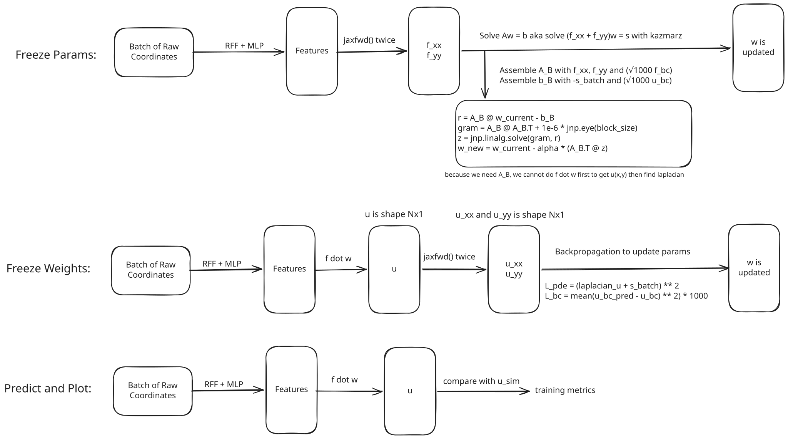
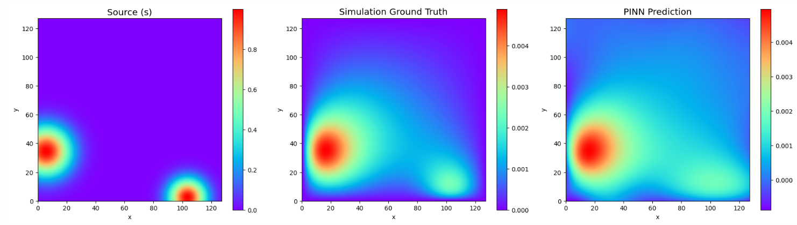
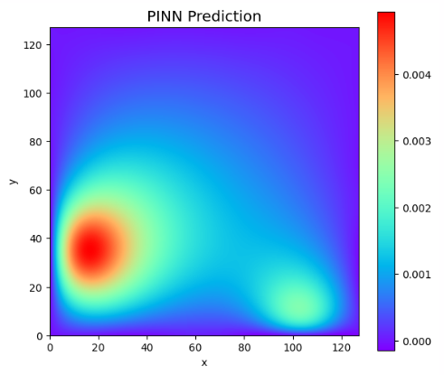

### Daily Report
* **Tuesday** - Load T10_data, Trace Example-A100-SIR_MODEL_Optuna code
* **Wednesday** - Set up Poisson Gauss Double Training Loop
* **Thursday** - Test and Refine Poisson Gauss Training, the results make sense now.
* **Friday** - Learn and Add Random Fourier Features
* **Monday** - Clear up understanding of training loop and look at ways to fix OOM problems

## Current Problems
Consider a least squares problem $Aw = b$, where A is a $N$ by $m$ matrix. We already know that it is possible to solve with sketch and project even if $N$ >> $m$. Now, consider the sketched submatrix $A_B$ with dimensions $N_B$ by $m$. If $m$ is small enough, say $m = 1000$, we can fit it in VRAM. However, once we increase $m$, such as increasing the number of features or number of linear weights, we will get OOM problems when $m$ hits say over $5000$. Is there a way so that we can scale $m$ up and prevent OOM? Maybe there is a way so that we do not even need to assemble the matrix $A_B$.

### PINN Architecture & Training Loop


For the Hidden Layers, we currently use a standard MLP (e.g., 3x50 nodes) with tanh activations that takes spatial coordinates $(x, y)$ and outputs $m$ features, denoted as $f(\phi)$ Final layer is a set of linear weights $w$, where we do a dot product.

During each training epoch, we process the coordinates in mini-batches (shuffled) and alternate between two updates steps.

The Kaczmarz Step (Updates $w$): We freeze the hidden parameters. We build the sub-matrix $A_B$ using $f_{xx} + f_{yy}$ and update $w$ using the Kaczmarz.

The Optax Step (Updates $\phi$): We freeze the linear weights $w$. We calculate the loss of the final prediction (with simple dot product of features and linear layer and compare with simulation) and do gradient descent with AdamW to update params.

#### Current Data Flow
Below show the current data flow per batch to avoid building $A_aug$ because that is expensive.

JAX pushes raw coordinates `x_batch` and `y_batch` through the `FeatureExtractor` using the current hidden params. The GPU holds  $f_{xx}, f_{yy}$ in VRAM to assemble the block matrix $A_B$. The Kaczmarz projection runs, generating the new $w$. JAX instantly deletes the features and $A_B$ from VRAM.

Then, we want to update params with optax. JAX pushes raw coordinates `x_batch` and `y_batch` through the `FeatureExtractor` again. It builds a computational graph in VRAM, runs backpropagation and updates.

This means we do not ever build a $A_aug$. However, we are still building $A_B$.

#### Problems and Fixes
##### Problem 1
Initial runs had very high losses and predictions with very high magnitudes. We were passing raw grid indices 0 to 127 into the network and normalizing them to $[-1, 1]$ inside the call function of the Feature Extractor (getf). That made the derivatives (like laplacian) shrink too much as

$$
x_{\text{norm}} = \frac{2}{127} x_{\text{in}} - 1
$$

Then,

$$\frac{\partial f}{\partial x_{\text{in}}} = \frac{\partial f}{\partial x_{\text{norm}}} \cdot \frac{\partial x_{\text{norm}}}{\partial x_{\text{in}}}$$

$$\frac{\partial f}{\partial x_{\text{in}}} = \frac{\partial f}{\partial x_{\text{norm}}} \cdot \left(\frac{2}{127}\right)$$

$$\frac{\partial^2 f}{\partial x_{\text{in}}^2} = \frac{\partial^2 f}{\partial x_{\text{norm}}^2} \cdot \left(\frac{2}{127}\right)^2$$

Hence, the network saw that the `f_xx` and `f_yy` was thousands of times smaller than the source $s$. To compensate, it made the linear weights $w$ to become thousands of times larger. To fix this, we simply do the normalization at the very start of the notebook outside the network.

##### Problem 2
The resulting plot showed that the answer is not really caring about the boundary conditions. Applying a big multiplier (eg. *1000) made the result much better.

In Optax, we did `loss_bc = jnp.mean((u_bc_pred - u_bc)2) * 1000.0`.

$$\mathcal{L} = \mathcal{L}_{\text{PDE}} + 1000\,\mathcal{L}_{\text{BC}}$$

In Kaczmarz, we did `A_bc = f_vmap(...) * jnp.sqrt(1000.0)` and `b_bc = u_bc * jnp.sqrt(1000.0)`. This helped ensure the boundary conditions much better.

$$\sqrt{1000}\,\left(A_{\text{bc}}w - b_{\text{bc}}\right)$$

$$\left|\sqrt{1000}\,\left(A_{\text{bc}}w - b_{\text{bc}}\right)\right|^2 = 1000\,\left|A_{\text{bc}}w - b_{\text{bc}}\right|^2$$

Both actions scale the loss by a factor of 1000.

##### Problem 3
The network finally produced the correct looking plots, but the values were inverted.
Apparently, the We realized dataset was generated using $-\Delta u = s$. Hence, we flipped the target sign in Kaczmarz (`b_pde = -s_batch`) and inverted the residual in Optax (`laplacian_u + s_batch`).

#### Possible Improvements for Later
Replace uniform sampling without replacement in 1 epoch to more advanced sampling methods.
Use a non-fixed learning rate like cosine annealing.
Make the Tikhonov regularization parameter trainable (part of the feature extractor) instead of having it fixed.

#### Note on Tikhonov Regularization
Previously, we added Tikhonov Regularization to the entire $A^T A$. This served 2 purposes. The main purpose it to fixing ill-conditioned matrix. It also helped in keeping the weights of the linear layer to not be too big. Then, we decided to sample submatrices. Adding Tikhonov Regularization to the submatrices fixes the ill-conditioning but does not do weight decay because we are solving for the step direction. Hence, we added regularization block in the $A_{aug}$. However, that takes a lot of memory and there is better way to do this. We can add a penalty to the weights every update like this :`w_new = (1.0 - weight_decay) * w_current - alpha * (A_B.T @ z)`. This creates another problem. We are applying the decay multiplier on every single mini-batch, making it batch dependent. If we change the batch size, we need to tune the weight decay again. Hence, we could try a method that makes regularization decoupled from the batch. For example,
```
N_batches = total_points / batch_size
epoch_weight_decay = 0.001  
batch_weight_decay = 1.0 - (1.0 - epoch_weight_decay) ** (1.0 / N_batches)
w_new = (1.0 - batch_weight_decay) * w_current - alpha * (A_B.T @ z)
```
However, current tests show that this linear layer weight decay is not that significant for Poisson Gauss, maybe in the future we might need it.

### Saving Memory
$u(x,y) = w \cdot f(x,y)$ and $\nabla^2 u(x,y) = s(x,y)$. 

#### Calculating $u(x,y)$
Previously in the frPINN, we did $(\nabla^2 f) \cdot w$. However, because w is independent of the raw coordinates $x$ and $y$, we can do $\nabla^2(f \cdot w)$ instead. This makes the JAX computational graph take way less memory.

By doing the dot product first, we multiply the $(N, m)$ features by the $(m, 1)$ weights, getting a vector $u$ of shape $(N, 1)$. Taking laplacian on $(N, 1)$ versus on $(N, m)$ matrix is a huge memory save.

#### Avoid building $A_B$
Before we go into trying to avoid building $A_B$, we look at a few other problems. In the case that we freeze the last linear weights, we will do $f \cdot w$ then find $u_{xx}$ and $u_{yy}$. The computational graph will track the derivative of that each number in $u$ so the memory is $O(n_{batch})$. To do backpropagation, JAX also save the intermediate feature activations from the forward pass in memory. So, it will hold that $(N_{batch}, m)$ matrix while it calculates the loss. While this can take quite some memory if batch size is big and $m$ is also very very big, it is still manageable in GPU VRAM (eg. 1024x50000 is 400MB on `jax_enable_x6`). The problem comes when we have to freeze the params and do kaczmarz. This is because we will need to calculate the $f_{xx}$ and $f_{yy}$ first by stacking $A_{pde}$ and $A_{bc}$ to create $A_B$ then jacfwd() twice which goes OOM very easily when we scale $m$. Hence, we want methods where we avoid building $A_B$ in the first place.

Here are 3 ways to do it and why 2 of them seem not so great at first glance.
##### Slicing Before Autodiff
Update equation: $$w_{new} = w−A_B^T(A_B A_B^T)^ {−1}(A_B w − b_B)$$

The main problem is not building $A_B$, but doing `jacfwd(jacfwd(...))`. When we ask JAX to take the 2nd derivatives of all at once, JAX tries to build and store the big computational graph of every intermediate derivative for all features across the whole batch which causes OOM.

So, we can try to just slice the features so that does not happen. Here, we do not build $A_B$ but we build $A_{b_{chunk}}$ which is shape $(N_{batch}, m_{chunk})$.
```
def get_f_chunk(params, x, y, start_idx, end_idx):
    all_features = model.apply(params, x, y) 
    
    # Slice the output before returning
    return all_features[:, start_idx:end_idx]

# JAX only tracks the memory for the chunk
f_xx_chunk = jacfwd(jacfwd(get_f_chunk))(params, x, y, start_idx, end_idx)
```

Now, we just use these chunks to build the $(A_B A_B^T)$ shape $(N_{batch}, N_{batch})$.
Also, $(A_B w − b_B)$ is shape $(N_{batch}, 1)$.
Hence, we can just do $(A_B A_B^T)^ {−1}(A_B w − b_B)$ first which is shape $(N_{batch}, 1)$.
Then lastly, since $A_B^T$ is shape $(m,N_{batch})$, we do not want to build it so instead, we can do assembly again. We split along the big $m$ dimension to get $A_{b_{chunk}}^T$. Below, $b_{chunk} = 1, 2, 3...$ 

$$A_B^T = \begin{bmatrix} A_1^T \\ A_2^T \\ A_3^T \end{bmatrix}$$
Then multiply by $z = (A_B A_B^T)^ {−1}(A_B w − b_B) $, 
$$A_B^T z = \begin{bmatrix} A_1^T z \\ A_2^T z \\ A_3^T z \end{bmatrix}$$

$A_1^T z$ is shape $(m_{chunk},1)$ so we do not have any problems scaling $m$ now. The only problem is we need 1 more repeated pass to calculate features, because we will be deleting and not storing them. We need one pass for constructing $A_B A_B^T$ and one more for $A_B^T$.

##### Matrix-Free Projections via JVPs and VJPs
Using the Matrix-Free method (JVP/VJP) would technically avoid building $A_B$ entirely, but it may break down when moving to harder PDEs like Stokes flow because the Conjugate Gradient solver cannot handle the ill-conditioned matrices that fluid dynamics equations produce.

## Results
#### Thursday


Epoch 000 | PDE/BC Loss: 3.0351e-02 | Full Grid MSE vs Ground Truth: 1.1370e-06
Epoch 010 | PDE/BC Loss: 1.2954e-02 | Full Grid MSE vs Ground Truth: 3.0173e-07
Epoch 020 | PDE/BC Loss: 7.4086e-03 | Full Grid MSE vs Ground Truth: 1.3616e-07
Epoch 030 | PDE/BC Loss: 5.9176e-03 | Full Grid MSE vs Ground Truth: 1.7221e-07
Epoch 040 | PDE/BC Loss: 5.0643e-03 | Full Grid MSE vs Ground Truth: 2.1814e-07
Epoch 050 | PDE/BC Loss: 4.5721e-03 | Full Grid MSE vs Ground Truth: 8.7465e-08
Epoch 060 | PDE/BC Loss: 4.2873e-03 | Full Grid MSE vs Ground Truth: 5.1757e-08
Epoch 070 | PDE/BC Loss: 4.1479e-03 | Full Grid MSE vs Ground Truth: 2.0771e-07
Epoch 080 | PDE/BC Loss: 4.0031e-03 | Full Grid MSE vs Ground Truth: 7.2870e-08
Epoch 090 | PDE/BC Loss: 3.9450e-03 | Full Grid MSE vs Ground Truth: 9.3306e-08
Epoch 099 | PDE/BC Loss: 3.8605e-03 | Full Grid MSE vs Ground Truth: 4.3255e-08
Training Complete!

#### Friday
num_frequencies = 100
sigma = 0.5


Epoch 000 | PDE/BC Loss: 2.3064e-02 | Full Grid MSE vs Ground Truth: 1.2055e-06
Epoch 010 | PDE/BC Loss: 2.4217e-04 | Full Grid MSE vs Ground Truth: 1.7687e-08
Epoch 020 | PDE/BC Loss: 9.8987e-05 | Full Grid MSE vs Ground Truth: 5.8356e-09
Epoch 030 | PDE/BC Loss: 5.4622e-05 | Full Grid MSE vs Ground Truth: 3.6929e-09
Epoch 040 | PDE/BC Loss: 3.4270e-05 | Full Grid MSE vs Ground Truth: 2.1605e-09
Epoch 050 | PDE/BC Loss: 2.2638e-05 | Full Grid MSE vs Ground Truth: 1.0027e-09
Epoch 060 | PDE/BC Loss: 1.5919e-05 | Full Grid MSE vs Ground Truth: 8.6534e-10
Epoch 070 | PDE/BC Loss: 1.1861e-05 | Full Grid MSE vs Ground Truth: 6.3788e-10
Epoch 080 | PDE/BC Loss: 9.1154e-06 | Full Grid MSE vs Ground Truth: 4.4285e-10
Epoch 090 | PDE/BC Loss: 6.6308e-06 | Full Grid MSE vs Ground Truth: 4.4381e-10
Epoch 099 | PDE/BC Loss: 5.9234e-06 | Full Grid MSE vs Ground Truth: 2.9299e-10
Training Complete!