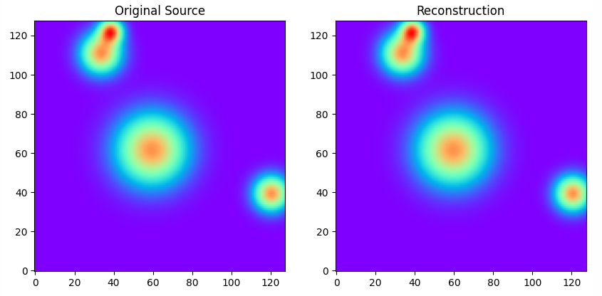
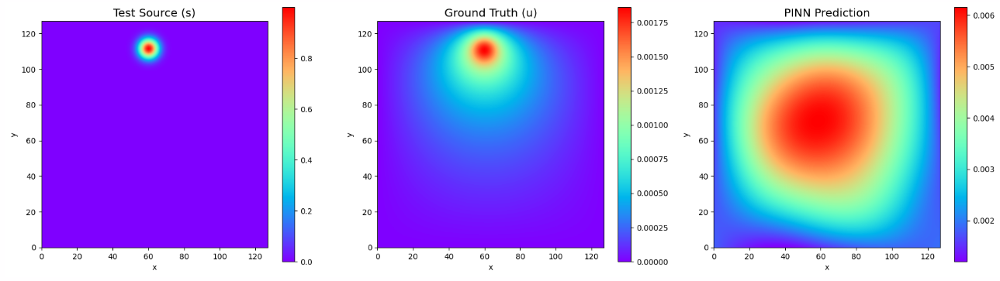
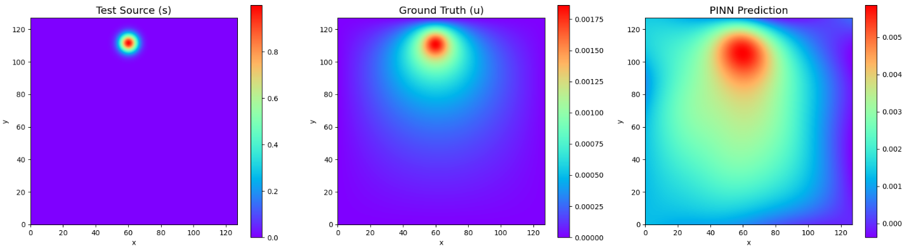
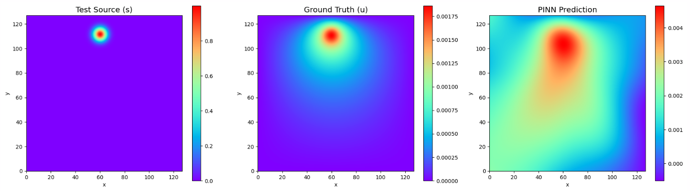

### Daily Report
* **Wednesday** - Implement method to avoid building $A_B$
* **Thursday** - Pull params from dataset and integrate into training
* **Friday**  - Improve training pipeline, vmaps, and tracking, add jax-dataloader and run tests (bad results)
* **Monday** - Try to get better results with different modifications.

## Introduction
Last week, we did single sample of the Poisson-Gauss dataset. This week, we increase the parameter count. We also want to test the memory saving methods proposed in week 3.

### Pulling variables from data
In the dataset, they only provide 
```
solution  (sample, x, y) float32 1GB
source    (sample, x, y) float32 1GB
```

Source formula (from paper: https://arxiv.org/pdf/2405.19101):
$$f(x,y) = \sum_{i=1}^{N} \exp\left(-\frac{(x-\mu_{x,i})^2 + (y-\mu_{y,i})^2}{2\sigma_i^2}\right)$$
$N \sim \text{Geom}(0.4)$: Number of Gaussians
$\mu_{x,i}, \mu_{y,i} \sim U[0, 1]$: The $x$ and $y$ coordinates of each Gaussian. 
$\sigma_i \sim U[0.025, 0.1]$: The spread of the Gaussian

#### More Parameters
We use sckit-image and scipy to extract parameters. Every sample in the dataset contains at least 1 peak.

To extract the data, we use scipy.optimize.curve_fit. 
```
popt, _ = curve_fit(
    multi_gaussian_2d,    # Generates the guess
    (x_grid, y_grid), 
    sample.ravel(),       # actual value
    p0=initial_guess,
    bounds=(lower_bounds, upper_bounds)
)
```

Example result for 1 sample: 
Peak 1: (mu_x, mu_y, sigma) = (0.3041, 0.9598, 0.0334)
Peak 2: (mu_x, mu_y, sigma) = (0.2639, 0.8693, 0.0566)
Peak 3: (mu_x, mu_y, sigma) = (0.9467, 0.3076, 0.0496)
Peak 4: (mu_x, mu_y, sigma) = (0.4671, 0.4835, 0.0985)

We reconstruct it and see that it matches the provided one.


*Note: There will be NaN values in the dataset because some samples have more peaks than others, then it will have NaN values for `x3` and `y3` when `N=2`. The max peaks in the dataset is `N=18`*

Since parameters increased, we also need to increase number of output features.
However, we apply Random Fourier Features only to the coordinates ($x, y$) and just concatenate the parameters ($\mu_x, \mu_y, \sigma$) after the RFF projection.

#### Batching
There are two times we batch in the high level. The first is the batch of coordinates for a single sample for kaczmarz and the second is the batch for multiple samples from the dataset to be evaluated. It becomes messy fast, so we use jax-dataloader. We shall do mini-batch gradient descent. We do 1 vmap for coordinates of a single sample and 1 more for the entire Kaczmarz and Loss functions over the batch size.

#### Flow of parameters
This is the setup we had for week 4. Most likely we need to modify this in week 5.
The parameters $p$ (the $\mu_x$, $\mu_y$, and $\sigma$ values) goes through the Feature Extractor. The coordinates ($x, y$) are projected into Random Fourier Features. At every hidden layer, $p$ generates a scaling factor ($\gamma$) and shifting factor ($\beta$) that modulate the spatial features.The output of the network is a set of $M$ features.

Kaczmarz only sees the final $M$ features output by the network, and the source data $s$ from the dataset. The network processes the batch and outputs 8 unqiue feature matrices ($f$) and their derivatives ($f_{xx}, f_{yy}$). 

The batched_kaczmarz function uses jax.vmap to construct 8 separate systems ($Aw = b$). Since we chunk the data (1,000 points at a time), the solver is doing Block Kaczmarz, where it aims to satisfy the residual for each of the 8 samples with linear weights. Then we do `jnp.mean(w_new_batch, axis=0)` which might be destroying the Kaczmarz convergence because it makes the $w$ vector satisfy none of the 8 systems, hence we see just a "blob" that is not accurate for a specific given sample.

### Problems
#### Problem 1
The training took way too long (almost 3 hours per epoch). There was too many nested for loops: 
1. Main epoch loop.
2. Samples Batch Loop: Each epoch processes 2,455 batches (8 samples per batch) to cover the 19,640 training samples.
3. Spatial Grid Loop: For every single batch of 8 samples, the 128x128 spatial grid (16,384 points) was shuffled and processed in chunks of 1,000 coordinates. This loops until the entire grid is sampled.
4. Feature Loop ($M$-chunking): For each 1,000-point chunk, the network features ($M$) were sliced into smaller blocks to safely assemble the Kaczmarz Gram matrix without exceeding GPU VRAM.
5. Weight Updates: After calculating the Kaczmarz step for the linear weights, the hidden weights (params) were updated using AdamW for that same 1,000-point chunk.

Previously, when training on just 1 sample, the model did about 17 updates per epoch (16,384 points divided into chunks of 1,000). However, by nesting the spatial loops inside the new sample batch loop, the network need to do $17 \times 2,455 = 41,735$ Kaczmarz and Adam updates per epoch. 

We are doing 17 highly correlated updates on the exact same 8 samples before the network sees new data, making the training redundant and slow.

#### Fix
Instead of sweeping the whole grid for every batch of samnples, we take one chunk of 1,000 points, do one update on the 8 samples, and move to the next sample batch along with the next 1000 points. When all points passed once, we just repeat with the first 1000 points for sampling without replacement (the coordinate points are shuffled to begin with). This reduce compute time by 17x. 

Will it work though? In the train-dataloader, we have `shuffle=True`, meaning every epoch the samples being sampled has different sequence. Moreover, the spatial grid has 16,384 points. We pulling 1,000 points per batch meaning the pointer resets and the grid reshuffles every 16.38 batches. The 1 epoch has 2,455 batches of 8 samples. 2,455 does not divide evenly by 16.38. When Epoch 1 ends, the grid pointer keeps moving. Furthurmore, every time the pointer finish 16,384 points, the coordinates is reshuffled (~150 times per epoch). The 1,000 coordinates you grab at the start of Epoch 2 are pulled from a different shuffled order than the ones in Epoch 1. Hence there won't be any unwanted overlaps.

#### Problem 2
The PINN predicts the same result for any given sample.

Likely Reasons:
1. The parameters are being forgotten in the MLP because right now we are concatenating $p$ (18 values, most might even be 0.0) with the Random Fourier Features (300 values). Might need residual?
2. We are still doing a linear final layer for it to satisfy the entire batch of 8 different samples. It might not be good enough. Might need non-linear because a linear layer cannot separate the samples based on p.
3. Right now, the AdamW optimizer only see loss after Kaczmarz update the weights. The kaczmarz might be making the weights update to minimize errors that is supposed to be fixed by the MLP. For example,  the MLP never learns to distinguish between a Gaussian at $(0.1, 0.1)$ and one at $(0.9, 0.9)$ because the Kaczmarz layer is masking the error that should be pushing the MLP to change.

#### Possible Fixes (still trying)
- Pass the parameters at every layer (trying this now)
- Modifying the Kaczmarz learning rate parameter

### Memory
#### Note on doing $\nabla^2(f \cdot w)$ instead of $(\nabla^2 f) \cdot w$
This works for Poisson equation but would not work for non-linear equations. If we are unable to do this trick, we might need other methods to prevent optax from OOM.

#### More methods if we cannot do $\nabla^2(f \cdot w)$
*Below 2 are unverified and also not tested yet for now*

##### Gradient Checkpointing (jax.remat)
Idea: We do not save the intermediate features in VRAM. Just delete them. When we need to do the backward pass, we compute forward pass again.

##### Mini-batching the Mini-batch when calculating gradient
Split the batch itself inside the loss function. Calculate the loss and gradients for a small sub-chunk of the coordinates, add the gradients to a running total (a tree_map of zeros), and delete the computational graph. Repeat till the batch is finishedm then pass the accumulated gradients to the optimizer. It only ever holds the memory for one tiny chunk at a time.

## Results
#### Wednesday
*Equal results as last friday*
Epoch 099 | PDE/BC Loss: 5.9234e-06 | Full Grid MSE vs Ground Truth: 2.9299e-10

#### Friday
Epoch 1/5: 100%
 2455/2455 [43:09<00:00,  1.10s/it]
Epoch 001 | Train Loss (PDE+BC): 3.2102e-02 | Validation MSE: 9.1842e-06
Epoch 2/5: 100%
 2455/2455 [36:15<00:00,  1.14it/s]
Epoch 002 | Train Loss (PDE+BC): 3.1046e-02 | Validation MSE: 8.2971e-06
Epoch 3/5: 100%
 2455/2455 [39:28<00:00,  1.03it/s]
Epoch 003 | Train Loss (PDE+BC): 3.2085e-02 | Validation MSE: 1.0515e-05
Epoch 4/5: 100%
 2455/2455 [40:22<00:00,  1.01it/s]
Epoch 004 | Train Loss (PDE+BC): 3.5454e-02 | Validation MSE: 7.0512e-06
Epoch 5/5: 100%
 2455/2455 [39:52<00:00,  1.03it/s]
Epoch 005 | Train Loss (PDE+BC): 3.6573e-02 | Validation MSE: 1.1345e-05

**Bad Results: The network keeps guessing the exact same prediction shown below given any sample.**
```
epochs = 5
batch_size = 1024
alpha = 1e-4 # Kaczmarz relaxation parameter
M = 1000 # tied to out_features, num_frequencies and no. of linear weights
chunk_size = 1000 
hidden_layers = [256, 256, 256, 256] # scale up when scaling M up 
```
5 Epochs took 200 mins. 


#### Monday
##### Modification 1: Pass the parameters at every layer
Epoch 1/5: 100%
 2455/2455 [44:08<00:00,  1.12s/it]
Epoch 001 | Train Loss (PDE+BC): 3.0145e-02 | Validation MSE: 6.5092e-06
Epoch 2/5: 100%
 2455/2455 [42:24<00:00,  1.06s/it]
Epoch 002 | Train Loss (PDE+BC): 2.5756e-02 | Validation MSE: 4.9746e-06
Epoch 3/5: 100%
 2455/2455 [43:25<00:00,  1.06s/it]
Epoch 003 | Train Loss (PDE+BC): 2.1571e-02 | Validation MSE: 7.3878e-06
Epoch 4/5: 100%
 2455/2455 [43:23<00:00,  1.06s/it]
Epoch 004 | Train Loss (PDE+BC): 2.1583e-02 | Validation MSE: 4.7898e-06
Epoch 5/5: 100%
 2455/2455 [43:23<00:00,  1.06s/it]
Epoch 005 | Train Loss (PDE+BC): 2.0432e-02 | Validation MSE: 5.8497e-06

**Now, it appears that the network understands the parameters mean it is for different samples. It no longer guess exact same prediction for every sample but the results are still very bad, where it now shifting to match the varying locations. Maybe it is too difficult for the the kaczmarz part to take in all 8 samples at the same time to do updates to the linear weights. Might need to increase M?**



##### Modification 2: Change sigma = 0.5 to sigma = 1.0
**Results are similar**

Epoch 1/5: 100%
 2455/2455 [46:42<00:00,  1.07s/it]
Epoch 001 | Train Loss (PDE+BC): 3.1249e-02 | Validation MSE: 7.6221e-06
Epoch 2/5: 100%
 2455/2455 [40:13<00:00,  1.06it/s]
Epoch 002 | Train Loss (PDE+BC): 2.8588e-02 | Validation MSE: 6.2430e-06
Epoch 3/5: 100%
 2455/2455 [38:49<00:00,  1.06it/s]
Epoch 003 | Train Loss (PDE+BC): 2.4375e-02 | Validation MSE: 4.6888e-06
Epoch 4/5: 100%
 2455/2455 [41:28<00:00,  1.01s/it]
Epoch 004 | Train Loss (PDE+BC): 1.9517e-02 | Validation MSE: 4.7630e-06
Epoch 5/5: 100%
 2455/2455 [43:37<00:00,  1.48s/it]
Epoch 005 | Train Loss (PDE+BC): 1.8749e-02 | Validation MSE: 4.3489e-06


##### Modification 3: Add Feature-wise Linear Modulation (FiLM)
Apply a scale and shift derived from the parameters at every single layer.
```
for size in self.hidden_layers:
            h = nn.Dense(size, kernel_init=nn.initializers.he_normal())(h)
            
            gamma = 1.0 + nn.Dense(size, kernel_init=nn.initializers.zeros)(p_val)
            beta = nn.Dense(size, kernel_init=nn.initializers.zeros)(p_val)
            
            h = gamma * h + beta
            h = nn.tanh(h) 
```
**Results are similar, the example plot do not look as good (maybe because last epoch it started overfitting) but generally its similar results**
Epoch 1/5: 100%
 2455/2455 [33:34<00:00,  1.32it/s]
Epoch 001 | Train Loss (PDE+BC): 3.0980e-02 | Validation MSE: 6.8869e-06
Epoch 2/5: 100%
 2455/2455 [32:56<00:00,  1.23it/s]
Epoch 002 | Train Loss (PDE+BC): 2.8340e-02 | Validation MSE: 5.0190e-06
Epoch 3/5: 100%
 2455/2455 [33:09<00:00,  1.23it/s]
Epoch 003 | Train Loss (PDE+BC): 2.2728e-02 | Validation MSE: 4.0873e-06
Epoch 4/5: 100%
 2455/2455 [33:10<00:00,  1.23it/s]
Epoch 004 | Train Loss (PDE+BC): 1.8986e-02 | Validation MSE: 3.9168e-06
Epoch 5/5: 100%
 2455/2455 [34:19<00:00,  1.29it/s]
Epoch 005 | Train Loss (PDE+BC): 1.8603e-02 | Validation MSE: 7.0201e-06


