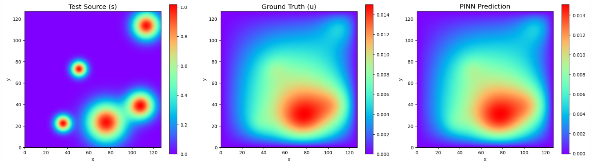
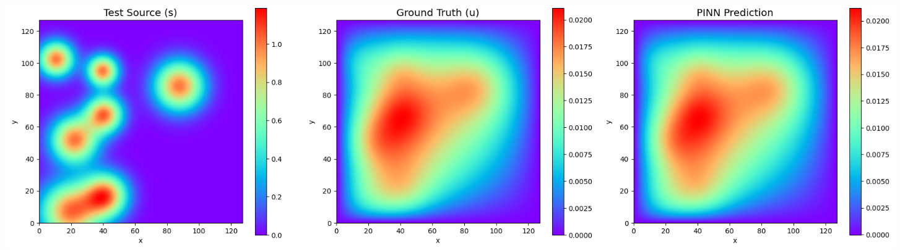

### Todo
- [x] Make Tikhonov Regularization a trainable parameter
- [x] Try removing params from RFF
- [ ] Try replace direct solve with sketch-and-project 
- [ ] Try old harder dataset

### Daily Report
* **Wednesday** - Change to direct pseudoinverse and change feature extractor network architecture
* **Thursday** - Try different activation functions and try different inputs. Replace old training method for new method that solves for new $w$ every time. Train tik_reg.

## Introduction
Last week, we injected parameters at every layer of the MLP feature generator. Now, we treat the params like the coordinates too, and pass them into the RFF at the very start.
We also were attempting to get a $w$ that works for every sample without recalculation. We did this by solving for $w$ individually and then average them out to get the new $w$ for that epoch. But that did not work well. So this week, we change it so that $w$ is recalculated every pass. So, given a batch of 8 samples, we will have 8 different $A$ matrices and 8 different $b$ target vectors (the source $s$). Then, we concat all of them into an A matrix and solve it directly with pseudoinverse, meaning we vertically stack the matrices using only the 1,000 sampled spatial points per sample. However this might OOM on bigger datasets, so we can just do the gram assembly first then feed it into jax to direct solve.

#### Random Fourier Features
$v$ is the concatenated input vector:
$$v = \begin{bmatrix} x \\ y \\ p \end{bmatrix} \in \mathbb{R}^{2 + |p|}$$

$B$ is the random projection matrix sampled from a normal distribution with variance $\sigma^2$, where $M$ is the number of frequencies:
$$B \sim \mathcal{N}(0, \sigma^2)^{(2 + |p|) \times M}$$
 
The RFF projection, $h_0$, is computed as:
$$h_0 = \begin{bmatrix} \sin(2\pi B^T v) \\ \cos(2\pi B^T v) \end{bmatrix} \in \mathbb{R}^{2M}$$

So, if we have `M = 256`, we would have $2 \times 256 = 512$ features.

**In addition, we concat the outputs of each layer of the MLP to the resulting features. Moreover, we also add a skip connection from the input of the MLP to the output of the MLP.**
 This is the result:
RFF: $M = 256$ frequencies $\rightarrow$ $512$ RFF nodes
MLP: $4$ hidden layers of $128$ nodes $\rightarrow$ $512$ MLP nodes
Total Features for Solver: $1024$

This makes it so that we have equal features from RFF and MLP.

**The correct method**
$w$ is no longer something we train, but the analytical solution calculated on the fly. It does not update. It is just the answer of the for $w = (A^T A + \lambda I)^{-1} A^T b$. In this setup we are training the MLP to generate the perfect features such that the direct solver can calculate the  (the 1,024 features). For evaluation, we solve for a brand new $w$ specifically for the validation samples to test if the MLP's output features are actually good.
To plot the results, we pull the specific sample and its parameters, solve for $w$ with a small chunk of coordinates, then push the entire $128 \times 128$ grid through your MLP to get the 1,024 features for the whole sample. Then we just do the final dot product with the solved $w$ to get the final $u_{\text{pred}}$ values.

#### Training Tiknov Regularization parameter
1. We register the lambda parameter inside the feature extractor.
2. We shift the matrix solve inside the loss function (eval_loss) so JAX can track the gradients through the matrix inversion.
3. We add a bound to the possible value of the regularization parameter $[10^{-5}, 10^1]$ with `reg = 10**(nn.tanh(raw_lambda)* 3 - 2)`. 

**Case 1: Initialize raw_lambda to start at 1**
Result: tik_reg keeps dropping to around 1e-05.

**Case 2: Initialize raw_lambda to start at -3 => tik_reg = 1e-5**
Result: tik_reg says at 1e-05, not much changes not that sensitive.

The idea is that we train the parameter based on u_sim (and loss from pde and boundary) for a small portion / small dataset, then once we find a general / decent number, we can just use that value for the rest of the training and we can remove / comment out the code that keeps updating the tik_reg because sometimes we won't have the underlying u_sim to compare for training tik_reg because we want to predict u_sim to begin with. 

A more complex way is alternating optimization where one loop gives pde and bc loss to update weights and the other loop gives u_sim to compare with pred to update tik_reg so there is no data leak (u_sim loss to update weights). But we shall not implement this for now because 1e-5 is working well. For now, the tik is being updated only to minimize pde residual (although it barely moves as we initialize it to start at tik_reg = 1e-5, so its just kind of for show) and we never include the u_sim loss.

## Results
#### Wednesday
With direct pseudoinverse, coordinates + params -> RFF, tik_reg = $1^{-5}$
```
epochs = 5
batch_size = 1024
M = 256
chunk_size = 256
hidden_layers = [128, 128, 128, 128] 
total_features = (2 * M) + sum(hidden_layers) # 512 + 512 = 1024
``` 
Epoch 001 | Train Loss (PDE+BC): 1.5005e-03 | Validation MSE: 1.4644e-08
Epoch 002 | Train Loss (PDE+BC): 1.0846e-03 | Validation MSE: 1.2996e-08
Epoch 003 | Train Loss (PDE+BC): 9.0306e-04 | Validation MSE: 1.1469e-08
Epoch 004 | Train Loss (PDE+BC): 7.8764e-04 | Validation MSE: 1.1302e-08
Epoch 005 | Train Loss (PDE+BC): 7.1406e-04 | Validation MSE: 1.1018e-08



#### Thursday
*With sin activation function*
Epoch 001 | Train Loss (PDE+BC): 1.2943e-03 | Validation MSE: 1.5248e-08
Epoch 002 | Train Loss (PDE+BC): 1.0168e-03 | Validation MSE: 1.4246e-08
Epoch 003 | Train Loss (PDE+BC): 8.7439e-04 | Validation MSE: 1.2832e-08
Epoch 004 | Train Loss (PDE+BC): 7.8396e-04 | Validation MSE: 1.2767e-08
Epoch 005 | Train Loss (PDE+BC): 7.2586e-04 | Validation MSE: 1.1796e-08

*With sinh activation function*
All Epochs | Train Loss (PDE+BC): nan | Validation MSE: nan

*With trainable tik_reg*
Epoch 1/5: 100%
 2455/2455 [27:31<00:00,  1.50it/s]
Epoch 001 | Train Loss: 1.7818e-03 | Val MSE: 1.9319e-08 | TikReg: 2.45e-03
Epoch 2/5: 100%
 2455/2455 [28:28<00:00,  1.40it/s]
Epoch 002 | Train Loss: 1.2434e-03 | Val MSE: 1.6392e-08 | TikReg: 7.63e-04
Epoch 3/5: 100%
 2455/2455 [26:32<00:00,  1.52it/s]
Epoch 003 | Train Loss: 1.0010e-03 | Val MSE: 1.4047e-08 | TikReg: 2.84e-04
Epoch 4/5: 100%
 2455/2455 [26:50<00:00,  1.52it/s]
Epoch 004 | Train Loss: 8.5176e-04 | Val MSE: 1.2983e-08 | TikReg: 1.26e-04
Epoch 5/5: 100%
 2455/2455 [27:41<00:00,  1.62it/s]
Epoch 005 | Train Loss: 7.6069e-04 | Val MSE: 1.1977e-08 | TikReg: 6.59e-05

*Without adding params completely*

Epoch 001 | Train Loss: 2.8265e-02 | Val MSE: 1.0272e-05 | TikReg: 1.03e-05
**MSE increased from e-08 to e-05 but the plots still look perfect**

