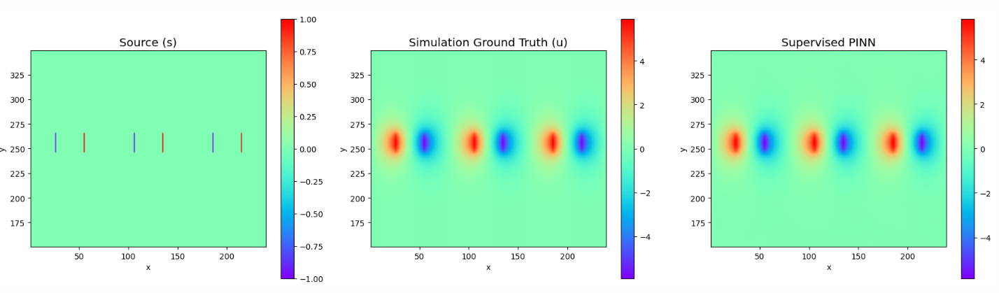
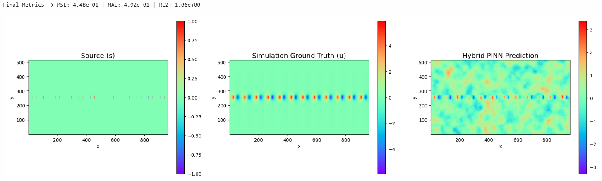
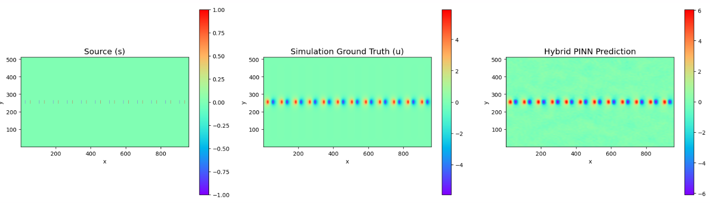

### Todo
- [ ] Increase size of matrix in both dimensions for testing for Poisson Gauss
- [ ] Try T10 dataset
- [ ] Try multiple equations in same model if have time

### Daily Report
* **Wednesday** - Test RFF+MLP to replace T20 Dataset
* **Thursday** - Change 8 sample 1 w to 8 samples 8 w with vmap, fix sketch and project loops

### Training Notes 
use `watch -n 0.5 free -h` to check live System RAM usage
use `watch -n 0.5 nvidia-smi` to check live GPU VRAM usage and set `XLA_PYTHON_CLIENT_PREALLOCATE='false'`

When training, we typically have the setup where 1 linear weight corresponds to 1 sample. Don't combine 8 samples to use 1 linear weight even though it works right now. Also, the point of picking the same set of coordinates for 1 minibatch is so that we can make use of `vmap`. Moreover, we can make use of the simulation data for training, because it is not always provided anyway. If we have a dataset with some simulation training data, we can have the loss function for those samples to include the simulation training data while those that do not have sim data we do not include that into the loss function for those samples. To do that, we can have separate sampling pools like how we did it with the boundary conditions. In the training loop, we sample a batch from the pools independently. 

#### Grid resolution versus Grid Size
For Poisson-Gauss, they mention: We consider the Poisson equation, $-\Delta u = f$, in $(0,1)^2$. This means the simulation physically takes place inside a 2D square where the $x$-axis goes from 0.0 to 1.0, and the $y$-axis goes from 0.0 to 1.0. The $128 \times 128$ is grid resolution. This is why we can just generate coordinates using linspace from 0 to 1. However, for the T20_S30_G50 dataset, the simulation takes place inside 2D square of 512x960, so must normalize the coordinates normally instead, and we do this inside feature extractor. 
v
#### data_T20_S30_G50_reduced
We perfectly replicate the simulation by training on the simulation loss to tune the value for sigma and tikreg. Then we can use those values to train with physics loss.

Dataset is stable around sigma = 2.0 to sigma = 3.0. (using 2.8931)
Tik Reg is stable somewhere below 1e-5 (using 7.90e-06)
Cannot remove / 100 from A_pde and s_pde, / 100 is to scale down the weight of pde so that boundary conditions have non negligible weightage in the loss function, unrelated to the normalization done inside getf

*Note:* Previously in week 2, we OOM because we evaluated for all the points and took the laplacian, that cannot be stored on the GPU so we shift that data out. But now, since we are calculating with samples of coordinates every time, we do not have this problem. The problem is scaling up features.

## Results
#### Wednesday
*With only physics loss, using full grid in 1 pass*
Epoch 395 | Physics Loss: 1.7611e-07
MSE: 1.03e-01 | MAE: 2.43e-01 | RL2: 3.16e-01

*With physics loss + sim loss, using full grid in 1 pass*
Obviously, training with simulation data, the results are perfect, but we are just testing the code.
Epoch 390 | Total Loss: 3.3347e-04 | Data Loss: 3.3318e-04 | PDE Loss: 8.2799e-08
MSE: 5.39e-04 | MAE: 1.79e-02 | RL2: 2.29e-02

**Uncropped**
Previously we sample all the coordinates once for 1 epoch. Now, we sample 2000 random coordinates, but we ensure 50% of them are source coordinates. There are 480 active source pixels out of 491520. This is because random sampling often leads to sampling no sources, giving PDE loss of 0.0000e+00. For now, we take all 480 sources every pass, but if sources increase, we can randomly sample, because now we run out of source points if we random sample without replacement.

*With only physics loss, with sampling of 2000 points (all source points + 1520 non source points) in each epoch, with direct solve*
Epoch 2950 | Total: 2.0690e-08 | Data: 2.2412e+00 | PDE: 1.8213e-08 | Tik: 6.35e-05
Final Metrics -> MSE: 4.48e-01 | MAE: 4.92e-01 | RL2: 1.06e+00

*With physics loss + sim loss, with sampling of 2000 points (all source points + 1520 non source points) in each epoch, with direct solve*
Epoch 1950 | Total: 4.2599e-02 | Data: 4.2579e-02 | PDE: 1.9335e-05 | Tik: 1.65e-04

#### Thursday
Results were accurate after changing the setup
Although it was quite weird as one of the run the code took 2h30min to run while the other took 17min even though nothing was changed... not sure why.
Epoch 001 | Train Loss: 3.6106e-02 | Val MSE: 1.9592e-05 | TikReg: 1.03e-05