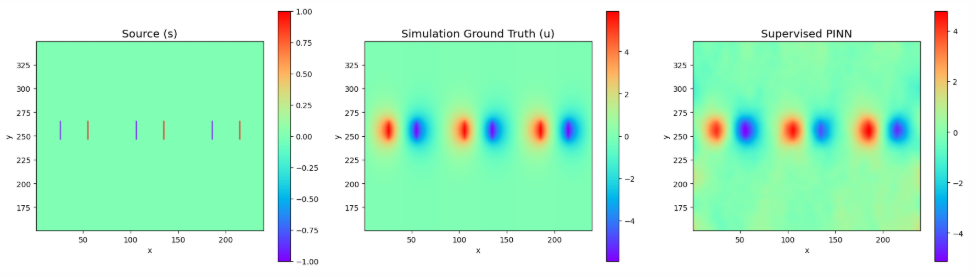

### Todo
- [ ] Try sampling
- [ ] Try sketch-and-project
- [ ] Try everything on non-reduced if previous stuff works

Original Sample Code
/ 100 is to scale down the weight of pde so that boundary conditions have non negligible weightage in the loss function, unrelated to the normalization
normalization is done inside getf

Initial problems?
Setting tik_reg too high at 1e-4, 1e-5 is better?

### Training Notes 
use `watch -n 0.5 free -h` to check live System RAM usage
use `watch -n 0.5 nvidia-smi` to check live GPU VRAM usage and set `XLA_PYTHON_CLIENT_PREALLOCATE='false'`

#### data_T20_S30_G50_reduced
We perfectly replicate the simulation by training on the simulation loss to tune the value for sigma and tikreg. Then we can use those values to train with physics loss.

Cannot remove / 100 from A_pde and s_pde
Dataset is stable around sigma = 2.0 to sigma = 3.0. (using 2.8931)
Tik Reg is stable somewhere below 1e-5 (using 7.90e-06)

## Results
#### Wednesday
Epoch 395 | Physics Loss: 1.7611e-07
Final Metrics -> MSE: 1.03e-01 | MAE: 2.43e-01 | RL2: 3.16e-01

