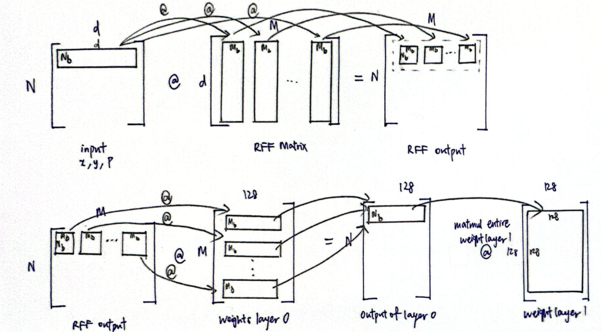
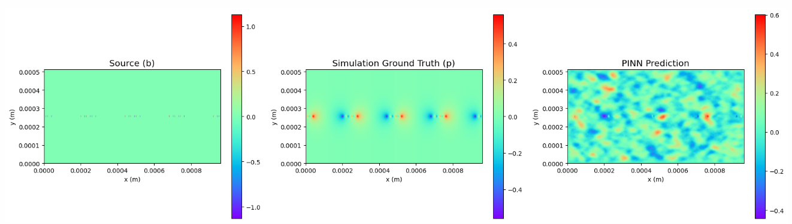
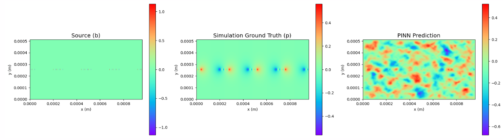
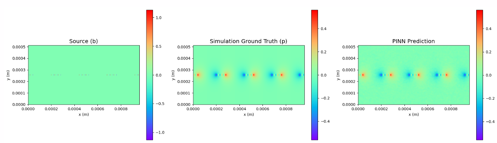
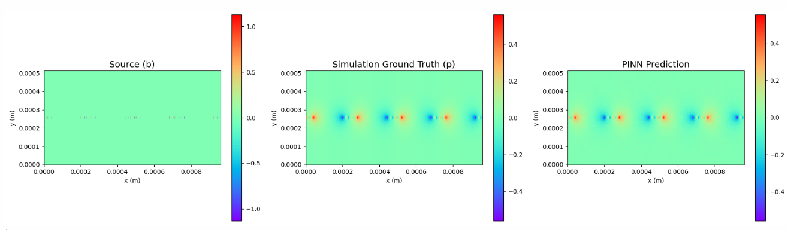
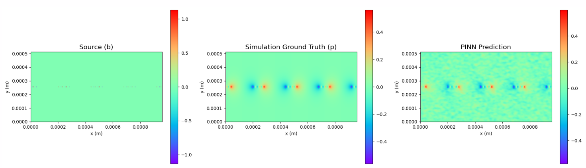

### Daily Report
* **Wednesday** - Confirm m chunking details, explore and make sense of T10 dataset
* **Thursday** - Run T10 dataset, rubbish results
* **Friday** - Try to get results to make sense, solve for single sample instead of the entire dataset
* **Monday** - Get good results, but not sure if adding $A_sim$ is considered cheating
* **Tuesday** - Remove sim data from linear solve and increase features and modify parameters

### Clarification $m$ chunking
To ensure the $N_b \times M$ matrix does not materialize:

Sketch-and-project uses $N_b$ for the linear weights update. Once we use all $N$ rows, it is considered 1 sweep. 

The method here fixes the scaling of $M$ for RFF but does not fix the scaling of the hidden nodes in each weight layer. When we want to scale the weights layer so that it is a good ratio to M, we do so carefully and slowly so that memory is enough, though too deep may have vanishing gradients and too wide may cause OOM. For now, if we remove the adding of the params, we should have plenty of memory and probably do not even need the above m chunking.

### T_10 Dataset
For an incompressible fluid, the velocity field must satisfy: $\nabla \cdot \mathbf{u} = 0$. To advance the simulation by one time step ($\Delta t$), we look at the momentum equations while temporarily omitting the pressure gradient term. This yields an intermediate velocity field $\mathbf{u}^*$. Because the stabilizing pressure term was excluded from the predictor step, $\mathbf{u}^*$ generally violates the continuity equation ($\nabla \cdot \mathbf{u}^* \neq 0$). To enforce incompressibility, we solve the Pressure Poisson Equation: $\nabla^2 p = \frac{\rho}{\Delta t} \nabla \cdot \mathbf{u}^*$. The right-hand side serves as the source term ($b = \frac{\rho}{\Delta t} \nabla \cdot \mathbf{u}^*$). It quantifies the exact magnitude of the divergence error. By solving this equation, we compute a pressure field ($p$) whose $\nabla^2$ counteracts this error. The computed pressure gradient ($\nabla p$) is applied to correct the intermediate velocity field. We get a true velocity field ($\mathbf{u}$) that satisfies $\nabla \cdot \mathbf{u} = 0$. The simulation can then safely proceed to the next time step.

**Data for insights in and outside obstacles**
Sample 1 Total solid cells: 3600
Max pressure in solid: 4.7054e-01
Min pressure in solid: -4.7054e-01
Mean absolute pressure in solid: 1.8351e-01
Solid cells with |p| > 1e-08: 3600 / 3600

--- Poisson Equation Residual Analysis ---
Mean residual in Fluid (eta=0): 8.4550e+04
Mean residual in Solid (eta=1): 2.0357e+03
Max residual in Fluid (eta=0):  1.3186e+05
Max residual in Solid (eta=1):  3.6641e+03

This means pressure is not 0 inside obstacles but the Poisson equation is still enforced inside the obstacle.

**Flow of data**
We use $b$ to solve for $w$ so we can make a prediction. We compute $\nabla^2 f(x, y)$ using the network then solve $Aw = b$ to get $w$. Then we make the pressure prediction: $p_{pred} = f(x, y) \cdot w$.

**The Loss Function**
We use the simulation data ($p_{sim}$), the source ($b$), and the physical boundaries (the 4 outer walls) to penalize the neural network. We are not using the internal mask ($\eta$) to force $p=0$, as the supervised data should ideally handle the internal ghost cell pressures natively. 

$Loss_{sim} = \text{Mean}((p_{pred} - p_{sim})^2)$: We want the prediction to perfectly match the ground truth across the entire grid. By evaluating this everywhere, we let the network naturally learn the non-zero pressures inside the obstacles.
$Loss_{pde} = \text{Mean}((\nabla^2 p_{pred} - b)^2)$: We want the Laplacian of our predicted basis functions to equal the physical source. We apply this loss to all sampled points, regardless of whether they are fluid or solid.
$Loss_{walls} = \text{Mean}(p_{pred}(x_{walls}, y_{walls})^2)$: We have Dirichlet boundary condition ($p = 0$) on the coordinates for the four outer perimeter walls.
$Loss_{obs\_neumann} = \text{Mean}\left(\left(\nabla p_{pred} \cdot \mathbf{\hat{n}}\right)^2\right)$: Neumann boundary condition for obstacles. We sample just the specific coordinates where the fluid contacts the obstacles

$\nabla^2 p = b$. If $b$ is on the order of $10^{11}$, and $\Delta x, \Delta y$ are on the order of $10^{-6}$, then:$$\frac{p_{i+1} - 2p_i + p_{i-1}}{(\Delta x)^2} = b$$ 
Substitute the physical scales: $\frac{0.4}{(10^{-6})^2} = \frac{0.4}{10^{-12}} = 0.4 \times 10^{12} \approx 10^{11}$. The reason the ground truth pressure is $0.4$ is precisely because the coordinates are $10^{-6}$.

### Adding $A_{sim}$
Because we already use the simulation data in the loss function, we probably can also add it to the linear solve $Aw = b$.

For points $(x_i, y_i)$, the corresponding row in $A_{sim}$ contains the raw outputs of the MLP (no derivatives)
$$Row_{sim} = \begin{bmatrix} f_1(x_i, y_i) & f_2(x_i, y_i) & \dots & f_{1024}(x_i, y_i) \end{bmatrix}$$

When the solver multiplies this row by the weight vector $w$, it sets it equal to the corresponding row in $b_{sim}$, which is the ground truth simulation data $p_{sim}(x_i, y_i)$:
$$w_1 f_1 + w_2 f_2 + \dots + w_{1024} f_{1024} = p_{sim}(x_i, y_i)$$

## Results
### Friday
self.param('raw_tik', nn.initializers.constant(-4.0), (1,))
sigma = 7.0 
W_PDE = 1
W_WALL = 100.0
W_SIFTER = 1.0 
epochs = 3000
chunk_size = 256
spatial_batch_size = 2000
wall_batch_size = 400
sifter_batch_size = 200

Epoch 2900 | Tot: 1.57e-02 | Sim: 1.52e-02 | PDE: 4.08e-04 | Wall: 3.30e-09 | Sift: 3.16e-05 | Tik: 8.23e-04
Final Single Sample Metrics -> MSE: 1.17e-02 | MAE: 8.49e-02 | RL2: 2.19e+00

*2600 sample points 1024 features, sigma 7, no important area sampling points, sample all sources*
Epoch 0000 | Tot: 2.46e+00 | Sim: 2.36e+00 | PDE: 8.60e-02 | Wall: 3.72e-07 | Sift: 6.98e-03 | Tik: 1.00e-04
Epoch 1000 | Tot: 8.99e-02 | Sim: 8.76e-02 | PDE: 2.12e-03 | Wall: 2.39e-08 | Sift: 1.83e-04 | Tik: 3.41e-04
Epoch 2000 | Tot: 3.34e-02 | Sim: 3.27e-02 | PDE: 6.07e-04 | Wall: 6.64e-09 | Sift: 7.04e-05 | Tik: 5.34e-04
Epoch 2900 | Tot: 1.57e-02 | Sim: 1.52e-02 | PDE: 4.08e-04 | Wall: 3.30e-09 | Sift: 3.16e-05 | Tik: 8.23e-04

### Monday
 

*2600 sample points 1024 features, sigma 7, 300 important area sampling points, sample all sources*
Epoch 0000 | Tot: 3.82e+00 | Sim: 3.73e+00 | PDE: 9.14e-02 | Wall: 3.80e-07 | Sift: 6.86e-03 | Tik: 1.00e-04
Epoch 1000 | Tot: 2.43e-01 | Sim: 2.37e-01 | PDE: 5.82e-03 | Wall: 5.25e-08 | Sift: 3.92e-04 | Tik: 1.00e-04
Epoch 2000 | Tot: 7.85e-02 | Sim: 7.71e-02 | PDE: 1.29e-03 | Wall: 9.98e-09 | Sift: 7.84e-05 | Tik: 1.00e-04
Epoch 2900 | Tot: 3.92e-02 | Sim: 3.83e-02 | PDE: 8.58e-04 | Wall: 7.10e-09 | Sift: 4.92e-05 | Tik: 1.00e-04

 

*2600 sample points 1024 features, sigma 7, 300 important area sampling points, sample all sources and inject Asim*
Epoch 0000 | Tot: 1.43e-01 | Sim: 3.53e-03 | PDE: 1.39e-01 | Wall: 8.60e-06 | Sift: 4.29e-04 | Tik: 1.00e-04
Epoch 1000 | Tot: 3.87e-04 | Sim: 2.52e-05 | PDE: 3.43e-04 | Wall: 5.38e-08 | Sift: 1.88e-05 | Tik: 1.00e-04
Epoch 2000 | Tot: 1.48e-04 | Sim: 7.44e-06 | PDE: 1.26e-04 | Wall: 3.20e-08 | Sift: 1.42e-05 | Tik: 1.00e-04
Epoch 2900 | Tot: 5.07e-04 | Sim: 3.84e-05 | PDE: 4.53e-04 | Wall: 1.07e-07 | Sift: 1.49e-05 | Tik: 1.00e-04
Final Single Sample Metrics -> MSE: 6.97e-05 | MAE: 6.54e-03 | RL2: 1.68e-01

 

*2600 sample points 1024 features, sigma 7, no important area sampling points, sample all sources and inject Asim*
Epoch 0000 | Tot: 1.43e-01 | Sim: 3.64e-03 | PDE: 1.38e-01 | Wall: 7.92e-06 | Sift: 5.31e-04 | Tik: 1.00e-04
Epoch 1000 | Tot: 4.01e-04 | Sim: 3.11e-05 | PDE: 3.53e-04 | Wall: 6.84e-08 | Sift: 1.56e-05 | Tik: 1.00e-04
Epoch 2000 | Tot: 2.12e-04 | Sim: 1.26e-05 | PDE: 1.86e-04 | Wall: 4.46e-08 | Sift: 1.34e-05 | Tik: 1.00e-04
Epoch 2900 | Tot: 1.46e-04 | Sim: 1.27e-05 | PDE: 1.19e-04 | Wall: 2.96e-08 | Sift: 1.36e-05 | Tik: 1.00e-04
Final Single Sample Metrics -> MSE: 2.17e-05 | MAE: 3.46e-03 | RL2: 9.40e-02

### Tuesday
*2600 sample points 4096 features, sigma 7, no important area sampling points, sample all sources and no Asim*
 

Epoch 0000 | Tot: 1.37e+00 | Sim: 1.37e+00 | PDE: 2.83e-12 | Wall: 1.42e-17 | Sift: 6.09e-10 | Tik: 1.00e-04
Epoch 1000 | Tot: 3.80e-03 | Sim: 3.80e-03 | PDE: 8.47e-15 | Wall: 7.74e-20 | Sift: 9.18e-13 | Tik: 1.00e-04
Epoch 2000 | Tot: 1.86e-03 | Sim: 1.86e-03 | PDE: 4.25e-15 | Wall: 5.55e-20 | Sift: 3.41e-13 | Tik: 1.00e-04
Epoch 2900 | Tot: 9.63e-04 | Sim: 9.63e-04 | PDE: 2.68e-15 | Wall: 9.78e-20 | Sift: 4.73e-13 | Tik: 1.00e-04
Final Single Sample Metrics -> MSE: 1.13e-03 | MAE: 2.66e-02 | RL2: 6.78e-01

However, in this example, the number of points sampled is less than the number of features, hence it is underdetermined and probably why the losses appear to be too good. With 4096 weights to solve only 2000+ points, it can just memorize.

**Below, we try with more points sampled and we see that if its overdetermined the results no longer become good.**

*6600 sample points 4096 features, sigma 7, no important area sampling points, sample all sources and no Asim*
Epoch 0000 | Tot: 3.71e+01 | Sim: 3.70e+01 | PDE: 1.40e-02 | Wall: 8.49e-08 | Sift: 8.19e-03 | Tik: 1.00e-04
Epoch 1000 | Tot: 1.54e+01 | Sim: 1.54e+01 | PDE: 7.19e-03 | Wall: 4.44e-08 | Sift: 3.65e-03 | Tik: 1.00e-04
Epoch 2000 | Tot: 5.17e+01 | Sim: 5.17e+01 | PDE: 1.30e-02 | Wall: 8.91e-08 | Sift: 6.39e-03 | Tik: 1.00e-04