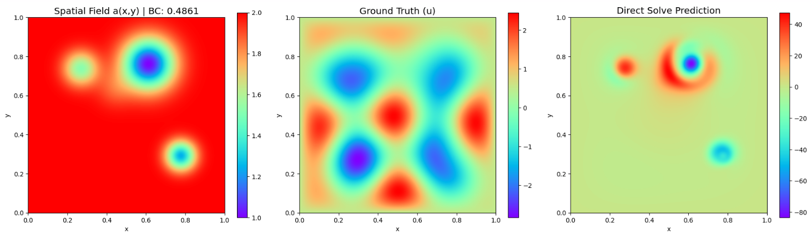
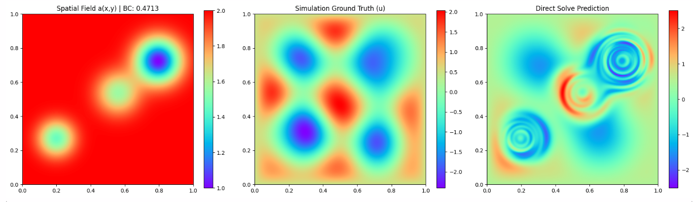
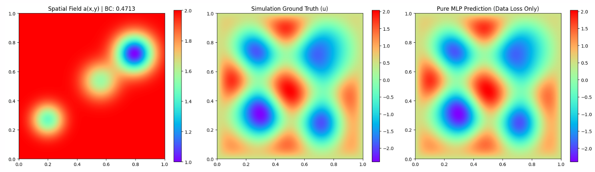
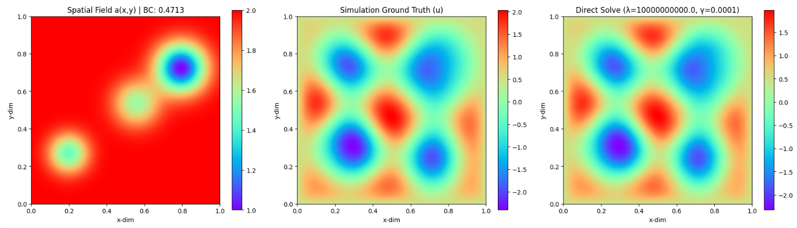
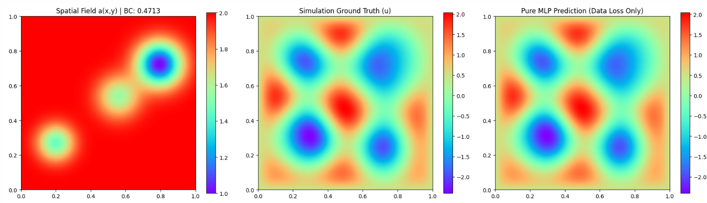
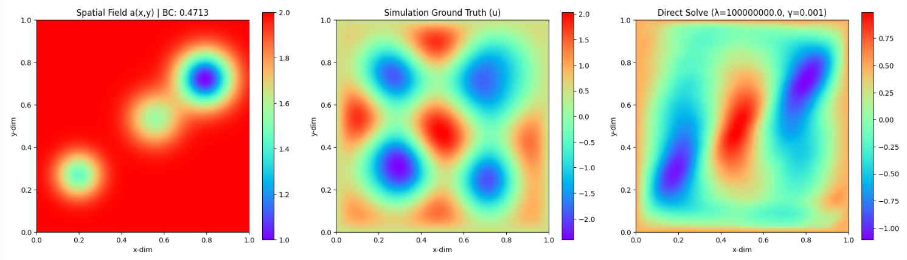
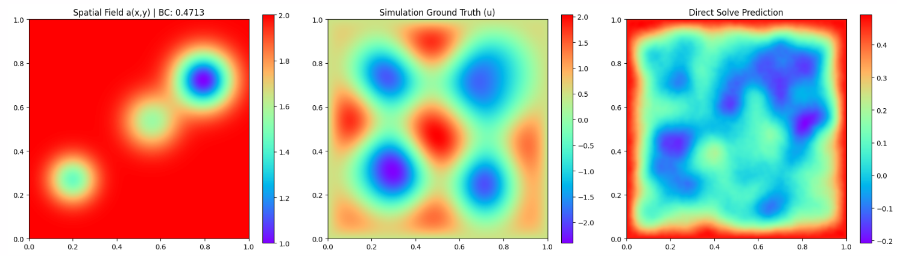
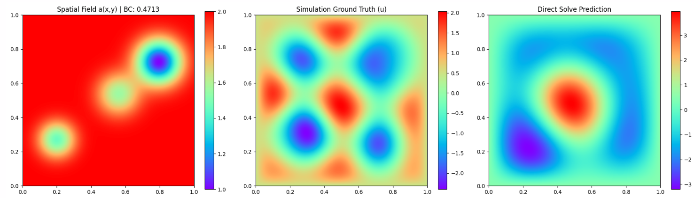
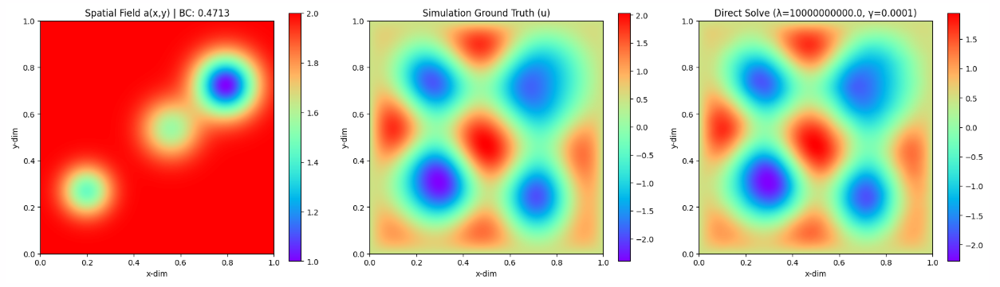
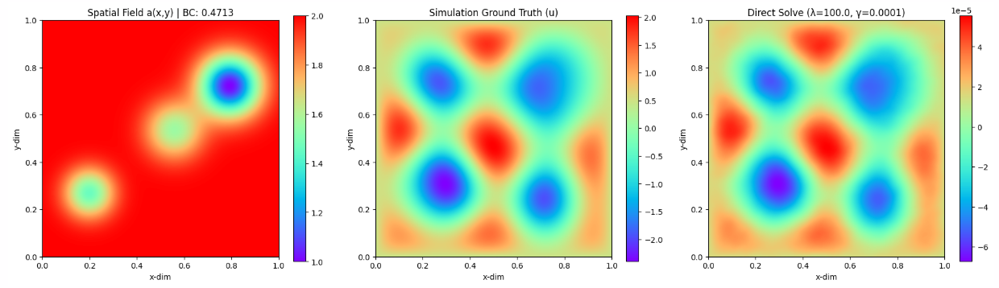

### Todo
- [ ] Try multiple equations in same model, solve individual sample first to ensure its working

### Daily Report
* **Wednesday** - Understand the helmholtz equation. Try get it working, network output same general result for all samples
* **Thursday** - Try on 1 sample. Try to find reason for bad results.
* **Friday/Saturday/Sunday** - Try to use diagnostic info to improve results.
* **Monday** - Try to find the problems

### Helmholtz Dataset
Paper: https://arxiv.org/pdf/2405.19101

The H5 file has **19675** variables called *Sample_i* where i is the sample number. Every sample has three sub-groups:
*a* with dimensionality
  - 128 (x-dim)
  - 128 (y-dim)

*bc* (the value of the Dirichlet boundary condition, a float), 

*u* with dimensionality
  - 128 (x-dim)
  - 128 (y-dim)

Train-test-split: 19035/128/512 trajectories

Helmholtz equation we are solving: $$-\Delta u - \omega^2 a(x, y)u = 0$$ and Dirichlet boundary conditions: $$u(x, y) = b, \quad x, y \in \partial D$$

where $\omega = 5\pi/2$ is the frequency, $D = (0, 1)^2$ is the domain, $a$ is the spatial dependent function that defines properties of the medium of the wave propagation and $b$ is the fixed value of the solution $u$ at the boundary $\partial D$.

$b \sim \mathcal{U}_{[0.25, 0.5]}$
$u$ (The Solution): Amplitude of the wave at any given point $(x, y)$.
$a(x, y)$: Represents the physical properties of the space the wave is traveling through. Note: for the dataset generated, there is a $+1$ shift to the field after normalizing it, so it ranges from $1.0$ to $2.0$.

#### $a(x,y)$ generation
The function $a$ is defined as a sum of random number of Gaussians and is generated in several steps. First, an integer $n$ is drawn from $[2, 7]$ uniformly at random, representing the number of Gaussians that will be randomly generated. For $1 \le i \le n$, it holds that $A_i \sim \mathcal{U}_{[0.5, 10.0]}$ and $\sigma_i \sim \mathcal{U}_{[0.05, 0.1]}$. Additionally, two numbers $x_i, y_i$ that represent x and y coordinates of the Gaussians are generated such that $x_i, y_i \sim \mathcal{U}_{[0.2, 0.8]}$. The unnormalized function $\bar{a}$ is obtained by

$$\bar{a}(x, y) = - \sum_{i=1}^n A_i \exp \left( - \frac{(x_i - x)^2 + (y_i - y)^2}{2\sigma_i^2} \right), \quad x, y \in (0, 1).$$

Function $a$ is obtained by normalizing $\bar{a}$, i.e.

$$a(x, y) = \frac{\bar{a} - \min(\bar{a})}{\max(\bar{a}) - \min(\bar{a})}.$$

The solution operator maps the tuple $(a, b)$ to the solution $u$. This problem is a *steady-state* problem. Trajectories are generated by a finite-difference method at $128^2$ resolution.

## Results
### Wednesday
**Across all samples**
Epoch 001 | Train Loss: 1.7087e-02 | Val MSE: 1.1551e+00 | TikReg: 1.03e-05

**Increasing number of points sampled to 4000 did not change anything:**
Epoch 001 | Train Loss: 3.2675e-02 | Val MSE: 1.1552e+00 | TikReg: 1.03e-05
**Increase features and change from tanh to sin did nothing**
**Add simulation loss into loss function did nothing too:**
Epoch 001 | Train Loss: 1.2106e+04 | Val MSE: 1.1554e+00 | TikReg: 1.03e-05

**Add a(x,y) into RFF**

### Thursday
**Helmholtz Across single sample**
Even on a single sample, the results are the same. The network just gives the same or similar results for any sample. Even though PDE loss is sitting at 0.0000 and the BC loss is 0.0002, the data loss is very large.

**Sanity Check:  RFF+MLP and Linear layer with pde and bc loss**

### Friday
We freeze the weights for the MLP for the model which we trained with only data loss and pseudoinverse to solve the matrix for a single case

Note: we take square root of the scaling factor to multiply the bc loss, and when we report, we report the unscaled values. The total loss reported is scaled. For reference, the poisson gauss dataset scaling factor for bc loss is 1e4. Scaling factor applied to both bc loss and the bc matrix.
 
**Data Loss Only: RFF + Basic MLP (512x2 RFF => 256x4 => 256), features for final layer (be it dense / linear): 256 , points sampled: 5000**

*Replace last layer with pseudoinverse*
Finished building matrices! A_pde shape: (5000, 256), A_bc shape: (508, 256) # all boundary points are sampled

Starting Sweep (256 Features + Fixed Math):
bc_scaling_factor: 1.0e+04 | Tik: 1.0e-03 | MSE: 8.12e-01 | PDE: 2.11e+00 | BC: 2.18e-01
bc_scaling_factor: 1.0e+04 | Tik: 1.0e-04 | MSE: 8.12e-01 | PDE: 2.11e+00 | BC: 2.18e-01
bc_scaling_factor: 1.0e+04 | Tik: 1.0e-05 | MSE: 8.12e-01 | PDE: 2.11e+00 | BC: 2.18e-01
bc_scaling_factor: 1.0e+04 | Tik: 1.0e-06 | MSE: 8.12e-01 | PDE: 2.11e+00 | BC: 2.18e-01
bc_scaling_factor: 1.0e+06 | Tik: 1.0e-03 | MSE: 2.63e-01 | PDE: 5.61e+03 | BC: 5.90e-02
bc_scaling_factor: 1.0e+06 | Tik: 1.0e-04 | MSE: 2.63e-01 | PDE: 5.61e+03 | BC: 5.90e-02
bc_scaling_factor: 1.0e+06 | Tik: 1.0e-05 | MSE: 2.63e-01 | PDE: 5.61e+03 | BC: 5.90e-02
bc_scaling_factor: 1.0e+06 | Tik: 1.0e-06 | MSE: 2.63e-01 | PDE: 5.61e+03 | BC: 5.90e-02
bc_scaling_factor: 1.0e+08 | Tik: 1.0e-03 | MSE: 5.83e-03 | PDE: 2.45e+04 | BC: 8.80e-05
bc_scaling_factor: 1.0e+08 | Tik: 1.0e-04 | MSE: 5.83e-03 | PDE: 2.45e+04 | BC: 8.80e-05
bc_scaling_factor: 1.0e+08 | Tik: 1.0e-05 | MSE: 5.83e-03 | PDE: 2.45e+04 | BC: 8.80e-05
bc_scaling_factor: 1.0e+08 | Tik: 1.0e-06 | MSE: 5.83e-03 | PDE: 2.45e+04 | BC: 8.80e-05
bc_scaling_factor: 1.0e+10 | Tik: 1.0e-03 | MSE: 7.46e-04 | PDE: 2.78e+04 | BC: 3.78e-06
bc_scaling_factor: 1.0e+10 | Tik: 1.0e-04 | MSE: 7.46e-04 | PDE: 2.78e+04 | BC: 3.78e-06
bc_scaling_factor: 1.0e+10 | Tik: 1.0e-05 | MSE: 7.46e-04 | PDE: 2.78e+04 | BC: 3.78e-06
bc_scaling_factor: 1.0e+10 | Tik: 1.0e-06 | MSE: 7.46e-04 | PDE: 2.78e+04 | BC: 3.78e-06
bc_scaling_factor: 1.0e+12 | Tik: 1.0e-03 | MSE: 3.16e-03 | PDE: 4.85e+04 | BC: 2.25e-06
bc_scaling_factor: 1.0e+12 | Tik: 1.0e-04 | MSE: 3.16e-03 | PDE: 4.85e+04 | BC: 2.25e-06
bc_scaling_factor: 1.0e+12 | Tik: 1.0e-05 | MSE: 3.16e-03 | PDE: 4.85e+04 | BC: 2.25e-06
bc_scaling_factor: 1.0e+12 | Tik: 1.0e-06 | MSE: 3.16e-03 | PDE: 4.85e+04 | BC: 2.25e-06
BEST FOUND: bc_scaling_factor = 10000000000.0, TikReg = 0.0001
BEST MSE  = 7.4564e-04

**Data Loss Only: RFF + MLP (concat output of layers and skip connection: 512x2 RFF + 256x4 => 256), features for final layer (be it dense / linear): 2048, points sampled: 5000**

*Replace last layer with pseudoinverse*
Finished building matrices! A_pde shape: (5000, 2048), A_bc shape: (508, 2048)

bc_scaling_factor: 1.0e+04 | Tik: 1.0e-03 | MSE: 6.62e-01 | PDE: 5.16e+00 | BC: 1.94e-02
bc_scaling_factor: 1.0e+04 | Tik: 1.0e-04 | MSE: 6.61e-01 | PDE: 5.19e+00 | BC: 1.93e-02
bc_scaling_factor: 1.0e+04 | Tik: 1.0e-05 | MSE: 6.61e-01 | PDE: 5.20e+00 | BC: 1.92e-02
bc_scaling_factor: 1.0e+04 | Tik: 1.0e-06 | MSE: nan | PDE: nan | BC: nan
bc_scaling_factor: 1.0e+06 | Tik: 1.0e-03 | MSE: 6.16e-01 | PDE: 1.59e+02 | BC: 2.95e-04
bc_scaling_factor: 1.0e+06 | Tik: 1.0e-04 | MSE: 6.16e-01 | PDE: 1.57e+02 | BC: 2.84e-04
bc_scaling_factor: 1.0e+06 | Tik: 1.0e-05 | MSE: 6.15e-01 | PDE: 1.54e+02 | BC: 2.71e-04
bc_scaling_factor: 1.0e+06 | Tik: 1.0e-06 | MSE: nan | PDE: nan | BC: nan
bc_scaling_factor: 1.0e+08 | Tik: 1.0e-03 | MSE: 6.08e-01 | PDE: 2.40e+02 | BC: 5.14e-07
bc_scaling_factor: 1.0e+08 | Tik: 1.0e-04 | MSE: nan | PDE: nan | BC: nan
bc_scaling_factor: 1.0e+08 | Tik: 1.0e-05 | MSE: nan | PDE: nan | BC: nan
bc_scaling_factor: 1.0e+08 | Tik: 1.0e-06 | MSE: nan | PDE: nan | BC: nan
bc_scaling_factor: 1.0e+10 | Tik: 1.0e-03 | MSE: nan | PDE: nan | BC: nan
bc_scaling_factor: 1.0e+10 | Tik: 1.0e-04 | MSE: nan | PDE: nan | BC: nan
bc_scaling_factor: 1.0e+10 | Tik: 1.0e-05 | MSE: nan | PDE: nan | BC: nan
bc_scaling_factor: 1.0e+10 | Tik: 1.0e-06 | MSE: nan | PDE: nan | BC: nan
bc_scaling_factor: 1.0e+12 | Tik: 1.0e-03 | MSE: nan | PDE: nan | BC: nan
bc_scaling_factor: 1.0e+12 | Tik: 1.0e-04 | MSE: nan | PDE: nan | BC: nan
bc_scaling_factor: 1.0e+12 | Tik: 1.0e-05 | MSE: nan | PDE: nan | BC: nan
bc_scaling_factor: 1.0e+12 | Tik: 1.0e-06 | MSE: nan | PDE: nan | BC: nan
BEST FOUND: bc_scaling_factor = 100000000.0, TikReg = 0.001
BEST MSE  = 6.0803e-01

#### We now try the actual setup without freezing the weights.

**Main Pipeline: RFF + Basic MLP with pseudoinverse, pde + bc + data loss , total nodes: 2048, features linear solve sees: 256, points sampled: 5000**
BC: 1e10
with data loss
Epoch 0 | Total: 6.8102e+06 | PDE: 1.5536e+06 | BC: 5.2567e-04 | Data: 7.2974e-01
Epoch 100 | Total: 7.6069e+04 | PDE: 7.1802e+04 | BC: 4.2660e-07 | Data: 6.9468e-01
Epoch 200 | Total: 3.5361e+04 | PDE: 3.3361e+04 | BC: 1.9993e-07 | Data: 7.2277e-01
Epoch 300 | Total: 1.9648e+04 | PDE: 1.8639e+04 | BC: 1.0083e-07 | Data: 7.0405e-01
Epoch 400 | Total: 1.3637e+04 | PDE: 1.2910e+04 | BC: 7.2621e-08 | Data: 6.8558e-01

without data loss is the same because I think the bc loss is dominating too much. Changing to other configurations dont improve. It just looks like different type of rubbish result.

This one we are trying with no scaling for the loss function but we still scale the rows in the matrix also not much changes.

**Main Pipeline: RFF + MLP (concat output of layers and skip connection) with pseudoinverse, pde + bc + data loss , total features: 2048, points sampled: 5000**
BC:1e10

Epoch 0 | Total: 3.2784e+00 | PDE: 6.5097e-01 | BC: 9.7723e-11 | Data: 1.6502e+00
Epoch 100 | Total: 2.5684e+00 | PDE: 3.4622e-01 | BC: 5.9026e-11 | Data: 1.6320e+00
Epoch 200 | Total: 2.3382e+01 | PDE: 1.5334e+01 | BC: 6.3753e-10 | Data: 1.6726e+00
Epoch 300 | Total: 1.0087e+01 | PDE: 5.2215e+00 | BC: 3.2192e-10 | Data: 1.6464e+00
Epoch 400 | Total: 7.1621e+00 | PDE: 3.4579e+00 | BC: 2.0206e-10 | Data: 1.6835e+00

### Sunday
To check if the code has possible problems, we start with pretrained weights and train the pseudoinverse with data loss. The results were stable and there is no improvement: The pure MLP still gives good results while the concat version gives still give the same bad results.

### Monday
Since the regular mlp works with pure data loss, we check if using pretrained weights and training the model with pseudoinverse but instead using pde and bc loss will make the results turn bad.

We try with different scaling factors. Since we only have 2 variables, we can just adjust the scaling factor for bc.

In this example, with sigma = 3. When bc scaling factor is high (pde scaling factor low), the plot looks something like this:

When bc scaling factor is low (pde in comparision more important), the plot looks something like this, where the scaling bar gives very low values:

Essentially, as scaling factor for bc decreases, the values predicted for each point drops in magnitude.
Fyi, sigma lower than 3 does not train well.
For sigma = 3:
Average Magnitude of Laplacian (Network Derivatives): 1048.02
Average Magnitude of Reaction Term (Omega^2 * a * H): 67.51

least-squares solver is trying to minimize 
PDE Loss: $\|A_{pde} w - 0\|^2$
BC Loss: $\lambda \|A_{bc} w - b_{bc}\|^2$

$$\text{Loss} = \| A_{pde} w - 0 \|^2 + \lambda \| A_{bc} w - b \|^2$$

If bc scaling factor high, then it just ends up with big pde loss. If reduce bc scaling factor, pde loss becomes more significant and solver just bring weights closer to 0 so that the pde calculations get closer to 0.

Checking the backpropagated gradients, it appears that the scaling factor for the bc, even if I change from 1e2 to 1e10, barely makes a difference and is heavily dictated by the bc matrix scaling factor. 

Maybe training on pure data loss the network the network can give correct predictions but it completely dont obey physics.

Poisson Gauss problem was inhomogeneous equation. It need to learn properly and cannot just force weights to go to 0.
Helmholtz is homogeneous equation. The only thing preventing the network from making the linear weights all 0 is the boundary conditions. Since the boundary conditions take up little points/rows, it need to be quite high? Thats why reducing bc scaling factor the pde mse gets better cuz results just become closer to 0.

The sigma right now is 3 and from my checks, this makes the laplacian about approx 1000 while the w^2 u part is around 70. So the network when calculating pde loss the medium a(x,y) is barely being considered. But when drop sigma to like 1 or 0.5 it doesn’t train as good. Might need to get it onto the same magnitude band

Why not fix the boundary condition like this
$$u_{pred}(x,y) = b + d(x,y) \cdot \text{NN}(x,y)$$
$b$ is the boundary value, and $d(x,y)$ is a distance function that equals $0$ on the boundaries

If we plug this $u_{pred}$ into Helmholtz PDE ($-\Delta u - \omega^2 a u = 0$):
$$-\Delta (b + d \cdot \text{NN}) - \omega^2 a (b + d \cdot \text{NN}) = 0$$

Since $\Delta b = 0$. Then,
$$-\Delta (d \cdot \text{NN}) - \omega^2 a (d \cdot \text{NN}) - \omega^2 a b = 0$$

$$-\Delta (d \cdot \text{NN}) - \omega^2 a (d \cdot \text{NN}) = \omega^2 a(x,y) b$$
Then no more homogenous equation.