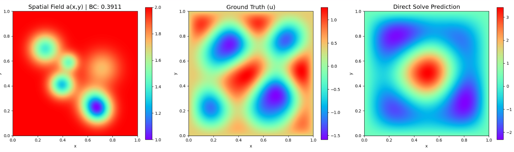

### Todo
- [ ] Try multiple equations in same model, solve individual sample first to ensure its working

### Daily Report
* **Wednesday** - Understand the helmholtz equation.

## Dataset Info
Paper: https://arxiv.org/pdf/2405.19101

### Poisson-Gauss Dataset
The NetCDF file has **two** variables called *solution* with dimensionality
  - 20000 (number of samples)
  - 128 (x-dim)
  - 128 (y-dim)

and *source* with dimensionality:
  - 20000 (number of samples)
  - 128 (x-dim)
  - 128 (y-dim)

$$f(x,y) = \sum_{i=1}^{N} \exp\left(-\frac{(x-\mu_{x,i})^2 + (y-\mu_{y,i})^2}{2\sigma_i^2}\right)$$
$N \sim \text{Geom}(0.4)$: Number of Gaussians
$\mu_{x,i}, \mu_{y,i} \sim U[0, 1]$: The $x$ and $y$ coordinates of each Gaussian. 
$\sigma_i \sim U[0.025, 0.1]$: The spread of the Gaussian

Train-test-split: 19640/120/240 trajectories

### Helmholtz Dataset
The H5 file has **19675** variables called *Sample_i* where i is the sample number. Every sample has three sub-groups:
*a* with dimensionality
  - 128 (x-dim)
  - 128 (y-dim)

*bc* (the value of the Dirichlet boundary condition, a float), 

*u* with dimensionality
  - 128 (x-dim)
  - 128 (y-dim)

Train-test-split: 19035/128/512 trajectories

Helmholtz equation we are solving: $$-\Delta u - \omega^2 a(x, y)u = 0$$ and Dirichlet boundary conditions: $$u(x, y) = b, \quad x, y \in \partial D$$

where $\omega = 5\pi/2$ is the frequency, $D = (0, 1)^2$ is the domain, $a$ is the spatial dependent function that defines properties of the medium of the wave propagation and $b$ is the fixed value of the solution $u$ at the boundary $\partial D$.

$b \sim \mathcal{U}_{[0.25, 0.5]}$
$u$ (The Solution): Amplitude of the wave at any given point $(x, y)$.
$a(x, y)$: Represents the physical properties of the space the wave is traveling through. Note: for the dataset generated, there is a $+1$ shift to the field after normalizing it, so it ranges from $1.0$ to $2.0$.

#### $a(x,y)$ generation
The function $a$ is defined as a sum of random number of Gaussians and is generated in several steps. First, an integer $n$ is drawn from $[2, 7]$ uniformly at random, representing the number of Gaussians that will be randomly generated. For $1 \le i \le n$, it holds that $A_i \sim \mathcal{U}_{[0.5, 10.0]}$ and $\sigma_i \sim \mathcal{U}_{[0.05, 0.1]}$. Additionally, two numbers $x_i, y_i$ that represent x and y coordinates of the Gaussians are generated such that $x_i, y_i \sim \mathcal{U}_{[0.2, 0.8]}$. The unnormalized function $\bar{a}$ is obtained by

$$\bar{a}(x, y) = - \sum_{i=1}^n A_i \exp \left( - \frac{(x_i - x)^2 + (y_i - y)^2}{2\sigma_i^2} \right), \quad x, y \in (0, 1).$$

Function $a$ is obtained by normalizing $\bar{a}$, i.e.

$$a(x, y) = \frac{\bar{a} - \min(\bar{a})}{\max(\bar{a}) - \min(\bar{a})}.$$

The solution operator maps the tuple $(a, b)$ to the solution $u$. This problem is a *steady-state* problem. Trajectories are generated by a finite-difference method at $128^2$ resolution.

### Allen-Cahn equation

### Results
**Helmholtz**
Epoch 001 | Train Loss: 1.7087e-02 | Val MSE: 1.1551e+00 | TikReg: 1.03e-05

Bad results, still looking into this