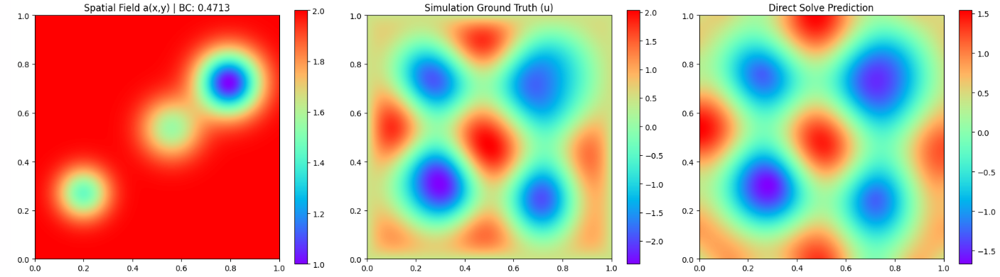

### Todo
- [ ] Try multiple equations in same model, solve individual sample first to ensure its working

### Daily Report
* **Wednesday** - Understand the helmholtz equation. Try get it working, network output same general result for all samples
* **Thursday** - Try on 1 sample. 

## Dataset Info
Paper: https://arxiv.org/pdf/2405.19101

### Poisson-Gauss Dataset
The NetCDF file has **two** variables called *solution* with dimensionality
  - 20000 (number of samples)
  - 128 (x-dim)
  - 128 (y-dim)

and *source* with dimensionality:
  - 20000 (number of samples)
  - 128 (x-dim)
  - 128 (y-dim)

$$f(x,y) = \sum_{i=1}^{N} \exp\left(-\frac{(x-\mu_{x,i})^2 + (y-\mu_{y,i})^2}{2\sigma_i^2}\right)$$
$N \sim \text{Geom}(0.4)$: Number of Gaussians
$\mu_{x,i}, \mu_{y,i} \sim U[0, 1]$: The $x$ and $y$ coordinates of each Gaussian. 
$\sigma_i \sim U[0.025, 0.1]$: The spread of the Gaussian

Train-test-split: 19640/120/240 trajectories

### Helmholtz Dataset
The H5 file has **19675** variables called *Sample_i* where i is the sample number. Every sample has three sub-groups:
*a* with dimensionality
  - 128 (x-dim)
  - 128 (y-dim)

*bc* (the value of the Dirichlet boundary condition, a float), 

*u* with dimensionality
  - 128 (x-dim)
  - 128 (y-dim)

Train-test-split: 19035/128/512 trajectories

Helmholtz equation we are solving: $$-\Delta u - \omega^2 a(x, y)u = 0$$ and Dirichlet boundary conditions: $$u(x, y) = b, \quad x, y \in \partial D$$

where $\omega = 5\pi/2$ is the frequency, $D = (0, 1)^2$ is the domain, $a$ is the spatial dependent function that defines properties of the medium of the wave propagation and $b$ is the fixed value of the solution $u$ at the boundary $\partial D$.

$b \sim \mathcal{U}_{[0.25, 0.5]}$
$u$ (The Solution): Amplitude of the wave at any given point $(x, y)$.
$a(x, y)$: Represents the physical properties of the space the wave is traveling through. Note: for the dataset generated, there is a $+1$ shift to the field after normalizing it, so it ranges from $1.0$ to $2.0$.

#### $a(x,y)$ generation
The function $a$ is defined as a sum of random number of Gaussians and is generated in several steps. First, an integer $n$ is drawn from $[2, 7]$ uniformly at random, representing the number of Gaussians that will be randomly generated. For $1 \le i \le n$, it holds that $A_i \sim \mathcal{U}_{[0.5, 10.0]}$ and $\sigma_i \sim \mathcal{U}_{[0.05, 0.1]}$. Additionally, two numbers $x_i, y_i$ that represent x and y coordinates of the Gaussians are generated such that $x_i, y_i \sim \mathcal{U}_{[0.2, 0.8]}$. The unnormalized function $\bar{a}$ is obtained by

$$\bar{a}(x, y) = - \sum_{i=1}^n A_i \exp \left( - \frac{(x_i - x)^2 + (y_i - y)^2}{2\sigma_i^2} \right), \quad x, y \in (0, 1).$$

Function $a$ is obtained by normalizing $\bar{a}$, i.e.

$$a(x, y) = \frac{\bar{a} - \min(\bar{a})}{\max(\bar{a}) - \min(\bar{a})}.$$

The solution operator maps the tuple $(a, b)$ to the solution $u$. This problem is a *steady-state* problem. Trajectories are generated by a finite-difference method at $128^2$ resolution.

### Allen-Cahn equation

### Results
#### Wednesday
**Helmholtz Across all samples**
Epoch 001 | Train Loss: 1.7087e-02 | Val MSE: 1.1551e+00 | TikReg: 1.03e-05

Increasing number of points to 4000 did not change anything:
Epoch 001 | Train Loss: 3.2675e-02 | Val MSE: 1.1552e+00 | TikReg: 1.03e-05
Increase features and change to sin did nothing
Add simulation loss into loss function did nothing too:
Epoch 001 | Train Loss: 1.2106e+04 | Val MSE: 1.1554e+00 | TikReg: 1.03e-05

Add a(x,y) into RFF

#### Thursday
**Helmholtz Across single sample**
Even on a single sample, the results are the same. The network just gives the same or similar results for any sample. Even though PDE loss is sitting at exactly 0.0000 and the BC loss is 0.0002, the sim loss is very large.
Now, we test with **adding simulation data directly** into the linear solve to see if it can even form the correct results in the first place.

Epoch 0 | Total: 2788.3954 | PDE: 960.5674 | BC: 935.9998 | Data: 891.8283
Epoch 100 | Total: 2827.8487 | PDE: 989.5168 | BC: 900.8223 | Data: 937.5096
Epoch 200 | Total: 2993.0740 | PDE: 1015.5581 | BC: 1056.3923 | Data: 921.1235
Epoch 300 | Total: 2741.1887 | PDE: 952.6667 | BC: 944.1153 | Data: 844.4066
Epoch 400 | Total: 2645.2733 | PDE: 962.1278 | BC: 912.1133 | Data: 771.0322
Epoch 500 | Total: 2515.7063 | PDE: 926.7528 | BC: 879.2071 | Data: 709.7463
Epoch 600 | Total: 2354.0600 | PDE: 935.3600 | BC: 756.7542 | Data: 661.9458
Epoch 700 | Total: 2246.5789 | PDE: 851.6641 | BC: 827.3828 | Data: 567.5320
Epoch 800 | Total: 2190.5931 | PDE: 867.5485 | BC: 760.9893 | Data: 562.0553
Epoch 900 | Total: 2226.6213 | PDE: 857.0095 | BC: 818.1409 | Data: 551.4709
the results show that it is possible to get the correct result with the current set of features. However, the color scales are not that correct.
Runs showed that the sigma or num epochs dont change how the result turn out when we add the simulation data into the linear solve

for single sample add a(x,y) into RFF

