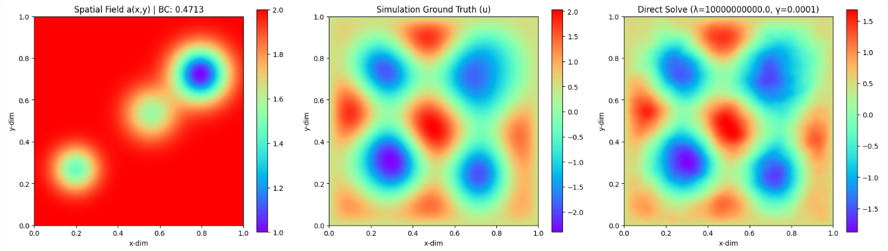
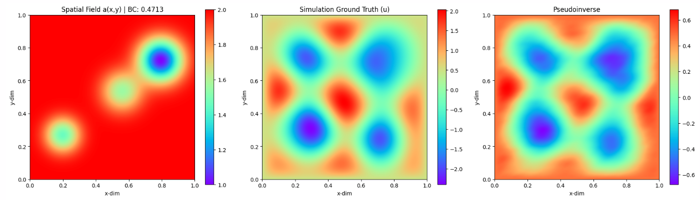
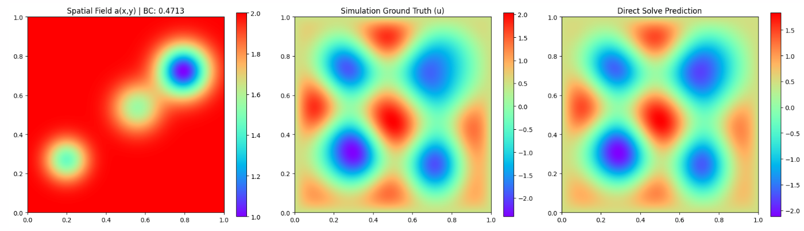
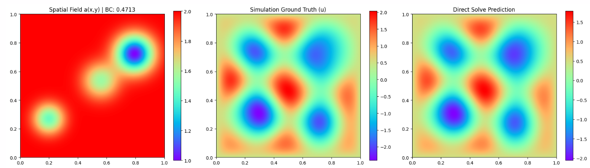
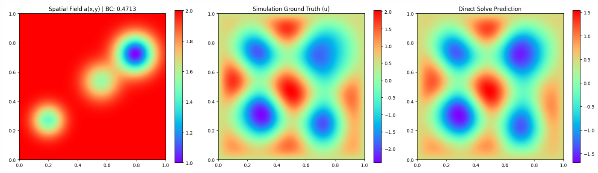
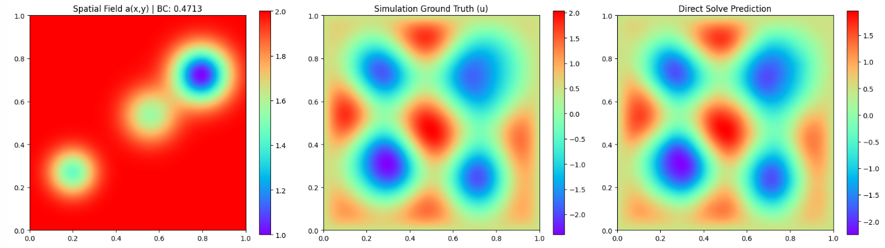
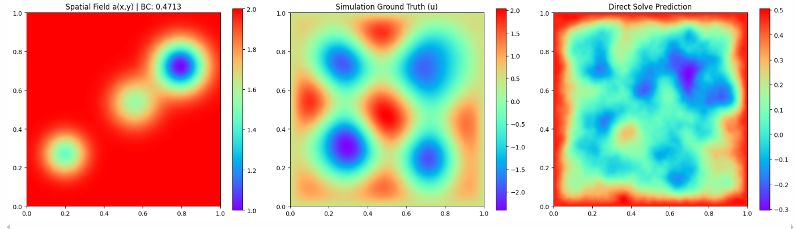
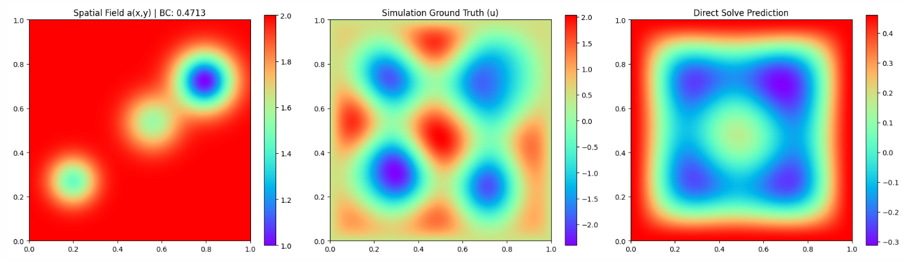
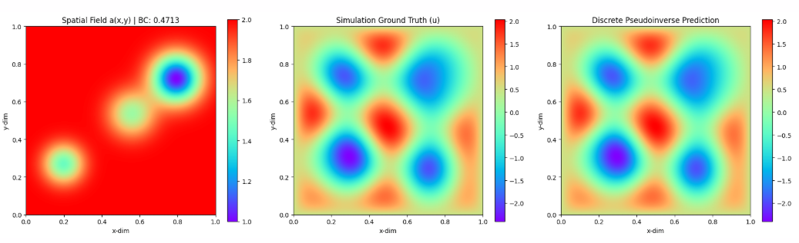
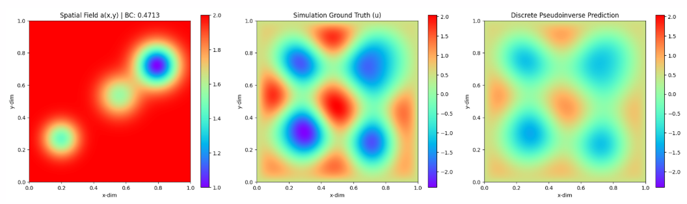

### Daily Report
* **Wednesday** - Try different scaling factors, try different approaches.
* **Thursday** - Tried many different scaling factors to try to balance the losses again. Tried the original pipeline and train. Tried to use finite difference to replace autodiff. Tried to check if the provided equation in the paper is misleading. Tried with the freeze model again. Tried to see if adding learning rate scheduler helps. Need to clean up this md file a bit, then I will message with updates. Results are weird I think.

## Results
### Wednesday
Concat model need higher sigma for the RFF and remove the output of the RFF, but the result is still not as good when freeze weights and do pseudoinverse with big bc scaling factor, giving mse of e-02 while normal mlp reaches mse of e-03. Below is an example of concat model.

Even after balancing the backpropagated gradients to be on the same magnitude, the results diverge and become worse.
Epoch 50  | Data MSE: 1.9727e-01 | Total Loss (pde unscaled, bc scaled): 5.5046e-02 | PDE unscaled: 5.2055e-02 | BC scaled: 2.9914e-08
            └─ Grad Norms => Total: 7.1499e-01 | PDE: 4.5745e-01 | BC: 4.8187e-01

Epoch 100 | Data MSE: 2.3184e-01 | Total Loss (pde unscaled, bc scaled): 3.5844e-02 | PDE unscaled: 3.4971e-02 | BC scaled: 8.7378e-09
            └─ Grad Norms => Total: 2.7704e-01 | PDE: 2.1904e-01 | BC: 1.3494e-01

Epoch 150 | Data MSE: 2.6107e-01 | Total Loss (pde unscaled, bc scaled): 2.7967e-02 | PDE unscaled: 2.7504e-02 | BC scaled: 4.6392e-09
            └─ Grad Norms => Total: 2.0636e-01 | PDE: 1.5554e-01 | BC: 1.1500e-01

Epoch 200 | Data MSE: 2.8558e-01 | Total Loss (pde unscaled, bc scaled): 2.2883e-02 | PDE unscaled: 2.2587e-02 | BC scaled: 2.9620e-09
            └─ Grad Norms => Total: 1.5009e-01 | PDE: 1.1432e-01 | BC: 7.9880e-02

Epoch 250 | Data MSE: 3.0607e-01 | Total Loss (pde unscaled, bc scaled): 1.9680e-02 | PDE unscaled: 1.9469e-02 | BC scaled: 2.1112e-09
            └─ Grad Norms => Total: 1.4764e-01 | PDE: 9.6360e-02 | BC: 8.9446e-02

Epoch 300 | Data MSE: 3.2375e-01 | Total Loss (pde unscaled, bc scaled): 1.7222e-02 | PDE unscaled: 1.7069e-02 | BC scaled: 1.5284e-09
            └─ Grad Norms => Total: 1.0233e-01 | PDE: 7.8476e-02 | BC: 5.0671e-02

Epoch 350 | Data MSE: 3.3957e-01 | Total Loss (pde unscaled, bc scaled): 1.5528e-02 | PDE unscaled: 1.5409e-02 | BC scaled: 1.1891e-09
            └─ Grad Norms => Total: 9.0340e-02 | PDE: 6.7699e-02 | BC: 5.0462e-02

Epoch 400 | Data MSE: 3.5354e-01 | Total Loss (pde unscaled, bc scaled): 1.4064e-02 | PDE unscaled: 1.3968e-02 | BC scaled: 9.5829e-10
            └─ Grad Norms => Total: 9.1028e-02 | PDE: 6.0174e-02 | BC: 5.6695e-02

Epoch 450 | Data MSE: 3.6577e-01 | Total Loss (pde unscaled, bc scaled): 1.3017e-02 | PDE unscaled: 1.2936e-02 | BC scaled: 8.0656e-10
            └─ Grad Norms => Total: 8.4116e-02 | PDE: 5.3013e-02 | BC: 5.5104e-02

We try the main pipeline with relevant scaling factors again, with normal mlp
loss uses max instead of mean
sigma = 3.0 
tik_reg_fixed = 1e-4 
matrix_bc_weight = 1e10
pde_loss_weight = 1e-5
bc_loss_weight = 1e5
data_loss_weight = 1
num_points = 10000

Epoch 0   | Tot Loss: 1.295e+05 | PDE(un): 1.184e+10 | BC(un): 4.042e-02 | Data(un): 7.094e+03
            └─ Grad Norms => Tot: 2.128e+06 | PDE: 2.042e+06 | BC: 1.682e+05 | Data: 7.295e+04
Epoch 10  | Tot Loss: 2.112e+04 | PDE(un): 1.440e+09 | BC(un): 2.051e-03 | Data(un): 6.518e+03
            └─ Grad Norms => Tot: 9.685e+04 | PDE: 9.572e+04 | BC: 9.458e+03 | Data: 2.097e+04
Epoch 20  | Tot Loss: 1.409e+04 | PDE(un): 7.450e+08 | BC(un): 9.688e-04 | Data(un): 6.542e+03
            └─ Grad Norms => Tot: 4.440e+04 | PDE: 4.387e+04 | BC: 5.103e+03 | Data: 1.740e+04
Epoch 30  | Tot Loss: 1.140e+04 | PDE(un): 5.077e+08 | BC(un): 6.269e-04 | Data(un): 6.255e+03
            └─ Grad Norms => Tot: 3.018e+04 | PDE: 3.170e+04 | BC: 3.443e+03 | Data: 1.507e+04
Epoch 40  | Tot Loss: 9.968e+03 | PDE(un): 3.712e+08 | BC(un): 4.633e-04 | Data(un): 6.209e+03
            └─ Grad Norms => Tot: 2.229e+04 | PDE: 2.298e+04 | BC: 2.471e+03 | Data: 1.474e+04
Epoch 50  | Tot Loss: 9.040e+03 | PDE(un): 2.994e+08 | BC(un): 3.685e-04 | Data(un): 6.009e+03
            └─ Grad Norms => Tot: 1.812e+04 | PDE: 2.065e+04 | BC: 2.118e+03 | Data: 1.433e+04
Epoch 60  | Tot Loss: 8.351e+03 | PDE(un): 2.491e+08 | BC(un): 2.957e-04 | Data(un): 5.830e+03
            └─ Grad Norms => Tot: 1.539e+04 | PDE: 1.774e+04 | BC: 1.743e+03 | Data: 1.393e+04
Epoch 70  | Tot Loss: 7.799e+03 | PDE(un): 2.127e+08 | BC(un): 2.542e-04 | Data(un): 5.646e+03
            └─ Grad Norms => Tot: 1.358e+04 | PDE: 1.682e+04 | BC: 1.530e+03 | Data: 1.399e+04
Epoch 80  | Tot Loss: 7.373e+03 | PDE(un): 1.854e+08 | BC(un): 2.290e-04 | Data(un): 5.496e+03
            └─ Grad Norms => Tot: 1.269e+04 | PDE: 1.685e+04 | BC: 1.452e+03 | Data: 1.398e+04
Epoch 90  | Tot Loss: 7.050e+03 | PDE(un): 1.672e+08 | BC(un): 2.017e-04 | Data(un): 5.358e+03
            └─ Grad Norms => Tot: 1.185e+04 | PDE: 1.560e+04 | BC: 1.265e+03 | Data: 1.392e+04
Epoch 100 | Tot Loss: 6.751e+03 | PDE(un): 1.495e+08 | BC(un): 1.789e-04 | Data(un): 5.237e+03
            └─ Grad Norms => Tot: 1.055e+04 | PDE: 1.564e+04 | BC: 1.176e+03 | Data: 1.444e+04
Epoch 110 | Tot Loss: 6.409e+03 | PDE(un): 1.345e+08 | BC(un): 1.608e-04 | Data(un): 5.048e+03
            └─ Grad Norms => Tot: 1.080e+04 | PDE: 1.552e+04 | BC: 1.115e+03 | Data: 1.463e+04
Epoch 120 | Tot Loss: 6.069e+03 | PDE(un): 1.237e+08 | BC(un): 1.480e-04 | Data(un): 4.817e+03
            └─ Grad Norms => Tot: 9.329e+03 | PDE: 1.569e+04 | BC: 1.022e+03 | Data: 1.479e+04
Epoch 130 | Tot Loss: 5.782e+03 | PDE(un): 1.116e+08 | BC(un): 1.356e-04 | Data(un): 4.653e+03
            └─ Grad Norms => Tot: 8.945e+03 | PDE: 1.470e+04 | BC: 9.727e+02 | Data: 1.524e+04
Epoch 140 | Tot Loss: 5.579e+03 | PDE(un): 1.064e+08 | BC(un): 1.254e-04 | Data(un): 4.503e+03
            └─ Grad Norms => Tot: 8.980e+03 | PDE: 1.569e+04 | BC: 9.408e+02 | Data: 1.569e+04
Epoch 150 | Tot Loss: 5.324e+03 | PDE(un): 9.921e+07 | BC(un): 1.161e-04 | Data(un): 4.320e+03
            └─ Grad Norms => Tot: 8.709e+03 | PDE: 1.582e+04 | BC: 8.711e+02 | Data: 1.631e+04
Epoch 160 | Tot Loss: 5.065e+03 | PDE(un): 9.451e+07 | BC(un): 1.095e-04 | Data(un): 4.109e+03
            └─ Grad Norms => Tot: 8.397e+03 | PDE: 1.590e+04 | BC: 8.710e+02 | Data: 1.682e+04
Epoch 170 | Tot Loss: 4.778e+03 | PDE(un): 8.998e+07 | BC(un): 1.058e-04 | Data(un): 3.868e+03
            └─ Grad Norms => Tot: 7.870e+03 | PDE: 1.723e+04 | BC: 8.665e+02 | Data: 1.744e+04
Epoch 180 | Tot Loss: 4.586e+03 | PDE(un): 8.710e+07 | BC(un): 1.010e-04 | Data(un): 3.705e+03
            └─ Grad Norms => Tot: 8.406e+03 | PDE: 1.825e+04 | BC: 8.788e+02 | Data: 1.835e+04
Epoch 190 | Tot Loss: 4.279e+03 | PDE(un): 8.404e+07 | BC(un): 9.574e-05 | Data(un): 3.429e+03
            └─ Grad Norms => Tot: 8.271e+03 | PDE: 1.872e+04 | BC: 8.604e+02 | Data: 1.908e+04
Epoch 200 | Tot Loss: 4.139e+03 | PDE(un): 8.436e+07 | BC(un): 9.474e-05 | Data(un): 3.286e+03
            └─ Grad Norms => Tot: 8.579e+03 | PDE: 1.986e+04 | BC: 8.995e+02 | Data: 2.069e+04
Epoch 210 | Tot Loss: 3.813e+03 | PDE(un): 8.327e+07 | BC(un): 9.264e-05 | Data(un): 2.972e+03
            └─ Grad Norms => Tot: 8.476e+03 | PDE: 2.123e+04 | BC: 9.180e+02 | Data: 2.119e+04
Epoch 220 | Tot Loss: 3.529e+03 | PDE(un): 8.194e+07 | BC(un): 9.020e-05 | Data(un): 2.700e+03
            └─ Grad Norms => Tot: 8.060e+03 | PDE: 2.065e+04 | BC: 9.009e+02 | Data: 2.191e+04
Epoch 230 | Tot Loss: 3.293e+03 | PDE(un): 8.245e+07 | BC(un): 8.838e-05 | Data(un): 2.460e+03
            └─ Grad Norms => Tot: 8.264e+03 | PDE: 2.221e+04 | BC: 9.499e+02 | Data: 2.347e+04
Epoch 240 | Tot Loss: 3.099e+03 | PDE(un): 8.552e+07 | BC(un): 8.925e-05 | Data(un): 2.234e+03
            └─ Grad Norms => Tot: 8.847e+03 | PDE: 2.428e+04 | BC: 9.960e+02 | Data: 2.529e+04
Epoch 250 | Tot Loss: 2.812e+03 | PDE(un): 8.720e+07 | BC(un): 8.767e-05 | Data(un): 1.931e+03
            └─ Grad Norms => Tot: 9.135e+03 | PDE: 2.540e+04 | BC: 1.035e+03 | Data: 2.595e+04
Epoch 260 | Tot Loss: 2.542e+03 | PDE(un): 8.840e+07 | BC(un): 8.561e-05 | Data(un): 1.650e+03
            └─ Grad Norms => Tot: 8.370e+03 | PDE: 2.598e+04 | BC: 9.894e+02 | Data: 2.728e+04
Epoch 270 | Tot Loss: 2.308e+03 | PDE(un): 9.197e+07 | BC(un): 8.451e-05 | Data(un): 1.380e+03
            └─ Grad Norms => Tot: 9.946e+03 | PDE: 2.880e+04 | BC: 1.024e+03 | Data: 2.788e+04
Epoch 280 | Tot Loss: 2.092e+03 | PDE(un): 9.437e+07 | BC(un): 8.304e-05 | Data(un): 1.140e+03
            └─ Grad Norms => Tot: 9.743e+03 | PDE: 2.896e+04 | BC: 9.932e+02 | Data: 2.845e+04
Epoch 290 | Tot Loss: 1.866e+03 | PDE(un): 9.439e+07 | BC(un): 7.883e-05 | Data(un): 9.138e+02
            └─ Grad Norms => Tot: 8.875e+03 | PDE: 2.818e+04 | BC: 1.022e+03 | Data: 2.796e+04
Epoch 300 | Tot Loss: 1.690e+03 | PDE(un): 9.480e+07 | BC(un): 7.440e-05 | Data(un): 7.350e+02
            └─ Grad Norms => Tot: 9.272e+03 | PDE: 2.674e+04 | BC: 1.017e+03 | Data: 2.774e+04
Epoch 310 | Tot Loss: 1.527e+03 | PDE(un): 9.199e+07 | BC(un): 6.913e-05 | Data(un): 5.997e+02
            └─ Grad Norms => Tot: 1.013e+04 | PDE: 2.609e+04 | BC: 9.707e+02 | Data: 2.635e+04
Epoch 320 | Tot Loss: 1.433e+03 | PDE(un): 9.403e+07 | BC(un): 6.231e-05 | Data(un): 4.868e+02
            └─ Grad Norms => Tot: 1.014e+04 | PDE: 2.839e+04 | BC: 8.953e+02 | Data: 2.548e+04
Epoch 330 | Tot Loss: 1.325e+03 | PDE(un): 9.080e+07 | BC(un): 5.793e-05 | Data(un): 4.111e+02
            └─ Grad Norms => Tot: 9.952e+03 | PDE: 2.620e+04 | BC: 8.367e+02 | Data: 2.406e+04
Epoch 340 | Tot Loss: 1.253e+03 | PDE(un): 8.799e+07 | BC(un): 5.350e-05 | Data(un): 3.675e+02
            └─ Grad Norms => Tot: 1.035e+04 | PDE: 2.330e+04 | BC: 8.433e+02 | Data: 2.356e+04
Epoch 350 | Tot Loss: 1.190e+03 | PDE(un): 8.561e+07 | BC(un): 4.991e-05 | Data(un): 3.288e+02
            └─ Grad Norms => Tot: 1.217e+04 | PDE: 2.217e+04 | BC: 8.404e+02 | Data: 2.265e+04
Epoch 360 | Tot Loss: 1.142e+03 | PDE(un): 8.435e+07 | BC(un): 4.723e-05 | Data(un): 2.936e+02
            └─ Grad Norms => Tot: 1.263e+04 | PDE: 2.338e+04 | BC: 9.623e+02 | Data: 2.188e+04
Epoch 370 | Tot Loss: 1.102e+03 | PDE(un): 8.309e+07 | BC(un): 4.277e-05 | Data(un): 2.671e+02
            └─ Grad Norms => Tot: 1.159e+04 | PDE: 2.442e+04 | BC: 7.842e+02 | Data: 2.112e+04
Epoch 380 | Tot Loss: 1.064e+03 | PDE(un): 8.166e+07 | BC(un): 3.937e-05 | Data(un): 2.436e+02
            └─ Grad Norms => Tot: 1.146e+04 | PDE: 2.460e+04 | BC: 7.116e+02 | Data: 2.023e+04
Epoch 390 | Tot Loss: 1.027e+03 | PDE(un): 7.883e+07 | BC(un): 3.592e-05 | Data(un): 2.348e+02
            └─ Grad Norms => Tot: 1.134e+04 | PDE: 2.239e+04 | BC: 6.962e+02 | Data: 1.997e+04
Epoch 400 | Tot Loss: 1.009e+03 | PDE(un): 7.827e+07 | BC(un): 3.375e-05 | Data(un): 2.232e+02
            └─ Grad Norms => Tot: 9.189e+03 | PDE: 2.233e+04 | BC: 6.169e+02 | Data: 1.954e+04
Epoch 410 | Tot Loss: 1.006e+03 | PDE(un): 7.889e+07 | BC(un): 3.439e-05 | Data(un): 2.142e+02
            └─ Grad Norms => Tot: 1.031e+04 | PDE: 2.129e+04 | BC: 8.104e+02 | Data: 1.937e+04
Epoch 420 | Tot Loss: 9.567e+02 | PDE(un): 7.496e+07 | BC(un): 3.099e-05 | Data(un): 2.040e+02
            └─ Grad Norms => Tot: 1.118e+04 | PDE: 2.093e+04 | BC: 7.381e+02 | Data: 1.883e+04
Epoch 430 | Tot Loss: 9.489e+02 | PDE(un): 7.472e+07 | BC(un): 2.977e-05 | Data(un): 1.987e+02
            └─ Grad Norms => Tot: 1.053e+04 | PDE: 2.064e+04 | BC: 7.372e+02 | Data: 1.864e+04
Epoch 440 | Tot Loss: 9.300e+02 | PDE(un): 7.308e+07 | BC(un): 2.751e-05 | Data(un): 1.964e+02
            └─ Grad Norms => Tot: 1.199e+04 | PDE: 2.031e+04 | BC: 6.982e+02 | Data: 1.847e+04
Epoch 450 | Tot Loss: 9.356e+02 | PDE(un): 7.393e+07 | BC(un): 2.578e-05 | Data(un): 1.938e+02
            └─ Grad Norms => Tot: 1.069e+04 | PDE: 2.012e+04 | BC: 6.730e+02 | Data: 1.850e+04
Epoch 460 | Tot Loss: 9.077e+02 | PDE(un): 7.165e+07 | BC(un): 2.464e-05 | Data(un): 1.887e+02
            └─ Grad Norms => Tot: 9.801e+03 | PDE: 1.780e+04 | BC: 5.920e+02 | Data: 1.832e+04
Epoch 470 | Tot Loss: 9.008e+02 | PDE(un): 7.126e+07 | BC(un): 2.272e-05 | Data(un): 1.859e+02
            └─ Grad Norms => Tot: 1.261e+04 | PDE: 1.831e+04 | BC: 5.387e+02 | Data: 1.816e+04
Epoch 480 | Tot Loss: 8.840e+02 | PDE(un): 7.084e+07 | BC(un): 2.236e-05 | Data(un): 1.733e+02
            └─ Grad Norms => Tot: 9.277e+03 | PDE: 1.947e+04 | BC: 5.387e+02 | Data: 1.723e+04
Epoch 490 | Tot Loss: 8.887e+02 | PDE(un): 7.136e+07 | BC(un): 2.134e-05 | Data(un): 1.730e+02
            └─ Grad Norms => Tot: 9.199e+03 | PDE: 1.987e+04 | BC: 6.238e+02 | Data: 1.754e+04

Instead of 10000 points, we try 3000:

still with 3000, we try mean instead of max for residual calculation

Wave amplitudes are dropping when we use mean instead of max. Hence, we drop the pde_loss_weight = 1e-5 to pde_loss_weight = 1e-6

Works, but doesnt fix the problem of the network not being able to abide to physics shown here:
Epoch 0   | Tot Loss: 9.806e+00 | PDE(un): 1.135e+06 | BC(un): 7.983e-05 | Data(un): 6.877e-01
            └─ Grad Norms => Tot: 3.412e+02 | PDE: 2.041e+01 | BC: 3.316e+02 | Data: 7.320e+00
Epoch 10  | Tot Loss: 1.099e+00 | PDE(un): 3.087e+05 | BC(un): 1.791e-06 | Data(un): 6.115e-01
            └─ Grad Norms => Tot: 1.098e+01 | PDE: 2.948e+00 | BC: 9.434e+00 | Data: 2.622e+00
Epoch 20  | Tot Loss: 8.797e-01 | PDE(un): 2.164e+05 | BC(un): 7.103e-07 | Data(un): 5.923e-01
            └─ Grad Norms => Tot: 5.568e+00 | PDE: 1.781e+00 | BC: 4.856e+00 | Data: 2.284e+00
Epoch 30  | Tot Loss: 8.260e-01 | PDE(un): 1.874e+05 | BC(un): 3.938e-07 | Data(un): 5.992e-01
            └─ Grad Norms => Tot: 3.483e+00 | PDE: 1.535e+00 | BC: 2.812e+00 | Data: 2.218e+00
Epoch 40  | Tot Loss: 7.331e-01 | PDE(un): 1.544e+05 | BC(un): 2.619e-07 | Data(un): 5.525e-01
            └─ Grad Norms => Tot: 2.854e+00 | PDE: 1.272e+00 | BC: 2.147e+00 | Data: 2.021e+00
Epoch 50  | Tot Loss: 7.060e-01 | PDE(un): 1.464e+05 | BC(un): 2.335e-07 | Data(un): 5.362e-01
            └─ Grad Norms => Tot: 2.694e+00 | PDE: 1.256e+00 | BC: 2.522e+00 | Data: 2.057e+00
Epoch 60  | Tot Loss: 6.535e-01 | PDE(un): 1.378e+05 | BC(un): 1.930e-07 | Data(un): 4.964e-01
            └─ Grad Norms => Tot: 2.612e+00 | PDE: 1.213e+00 | BC: 2.280e+00 | Data: 1.941e+00
Epoch 70  | Tot Loss: 6.137e-01 | PDE(un): 1.321e+05 | BC(un): 1.948e-07 | Data(un): 4.621e-01
            └─ Grad Norms => Tot: 2.543e+00 | PDE: 1.176e+00 | BC: 2.263e+00 | Data: 1.922e+00
Epoch 80  | Tot Loss: 5.967e-01 | PDE(un): 1.264e+05 | BC(un): 1.699e-07 | Data(un): 4.533e-01
            └─ Grad Norms => Tot: 2.483e+00 | PDE: 1.225e+00 | BC: 2.061e+00 | Data: 1.940e+00
Epoch 90  | Tot Loss: 5.658e-01 | PDE(un): 1.226e+05 | BC(un): 1.554e-07 | Data(un): 4.276e-01
            └─ Grad Norms => Tot: 2.553e+00 | PDE: 1.213e+00 | BC: 2.080e+00 | Data: 1.989e+00
Epoch 100 | Tot Loss: 5.333e-01 | PDE(un): 1.214e+05 | BC(un): 1.605e-07 | Data(un): 3.958e-01
            └─ Grad Norms => Tot: 2.436e+00 | PDE: 1.185e+00 | BC: 2.072e+00 | Data: 2.043e+00
Epoch 110 | Tot Loss: 5.130e-01 | PDE(un): 1.225e+05 | BC(un): 1.619e-07 | Data(un): 3.743e-01
            └─ Grad Norms => Tot: 2.845e+00 | PDE: 1.355e+00 | BC: 2.254e+00 | Data: 2.115e+00
Epoch 120 | Tot Loss: 4.689e-01 | PDE(un): 1.159e+05 | BC(un): 1.613e-07 | Data(un): 3.370e-01
            └─ Grad Norms => Tot: 2.600e+00 | PDE: 1.308e+00 | BC: 2.169e+00 | Data: 2.044e+00
Epoch 130 | Tot Loss: 4.324e-01 | PDE(un): 1.154e+05 | BC(un): 1.649e-07 | Data(un): 3.005e-01
            └─ Grad Norms => Tot: 2.712e+00 | PDE: 1.396e+00 | BC: 2.539e+00 | Data: 2.061e+00
Epoch 140 | Tot Loss: 4.050e-01 | PDE(un): 1.151e+05 | BC(un): 1.764e-07 | Data(un): 2.723e-01
            └─ Grad Norms => Tot: 2.778e+00 | PDE: 1.506e+00 | BC: 2.455e+00 | Data: 2.029e+00
Epoch 150 | Tot Loss: 3.923e-01 | PDE(un): 1.132e+05 | BC(un): 1.561e-07 | Data(un): 2.635e-01
            └─ Grad Norms => Tot: 2.882e+00 | PDE: 1.446e+00 | BC: 2.396e+00 | Data: 2.204e+00
Epoch 160 | Tot Loss: 3.660e-01 | PDE(un): 1.168e+05 | BC(un): 1.720e-07 | Data(un): 2.320e-01
            └─ Grad Norms => Tot: 2.620e+00 | PDE: 1.649e+00 | BC: 2.172e+00 | Data: 2.182e+00
Epoch 170 | Tot Loss: 3.273e-01 | PDE(un): 1.111e+05 | BC(un): 1.603e-07 | Data(un): 2.001e-01
            └─ Grad Norms => Tot: 2.814e+00 | PDE: 1.597e+00 | BC: 2.521e+00 | Data: 2.120e+00
Epoch 180 | Tot Loss: 3.042e-01 | PDE(un): 1.115e+05 | BC(un): 1.475e-07 | Data(un): 1.780e-01
            └─ Grad Norms => Tot: 2.826e+00 | PDE: 1.693e+00 | BC: 2.286e+00 | Data: 2.185e+00
Epoch 190 | Tot Loss: 2.757e-01 | PDE(un): 1.107e+05 | BC(un): 1.654e-07 | Data(un): 1.485e-01
            └─ Grad Norms => Tot: 3.516e+00 | PDE: 1.783e+00 | BC: 2.997e+00 | Data: 2.134e+00
Epoch 200 | Tot Loss: 2.549e-01 | PDE(un): 1.023e+05 | BC(un): 1.620e-07 | Data(un): 1.364e-01
            └─ Grad Norms => Tot: 3.824e+00 | PDE: 1.619e+00 | BC: 3.493e+00 | Data: 2.208e+00
Epoch 210 | Tot Loss: 2.363e-01 | PDE(un): 1.055e+05 | BC(un): 1.635e-07 | Data(un): 1.144e-01
            └─ Grad Norms => Tot: 3.575e+00 | PDE: 1.713e+00 | BC: 3.241e+00 | Data: 2.089e+00
Epoch 220 | Tot Loss: 2.123e-01 | PDE(un): 1.010e+05 | BC(un): 1.765e-07 | Data(un): 9.368e-02
            └─ Grad Norms => Tot: 5.044e+00 | PDE: 1.724e+00 | BC: 4.700e+00 | Data: 2.002e+00
Epoch 230 | Tot Loss: 1.939e-01 | PDE(un): 9.800e+04 | BC(un): 1.492e-07 | Data(un): 8.102e-02
            └─ Grad Norms => Tot: 4.026e+00 | PDE: 1.613e+00 | BC: 3.678e+00 | Data: 1.903e+00
Epoch 240 | Tot Loss: 1.798e-01 | PDE(un): 9.808e+04 | BC(un): 1.317e-07 | Data(un): 6.851e-02
            └─ Grad Norms => Tot: 3.287e+00 | PDE: 1.619e+00 | BC: 2.940e+00 | Data: 1.802e+00
Epoch 250 | Tot Loss: 1.616e-01 | PDE(un): 9.017e+04 | BC(un): 1.304e-07 | Data(un): 5.836e-02
            └─ Grad Norms => Tot: 3.731e+00 | PDE: 1.530e+00 | BC: 3.434e+00 | Data: 1.714e+00
Epoch 260 | Tot Loss: 1.402e-01 | PDE(un): 8.271e+04 | BC(un): 9.288e-08 | Data(un): 4.819e-02
            └─ Grad Norms => Tot: 2.772e+00 | PDE: 1.462e+00 | BC: 2.395e+00 | Data: 1.595e+00
Epoch 270 | Tot Loss: 1.292e-01 | PDE(un): 7.622e+04 | BC(un): 1.083e-07 | Data(un): 4.219e-02
            └─ Grad Norms => Tot: 3.685e+00 | PDE: 1.379e+00 | BC: 3.406e+00 | Data: 1.543e+00
Epoch 280 | Tot Loss: 1.212e-01 | PDE(un): 7.733e+04 | BC(un): 9.162e-08 | Data(un): 3.472e-02
            └─ Grad Norms => Tot: 3.697e+00 | PDE: 1.347e+00 | BC: 3.333e+00 | Data: 1.400e+00
Epoch 290 | Tot Loss: 1.131e-01 | PDE(un): 7.197e+04 | BC(un): 1.206e-07 | Data(un): 2.907e-02
            └─ Grad Norms => Tot: 3.786e+00 | PDE: 1.362e+00 | BC: 3.405e+00 | Data: 1.342e+00
Epoch 300 | Tot Loss: 1.022e-01 | PDE(un): 6.735e+04 | BC(un): 8.355e-08 | Data(un): 2.647e-02
            └─ Grad Norms => Tot: 2.802e+00 | PDE: 1.205e+00 | BC: 2.404e+00 | Data: 1.294e+00
Epoch 310 | Tot Loss: 9.251e-02 | PDE(un): 6.246e+04 | BC(un): 8.848e-08 | Data(un): 2.120e-02
            └─ Grad Norms => Tot: 3.334e+00 | PDE: 1.224e+00 | BC: 3.044e+00 | Data: 1.101e+00
Epoch 320 | Tot Loss: 8.818e-02 | PDE(un): 5.954e+04 | BC(un): 8.543e-08 | Data(un): 2.011e-02
            └─ Grad Norms => Tot: 3.646e+00 | PDE: 1.130e+00 | BC: 3.308e+00 | Data: 1.125e+00
Epoch 330 | Tot Loss: 8.544e-02 | PDE(un): 5.974e+04 | BC(un): 8.081e-08 | Data(un): 1.762e-02
            └─ Grad Norms => Tot: 3.126e+00 | PDE: 1.123e+00 | BC: 2.772e+00 | Data: 1.053e+00
Epoch 340 | Tot Loss: 7.712e-02 | PDE(un): 5.430e+04 | BC(un): 7.541e-08 | Data(un): 1.528e-02
            └─ Grad Norms => Tot: 3.005e+00 | PDE: 1.052e+00 | BC: 2.776e+00 | Data: 1.007e+00
Epoch 350 | Tot Loss: 7.089e-02 | PDE(un): 5.083e+04 | BC(un): 6.294e-08 | Data(un): 1.377e-02
            └─ Grad Norms => Tot: 2.982e+00 | PDE: 1.009e+00 | BC: 2.723e+00 | Data: 9.750e-01
Epoch 360 | Tot Loss: 6.736e-02 | PDE(un): 4.900e+04 | BC(un): 6.224e-08 | Data(un): 1.214e-02
            └─ Grad Norms => Tot: 2.664e+00 | PDE: 9.644e-01 | BC: 2.426e+00 | Data: 8.997e-01
Epoch 370 | Tot Loss: 6.152e-02 | PDE(un): 4.525e+04 | BC(un): 5.447e-08 | Data(un): 1.082e-02
            └─ Grad Norms => Tot: 2.541e+00 | PDE: 8.701e-01 | BC: 2.238e+00 | Data: 8.934e-01
Epoch 380 | Tot Loss: 5.990e-02 | PDE(un): 4.411e+04 | BC(un): 6.523e-08 | Data(un): 9.262e-03
            └─ Grad Norms => Tot: 3.051e+00 | PDE: 9.034e-01 | BC: 2.829e+00 | Data: 8.001e-01
Epoch 390 | Tot Loss: 5.564e-02 | PDE(un): 4.278e+04 | BC(un): 4.529e-08 | Data(un): 8.328e-03
            └─ Grad Norms => Tot: 2.198e+00 | PDE: 8.826e-01 | BC: 1.933e+00 | Data: 7.522e-01
Epoch 400 | Tot Loss: 5.565e-02 | PDE(un): 4.128e+04 | BC(un): 6.741e-08 | Data(un): 7.635e-03
            └─ Grad Norms => Tot: 3.342e+00 | PDE: 8.414e-01 | BC: 3.096e+00 | Data: 7.349e-01
Epoch 410 | Tot Loss: 5.288e-02 | PDE(un): 4.021e+04 | BC(un): 5.522e-08 | Data(un): 7.149e-03
            └─ Grad Norms => Tot: 2.857e+00 | PDE: 8.469e-01 | BC: 2.617e+00 | Data: 7.281e-01
Epoch 420 | Tot Loss: 4.859e-02 | PDE(un): 3.612e+04 | BC(un): 6.178e-08 | Data(un): 6.286e-03
            └─ Grad Norms => Tot: 2.968e+00 | PDE: 8.140e-01 | BC: 2.716e+00 | Data: 6.869e-01
Epoch 430 | Tot Loss: 4.513e-02 | PDE(un): 3.512e+04 | BC(un): 4.400e-08 | Data(un): 5.601e-03
            └─ Grad Norms => Tot: 2.385e+00 | PDE: 7.544e-01 | BC: 2.165e+00 | Data: 6.404e-01
Epoch 440 | Tot Loss: 4.343e-02 | PDE(un): 3.421e+04 | BC(un): 4.108e-08 | Data(un): 5.117e-03
            └─ Grad Norms => Tot: 2.675e+00 | PDE: 7.055e-01 | BC: 2.441e+00 | Data: 6.098e-01
Epoch 450 | Tot Loss: 4.244e-02 | PDE(un): 3.312e+04 | BC(un): 4.141e-08 | Data(un): 5.171e-03
            └─ Grad Norms => Tot: 2.555e+00 | PDE: 6.821e-01 | BC: 2.333e+00 | Data: 6.374e-01
Epoch 460 | Tot Loss: 4.055e-02 | PDE(un): 3.278e+04 | BC(un): 3.123e-08 | Data(un): 4.647e-03
            └─ Grad Norms => Tot: 1.937e+00 | PDE: 6.438e-01 | BC: 1.794e+00 | Data: 6.059e-01
Epoch 470 | Tot Loss: 3.885e-02 | PDE(un): 3.125e+04 | BC(un): 3.412e-08 | Data(un): 4.186e-03
            └─ Grad Norms => Tot: 1.865e+00 | PDE: 6.627e-01 | BC: 1.692e+00 | Data: 5.714e-01
Epoch 480 | Tot Loss: 3.853e-02 | PDE(un): 3.045e+04 | BC(un): 4.401e-08 | Data(un): 3.683e-03
            └─ Grad Norms => Tot: 2.921e+00 | PDE: 6.713e-01 | BC: 2.690e+00 | Data: 5.248e-01
Epoch 490 | Tot Loss: 3.867e-02 | PDE(un): 3.119e+04 | BC(un): 3.970e-08 | Data(un): 3.511e-03
            └─ Grad Norms => Tot: 2.457e+00 | PDE: 6.713e-01 | BC: 2.259e+00 | Data: 5.200e-01

If we remove the data loss from training, sampling 10000 points, using mean for residual
sigma = 3.0 
tik_reg_fixed = 1e-4 
matrix_bc_weight = 1e10
pde_loss_weight = 1e-6
bc_loss_weight = 1e5
data_loss_weight = 0

we get this, showing that the bulk of the work is done by data loss alone, not only is it not learning physics, it is just memorizing data:

### Thursday
Using finite difference to replace jacfwd:
sigma = 3.0 
tik_reg_fixed = 1e-4 
matrix_bc_weight = 1e10
pde_loss_weight = 1e-6
bc_loss_weight = 1e5
data_loss_weight = 1

Epoch 0   | Tot Loss: 9.451e+00 | PDE(un): 1.083e+06 | BC(un): 7.662e-05 | Data(un): 7.057e-01
            └─ Grad Norms => Tot: 3.340e+02 | PDE: 1.927e+01 | BC: 3.249e+02 | Data: 7.376e+00
Epoch 10  | Tot Loss: 1.080e+00 | PDE(un): 2.887e+05 | BC(un): 1.594e-06 | Data(un): 6.320e-01
            └─ Grad Norms => Tot: 9.726e+00 | PDE: 2.574e+00 | BC: 8.473e+00 | Data: 2.717e+00
Epoch 20  | Tot Loss: 8.584e-01 | PDE(un): 2.037e+05 | BC(un): 5.582e-07 | Data(un): 5.989e-01
            └─ Grad Norms => Tot: 4.374e+00 | PDE: 1.535e+00 | BC: 3.916e+00 | Data: 2.319e+00
Epoch 30  | Tot Loss: 7.677e-01 | PDE(un): 1.695e+05 | BC(un): 2.656e-07 | Data(un): 5.716e-01
            └─ Grad Norms => Tot: 2.527e+00 | PDE: 1.279e+00 | BC: 2.128e+00 | Data: 2.157e+00
Epoch 40  | Tot Loss: 7.111e-01 | PDE(un): 1.502e+05 | BC(un): 1.633e-07 | Data(un): 5.446e-01
            └─ Grad Norms => Tot: 1.789e+00 | PDE: 1.103e+00 | BC: 1.466e+00 | Data: 2.066e+00
Epoch 50  | Tot Loss: 6.662e-01 | PDE(un): 1.399e+05 | BC(un): 1.237e-07 | Data(un): 5.140e-01
            └─ Grad Norms => Tot: 1.428e+00 | PDE: 1.084e+00 | BC: 1.165e+00 | Data: 2.041e+00
Epoch 60  | Tot Loss: 6.268e-01 | PDE(un): 1.328e+05 | BC(un): 1.050e-07 | Data(un): 4.835e-01
            └─ Grad Norms => Tot: 1.281e+00 | PDE: 1.091e+00 | BC: 9.960e-01 | Data: 2.033e+00
Epoch 70  | Tot Loss: 5.904e-01 | PDE(un): 1.280e+05 | BC(un): 9.878e-08 | Data(un): 4.525e-01
            └─ Grad Norms => Tot: 1.177e+00 | PDE: 1.121e+00 | BC: 9.570e-01 | Data: 2.041e+00
Epoch 80  | Tot Loss: 5.554e-01 | PDE(un): 1.246e+05 | BC(un): 9.276e-08 | Data(un): 4.215e-01
            └─ Grad Norms => Tot: 1.120e+00 | PDE: 1.163e+00 | BC: 8.629e-01 | Data: 2.056e+00
Epoch 90  | Tot Loss: 5.213e-01 | PDE(un): 1.224e+05 | BC(un): 8.978e-08 | Data(un): 3.899e-01
            └─ Grad Norms => Tot: 1.087e+00 | PDE: 1.225e+00 | BC: 8.064e-01 | Data: 2.076e+00
Epoch 100 | Tot Loss: 4.879e-01 | PDE(un): 1.210e+05 | BC(un): 8.760e-08 | Data(un): 3.581e-01
            └─ Grad Norms => Tot: 1.053e+00 | PDE: 1.295e+00 | BC: 7.602e-01 | Data: 2.102e+00
Epoch 110 | Tot Loss: 4.549e-01 | PDE(un): 1.202e+05 | BC(un): 8.569e-08 | Data(un): 3.261e-01
            └─ Grad Norms => Tot: 1.027e+00 | PDE: 1.369e+00 | BC: 7.095e-01 | Data: 2.131e+00
Epoch 120 | Tot Loss: 4.224e-01 | PDE(un): 1.200e+05 | BC(un): 8.386e-08 | Data(un): 2.940e-01
            └─ Grad Norms => Tot: 1.001e+00 | PDE: 1.450e+00 | BC: 6.653e-01 | Data: 2.163e+00
Epoch 130 | Tot Loss: 3.903e-01 | PDE(un): 1.200e+05 | BC(un): 8.169e-08 | Data(un): 2.621e-01
            └─ Grad Norms => Tot: 9.746e-01 | PDE: 1.532e+00 | BC: 6.258e-01 | Data: 2.195e+00
Epoch 140 | Tot Loss: 3.587e-01 | PDE(un): 1.200e+05 | BC(un): 7.876e-08 | Data(un): 2.309e-01
            └─ Grad Norms => Tot: 9.458e-01 | PDE: 1.610e+00 | BC: 5.841e-01 | Data: 2.222e+00
Epoch 150 | Tot Loss: 3.279e-01 | PDE(un): 1.196e+05 | BC(un): 7.496e-08 | Data(un): 2.008e-01
            └─ Grad Norms => Tot: 9.158e-01 | PDE: 1.677e+00 | BC: 5.457e-01 | Data: 2.237e+00
Epoch 160 | Tot Loss: 2.980e-01 | PDE(un): 1.187e+05 | BC(un): 7.026e-08 | Data(un): 1.723e-01
            └─ Grad Norms => Tot: 8.828e-01 | PDE: 1.730e+00 | BC: 5.061e-01 | Data: 2.237e+00
Epoch 170 | Tot Loss: 2.695e-01 | PDE(un): 1.170e+05 | BC(un): 6.481e-08 | Data(un): 1.460e-01
            └─ Grad Norms => Tot: 8.458e-01 | PDE: 1.762e+00 | BC: 4.670e-01 | Data: 2.214e+00
Epoch 180 | Tot Loss: 2.426e-01 | PDE(un): 1.144e+05 | BC(un): 5.875e-08 | Data(un): 1.223e-01
            └─ Grad Norms => Tot: 8.055e-01 | PDE: 1.771e+00 | BC: 4.272e-01 | Data: 2.168e+00
Epoch 190 | Tot Loss: 2.177e-01 | PDE(un): 1.108e+05 | BC(un): 5.238e-08 | Data(un): 1.016e-01
            └─ Grad Norms => Tot: 7.614e-01 | PDE: 1.753e+00 | BC: 3.878e-01 | Data: 2.098e+00
Epoch 200 | Tot Loss: 1.950e-01 | PDE(un): 1.064e+05 | BC(un): 4.605e-08 | Data(un): 8.397e-02
            └─ Grad Norms => Tot: 7.147e-01 | PDE: 1.712e+00 | BC: 3.499e-01 | Data: 2.008e+00
Epoch 210 | Tot Loss: 1.746e-01 | PDE(un): 1.013e+05 | BC(un): 4.005e-08 | Data(un): 6.926e-02
            └─ Grad Norms => Tot: 6.662e-01 | PDE: 1.651e+00 | BC: 3.145e-01 | Data: 1.902e+00
Epoch 220 | Tot Loss: 1.565e-01 | PDE(un): 9.584e+04 | BC(un): 3.458e-08 | Data(un): 5.724e-02
            └─ Grad Norms => Tot: 6.176e-01 | PDE: 1.575e+00 | BC: 2.823e-01 | Data: 1.789e+00
Epoch 230 | Tot Loss: 1.407e-01 | PDE(un): 9.023e+04 | BC(un): 2.977e-08 | Data(un): 4.753e-02
            └─ Grad Norms => Tot: 5.699e-01 | PDE: 1.492e+00 | BC: 2.537e-01 | Data: 1.673e+00
Epoch 240 | Tot Loss: 1.270e-01 | PDE(un): 8.469e+04 | BC(un): 2.564e-08 | Data(un): 3.976e-02
            └─ Grad Norms => Tot: 5.243e-01 | PDE: 1.406e+00 | BC: 2.288e-01 | Data: 1.560e+00
Epoch 250 | Tot Loss: 1.152e-01 | PDE(un): 7.939e+04 | BC(un): 2.216e-08 | Data(un): 3.357e-02
            └─ Grad Norms => Tot: 4.816e-01 | PDE: 1.322e+00 | BC: 2.074e-01 | Data: 1.453e+00
Epoch 260 | Tot Loss: 1.050e-01 | PDE(un): 7.442e+04 | BC(un): 1.926e-08 | Data(un): 2.863e-02
            └─ Grad Norms => Tot: 4.421e-01 | PDE: 1.241e+00 | BC: 1.891e-01 | Data: 1.354e+00
Epoch 270 | Tot Loss: 9.620e-02 | PDE(un): 6.984e+04 | BC(un): 1.684e-08 | Data(un): 2.468e-02
            └─ Grad Norms => Tot: 4.060e-01 | PDE: 1.166e+00 | BC: 1.735e-01 | Data: 1.264e+00
Epoch 280 | Tot Loss: 8.865e-02 | PDE(un): 6.566e+04 | BC(un): 1.483e-08 | Data(un): 2.151e-02
            └─ Grad Norms => Tot: 3.731e-01 | PDE: 1.097e+00 | BC: 1.603e-01 | Data: 1.182e+00
Epoch 290 | Tot Loss: 8.215e-02 | PDE(un): 6.188e+04 | BC(un): 1.316e-08 | Data(un): 1.896e-02
            └─ Grad Norms => Tot: 3.434e-01 | PDE: 1.034e+00 | BC: 1.490e-01 | Data: 1.110e+00
Epoch 300 | Tot Loss: 7.652e-02 | PDE(un): 5.846e+04 | BC(un): 1.175e-08 | Data(un): 1.688e-02
            └─ Grad Norms => Tot: 3.165e-01 | PDE: 9.779e-01 | BC: 1.393e-01 | Data: 1.045e+00
Epoch 310 | Tot Loss: 7.164e-02 | PDE(un): 5.540e+04 | BC(un): 1.057e-08 | Data(un): 1.519e-02
            └─ Grad Norms => Tot: 2.923e-01 | PDE: 9.271e-01 | BC: 1.310e-01 | Data: 9.879e-01
Epoch 320 | Tot Loss: 6.740e-02 | PDE(un): 5.265e+04 | BC(un): 9.559e-09 | Data(un): 1.380e-02
            └─ Grad Norms => Tot: 2.705e-01 | PDE: 8.814e-01 | BC: 1.237e-01 | Data: 9.367e-01
Epoch 330 | Tot Loss: 6.369e-02 | PDE(un): 5.017e+04 | BC(un): 8.698e-09 | Data(un): 1.265e-02
            └─ Grad Norms => Tot: 2.509e-01 | PDE: 8.405e-01 | BC: 1.174e-01 | Data: 8.911e-01
Epoch 340 | Tot Loss: 6.044e-02 | PDE(un): 4.795e+04 | BC(un): 7.956e-09 | Data(un): 1.169e-02
            └─ Grad Norms => Tot: 2.331e-01 | PDE: 8.036e-01 | BC: 1.119e-01 | Data: 8.505e-01
Epoch 350 | Tot Loss: 5.757e-02 | PDE(un): 4.595e+04 | BC(un): 7.314e-09 | Data(un): 1.089e-02
            └─ Grad Norms => Tot: 2.171e-01 | PDE: 7.705e-01 | BC: 1.070e-01 | Data: 8.141e-01
Epoch 360 | Tot Loss: 5.503e-02 | PDE(un): 4.415e+04 | BC(un): 6.755e-09 | Data(un): 1.021e-02
            └─ Grad Norms => Tot: 2.026e-01 | PDE: 7.407e-01 | BC: 1.026e-01 | Data: 7.815e-01
Epoch 370 | Tot Loss: 5.278e-02 | PDE(un): 4.251e+04 | BC(un): 6.265e-09 | Data(un): 9.638e-03
            └─ Grad Norms => Tot: 1.894e-01 | PDE: 7.137e-01 | BC: 9.875e-02 | Data: 7.522e-01
Epoch 380 | Tot Loss: 5.077e-02 | PDE(un): 4.104e+04 | BC(un): 5.833e-09 | Data(un): 9.151e-03
            └─ Grad Norms => Tot: 1.775e-01 | PDE: 6.893e-01 | BC: 9.527e-02 | Data: 7.258e-01
Epoch 390 | Tot Loss: 4.897e-02 | PDE(un): 3.969e+04 | BC(un): 5.451e-09 | Data(un): 8.733e-03
            └─ Grad Norms => Tot: 1.667e-01 | PDE: 6.672e-01 | BC: 9.216e-02 | Data: 7.019e-01
Epoch 400 | Tot Loss: 4.735e-02 | PDE(un): 3.847e+04 | BC(un): 5.111e-09 | Data(un): 8.373e-03
            └─ Grad Norms => Tot: 1.568e-01 | PDE: 6.471e-01 | BC: 8.935e-02 | Data: 6.802e-01
Epoch 410 | Tot Loss: 4.589e-02 | PDE(un): 3.735e+04 | BC(un): 4.808e-09 | Data(un): 8.062e-03
            └─ Grad Norms => Tot: 1.478e-01 | PDE: 6.288e-01 | BC: 8.681e-02 | Data: 6.606e-01
Epoch 420 | Tot Loss: 4.457e-02 | PDE(un): 3.632e+04 | BC(un): 4.536e-09 | Data(un): 7.792e-03
            └─ Grad Norms => Tot: 1.396e-01 | PDE: 6.120e-01 | BC: 8.450e-02 | Data: 6.426e-01
Epoch 430 | Tot Loss: 4.337e-02 | PDE(un): 3.538e+04 | BC(un): 4.291e-09 | Data(un): 7.555e-03
            └─ Grad Norms => Tot: 1.321e-01 | PDE: 5.967e-01 | BC: 8.240e-02 | Data: 6.263e-01
Epoch 440 | Tot Loss: 4.227e-02 | PDE(un): 3.452e+04 | BC(un): 4.070e-09 | Data(un): 7.348e-03
            └─ Grad Norms => Tot: 1.252e-01 | PDE: 5.826e-01 | BC: 8.045e-02 | Data: 6.112e-01
Epoch 450 | Tot Loss: 4.127e-02 | PDE(un): 3.372e+04 | BC(un): 3.869e-09 | Data(un): 7.165e-03
            └─ Grad Norms => Tot: 1.189e-01 | PDE: 5.696e-01 | BC: 7.866e-02 | Data: 5.975e-01
Epoch 460 | Tot Loss: 4.036e-02 | PDE(un): 3.298e+04 | BC(un): 3.687e-09 | Data(un): 7.003e-03
            └─ Grad Norms => Tot: 1.130e-01 | PDE: 5.577e-01 | BC: 7.703e-02 | Data: 5.848e-01
Epoch 470 | Tot Loss: 3.951e-02 | PDE(un): 3.230e+04 | BC(un): 3.520e-09 | Data(un): 6.859e-03
            └─ Grad Norms => Tot: 1.076e-01 | PDE: 5.466e-01 | BC: 7.550e-02 | Data: 5.730e-01
Epoch 480 | Tot Loss: 3.873e-02 | PDE(un): 3.167e+04 | BC(un): 3.367e-09 | Data(un): 6.731e-03
            └─ Grad Norms => Tot: 1.027e-01 | PDE: 5.364e-01 | BC: 7.408e-02 | Data: 5.622e-01
Epoch 490 | Tot Loss: 3.801e-02 | PDE(un): 3.108e+04 | BC(un): 3.227e-09 | Data(un): 6.616e-03
            └─ Grad Norms => Tot: 9.803e-02 | PDE: 5.269e-01 | BC: 7.277e-02 | Data: 5.521e-01

It appears no difference is made.
Let's drop bc matrix weight from 1e10 to 1e5
Epoch 0   | Tot Loss: 1.911e+04 | PDE(un): 1.476e+03 | BC(un): 1.911e-01 | Data(un): 8.081e-01
            └─ Grad Norms => Tot: 1.855e+04 | PDE: 8.418e-03 | BC: 1.855e+04 | Data: 1.824e-01
Epoch 10  | Tot Loss: 6.638e+03 | PDE(un): 5.331e+03 | BC(un): 6.637e-02 | Data(un): 7.452e-01
            └─ Grad Norms => Tot: 2.769e+04 | PDE: 2.888e-03 | BC: 2.769e+04 | Data: 4.104e-01
Epoch 20  | Tot Loss: 1.035e+03 | PDE(un): 3.581e+03 | BC(un): 1.035e-02 | Data(un): 6.990e-01
            └─ Grad Norms => Tot: 7.181e+03 | PDE: 1.008e-02 | BC: 7.181e+03 | Data: 5.060e-01
Epoch 30  | Tot Loss: 3.180e+02 | PDE(un): 2.302e+03 | BC(un): 3.173e-03 | Data(un): 6.819e-01
            └─ Grad Norms => Tot: 2.697e+03 | PDE: 8.587e-03 | BC: 2.696e+03 | Data: 5.130e-01
Epoch 40  | Tot Loss: 1.600e+02 | PDE(un): 1.701e+03 | BC(un): 1.593e-03 | Data(un): 6.725e-01
            └─ Grad Norms => Tot: 1.331e+03 | PDE: 6.352e-03 | BC: 1.331e+03 | Data: 5.132e-01
Epoch 50  | Tot Loss: 1.018e+02 | PDE(un): 1.390e+03 | BC(un): 1.011e-03 | Data(un): 6.663e-01
            └─ Grad Norms => Tot: 7.287e+02 | PDE: 4.690e-03 | BC: 7.286e+02 | Data: 5.140e-01
Epoch 60  | Tot Loss: 7.685e+01 | PDE(un): 1.221e+03 | BC(un): 7.619e-04 | Data(un): 6.613e-01
            └─ Grad Norms => Tot: 4.799e+02 | PDE: 3.690e-03 | BC: 4.798e+02 | Data: 5.147e-01
Epoch 70  | Tot Loss: 6.384e+01 | PDE(un): 1.119e+03 | BC(un): 6.318e-04 | Data(un): 6.572e-01
            └─ Grad Norms => Tot: 3.571e+02 | PDE: 3.111e-03 | BC: 3.570e+02 | Data: 5.154e-01
Epoch 80  | Tot Loss: 5.592e+01 | PDE(un): 1.050e+03 | BC(un): 5.527e-04 | Data(un): 6.538e-01
            └─ Grad Norms => Tot: 2.859e+02 | PDE: 2.728e-03 | BC: 2.858e+02 | Data: 5.163e-01
Epoch 90  | Tot Loss: 5.050e+01 | PDE(un): 1.001e+03 | BC(un): 4.984e-04 | Data(un): 6.507e-01
            └─ Grad Norms => Tot: 2.422e+02 | PDE: 2.482e-03 | BC: 2.421e+02 | Data: 5.173e-01
Epoch 100 | Tot Loss: 4.642e+01 | PDE(un): 9.610e+02 | BC(un): 4.577e-04 | Data(un): 6.478e-01
            └─ Grad Norms => Tot: 2.135e+02 | PDE: 2.305e-03 | BC: 2.133e+02 | Data: 5.183e-01
Epoch 110 | Tot Loss: 4.314e+01 | PDE(un): 9.276e+02 | BC(un): 4.250e-04 | Data(un): 6.450e-01
            └─ Grad Norms => Tot: 1.902e+02 | PDE: 2.161e-03 | BC: 1.900e+02 | Data: 5.191e-01
Epoch 120 | Tot Loss: 4.040e+01 | PDE(un): 8.987e+02 | BC(un): 3.976e-04 | Data(un): 6.424e-01
            └─ Grad Norms => Tot: 1.722e+02 | PDE: 2.044e-03 | BC: 1.721e+02 | Data: 5.198e-01
Epoch 130 | Tot Loss: 3.805e+01 | PDE(un): 8.730e+02 | BC(un): 3.741e-04 | Data(un): 6.398e-01
            └─ Grad Norms => Tot: 1.579e+02 | PDE: 1.945e-03 | BC: 1.578e+02 | Data: 5.205e-01
Epoch 140 | Tot Loss: 3.602e+01 | PDE(un): 8.500e+02 | BC(un): 3.538e-04 | Data(un): 6.373e-01
            └─ Grad Norms => Tot: 1.458e+02 | PDE: 1.860e-03 | BC: 1.456e+02 | Data: 5.211e-01
Epoch 150 | Tot Loss: 3.423e+01 | PDE(un): 8.292e+02 | BC(un): 3.359e-04 | Data(un): 6.349e-01
            └─ Grad Norms => Tot: 1.354e+02 | PDE: 1.785e-03 | BC: 1.352e+02 | Data: 5.217e-01
Epoch 160 | Tot Loss: 3.265e+01 | PDE(un): 8.103e+02 | BC(un): 3.201e-04 | Data(un): 6.326e-01
            └─ Grad Norms => Tot: 1.261e+02 | PDE: 1.716e-03 | BC: 1.260e+02 | Data: 5.222e-01
Epoch 170 | Tot Loss: 3.123e+01 | PDE(un): 7.930e+02 | BC(un): 3.060e-04 | Data(un): 6.303e-01
            └─ Grad Norms => Tot: 1.180e+02 | PDE: 1.653e-03 | BC: 1.178e+02 | Data: 5.227e-01
Epoch 180 | Tot Loss: 2.997e+01 | PDE(un): 7.771e+02 | BC(un): 2.934e-04 | Data(un): 6.281e-01
            └─ Grad Norms => Tot: 1.107e+02 | PDE: 1.595e-03 | BC: 1.106e+02 | Data: 5.231e-01
Epoch 190 | Tot Loss: 2.883e+01 | PDE(un): 7.625e+02 | BC(un): 2.820e-04 | Data(un): 6.260e-01
            └─ Grad Norms => Tot: 1.042e+02 | PDE: 1.542e-03 | BC: 1.041e+02 | Data: 5.234e-01
Epoch 200 | Tot Loss: 2.779e+01 | PDE(un): 7.489e+02 | BC(un): 2.717e-04 | Data(un): 6.239e-01
            └─ Grad Norms => Tot: 9.843e+01 | PDE: 1.493e-03 | BC: 9.827e+01 | Data: 5.238e-01
Epoch 210 | Tot Loss: 2.685e+01 | PDE(un): 7.363e+02 | BC(un): 2.623e-04 | Data(un): 6.219e-01
            └─ Grad Norms => Tot: 9.317e+01 | PDE: 1.448e-03 | BC: 9.301e+01 | Data: 5.241e-01
Epoch 220 | Tot Loss: 2.599e+01 | PDE(un): 7.246e+02 | BC(un): 2.537e-04 | Data(un): 6.200e-01
            └─ Grad Norms => Tot: 8.841e+01 | PDE: 1.407e-03 | BC: 8.824e+01 | Data: 5.243e-01
Epoch 230 | Tot Loss: 2.520e+01 | PDE(un): 7.137e+02 | BC(un): 2.458e-04 | Data(un): 6.181e-01
            └─ Grad Norms => Tot: 8.408e+01 | PDE: 1.368e-03 | BC: 8.391e+01 | Data: 5.246e-01
Epoch 240 | Tot Loss: 2.447e+01 | PDE(un): 7.034e+02 | BC(un): 2.385e-04 | Data(un): 6.162e-01
            └─ Grad Norms => Tot: 8.012e+01 | PDE: 1.332e-03 | BC: 7.995e+01 | Data: 5.248e-01
Epoch 250 | Tot Loss: 2.380e+01 | PDE(un): 6.938e+02 | BC(un): 2.318e-04 | Data(un): 6.144e-01
            └─ Grad Norms => Tot: 7.650e+01 | PDE: 1.299e-03 | BC: 7.633e+01 | Data: 5.250e-01
Epoch 260 | Tot Loss: 2.317e+01 | PDE(un): 6.848e+02 | BC(un): 2.256e-04 | Data(un): 6.127e-01
            └─ Grad Norms => Tot: 7.317e+01 | PDE: 1.268e-03 | BC: 7.300e+01 | Data: 5.252e-01
Epoch 270 | Tot Loss: 2.259e+01 | PDE(un): 6.762e+02 | BC(un): 2.198e-04 | Data(un): 6.110e-01
            └─ Grad Norms => Tot: 7.010e+01 | PDE: 1.239e-03 | BC: 6.993e+01 | Data: 5.254e-01
Epoch 280 | Tot Loss: 2.205e+01 | PDE(un): 6.682e+02 | BC(un): 2.144e-04 | Data(un): 6.093e-01
            └─ Grad Norms => Tot: 6.726e+01 | PDE: 1.212e-03 | BC: 6.709e+01 | Data: 5.256e-01
Epoch 290 | Tot Loss: 2.155e+01 | PDE(un): 6.606e+02 | BC(un): 2.094e-04 | Data(un): 6.077e-01
            └─ Grad Norms => Tot: 6.463e+01 | PDE: 1.186e-03 | BC: 6.447e+01 | Data: 5.257e-01
Epoch 300 | Tot Loss: 2.108e+01 | PDE(un): 6.533e+02 | BC(un): 2.047e-04 | Data(un): 6.061e-01
            └─ Grad Norms => Tot: 6.219e+01 | PDE: 1.162e-03 | BC: 6.202e+01 | Data: 5.258e-01
Epoch 310 | Tot Loss: 2.063e+01 | PDE(un): 6.465e+02 | BC(un): 2.003e-04 | Data(un): 6.045e-01
            └─ Grad Norms => Tot: 5.992e+01 | PDE: 1.140e-03 | BC: 5.975e+01 | Data: 5.260e-01
Epoch 320 | Tot Loss: 2.022e+01 | PDE(un): 6.400e+02 | BC(un): 1.961e-04 | Data(un): 6.030e-01
            └─ Grad Norms => Tot: 5.779e+01 | PDE: 1.119e-03 | BC: 5.762e+01 | Data: 5.261e-01
Epoch 330 | Tot Loss: 1.982e+01 | PDE(un): 6.337e+02 | BC(un): 1.922e-04 | Data(un): 6.015e-01
            └─ Grad Norms => Tot: 5.580e+01 | PDE: 1.099e-03 | BC: 5.564e+01 | Data: 5.262e-01
Epoch 340 | Tot Loss: 1.945e+01 | PDE(un): 6.278e+02 | BC(un): 1.885e-04 | Data(un): 6.001e-01
            └─ Grad Norms => Tot: 5.394e+01 | PDE: 1.080e-03 | BC: 5.377e+01 | Data: 5.263e-01
Epoch 350 | Tot Loss: 1.910e+01 | PDE(un): 6.222e+02 | BC(un): 1.850e-04 | Data(un): 5.987e-01
            └─ Grad Norms => Tot: 5.219e+01 | PDE: 1.062e-03 | BC: 5.202e+01 | Data: 5.264e-01
Epoch 360 | Tot Loss: 1.877e+01 | PDE(un): 6.168e+02 | BC(un): 1.817e-04 | Data(un): 5.973e-01
            └─ Grad Norms => Tot: 5.054e+01 | PDE: 1.046e-03 | BC: 5.037e+01 | Data: 5.264e-01
Epoch 370 | Tot Loss: 1.846e+01 | PDE(un): 6.116e+02 | BC(un): 1.786e-04 | Data(un): 5.960e-01
            └─ Grad Norms => Tot: 4.899e+01 | PDE: 1.030e-03 | BC: 4.882e+01 | Data: 5.265e-01
Epoch 380 | Tot Loss: 1.816e+01 | PDE(un): 6.066e+02 | BC(un): 1.756e-04 | Data(un): 5.946e-01
            └─ Grad Norms => Tot: 4.752e+01 | PDE: 1.015e-03 | BC: 4.735e+01 | Data: 5.266e-01
Epoch 390 | Tot Loss: 1.787e+01 | PDE(un): 6.019e+02 | BC(un): 1.728e-04 | Data(un): 5.933e-01
            └─ Grad Norms => Tot: 4.613e+01 | PDE: 1.000e-03 | BC: 4.596e+01 | Data: 5.266e-01
Epoch 400 | Tot Loss: 1.760e+01 | PDE(un): 5.973e+02 | BC(un): 1.701e-04 | Data(un): 5.921e-01
            └─ Grad Norms => Tot: 4.481e+01 | PDE: 9.870e-04 | BC: 4.464e+01 | Data: 5.267e-01
Epoch 410 | Tot Loss: 1.735e+01 | PDE(un): 5.929e+02 | BC(un): 1.675e-04 | Data(un): 5.908e-01
            └─ Grad Norms => Tot: 4.355e+01 | PDE: 9.741e-04 | BC: 4.339e+01 | Data: 5.267e-01
Epoch 420 | Tot Loss: 1.710e+01 | PDE(un): 5.887e+02 | BC(un): 1.651e-04 | Data(un): 5.896e-01
            └─ Grad Norms => Tot: 4.236e+01 | PDE: 9.619e-04 | BC: 4.220e+01 | Data: 5.268e-01
Epoch 430 | Tot Loss: 1.687e+01 | PDE(un): 5.846e+02 | BC(un): 1.628e-04 | Data(un): 5.884e-01
            └─ Grad Norms => Tot: 4.123e+01 | PDE: 9.503e-04 | BC: 4.107e+01 | Data: 5.268e-01
Epoch 440 | Tot Loss: 1.664e+01 | PDE(un): 5.807e+02 | BC(un): 1.605e-04 | Data(un): 5.872e-01
            └─ Grad Norms => Tot: 4.015e+01 | PDE: 9.392e-04 | BC: 3.998e+01 | Data: 5.268e-01
Epoch 450 | Tot Loss: 1.643e+01 | PDE(un): 5.770e+02 | BC(un): 1.584e-04 | Data(un): 5.861e-01
            └─ Grad Norms => Tot: 3.911e+01 | PDE: 9.286e-04 | BC: 3.895e+01 | Data: 5.269e-01
Epoch 460 | Tot Loss: 1.622e+01 | PDE(un): 5.733e+02 | BC(un): 1.563e-04 | Data(un): 5.850e-01
            └─ Grad Norms => Tot: 3.812e+01 | PDE: 9.185e-04 | BC: 3.796e+01 | Data: 5.269e-01
Epoch 470 | Tot Loss: 1.602e+01 | PDE(un): 5.698e+02 | BC(un): 1.544e-04 | Data(un): 5.839e-01
            └─ Grad Norms => Tot: 3.718e+01 | PDE: 9.088e-04 | BC: 3.702e+01 | Data: 5.269e-01
Epoch 480 | Tot Loss: 1.583e+01 | PDE(un): 5.664e+02 | BC(un): 1.525e-04 | Data(un): 5.828e-01
            └─ Grad Norms => Tot: 3.627e+01 | PDE: 8.996e-04 | BC: 3.611e+01 | Data: 5.269e-01
Epoch 490 | Tot Loss: 1.565e+01 | PDE(un): 5.632e+02 | BC(un): 1.507e-04 | Data(un): 5.817e-01
            └─ Grad Norms => Tot: 3.540e+01 | PDE: 8.907e-04 | BC: 3.524e+01 | Data: 5.270e-01

Maybe the equation have problem?
==================================================
             DATASET PHYSICS VERIFICATION
==================================================
Paper's Stated omega_sq:         61.6850
Dataset Expected (2x Stated):    123.3701
--------------------------------------------------
Actual Dataset Mean omega_sq:    124.7522
Actual Dataset Median omega_sq:  125.0308
Empirical Scale Factor:          2.0269x
==================================================

with 123.3701
Weights successfully loaded from pretrained_helmholtz_mlp.pkl
Starting Balanced Pretrained Physics Loop (Discrete Convolution Logic)...
Epoch 0   | True Data MSE: 7.9760e-04
            ├─ Raw Residuals  => PDE: 1.5515e+04 | BC: 3.2020e-06
            └─ True Grad Norms => PDE: 4.844e+05 | BC: 2.343e-04 | Data Anchor: 3.696e-01
Epoch 50  | True Data MSE: 5.5494e-03
            ├─ Raw Residuals  => PDE: 7.7632e+03 | BC: 3.7369e-08
            └─ True Grad Norms => PDE: 1.113e+05 | BC: 1.396e-05 | Data Anchor: 9.150e-01
Epoch 100 | True Data MSE: 5.7644e-03
            ├─ Raw Residuals  => PDE: 4.5943e+03 | BC: 1.2231e-08
            └─ True Grad Norms => PDE: 6.830e+04 | BC: 1.301e-05 | Data Anchor: 8.893e-01
Epoch 150 | True Data MSE: 2.3006e-03
            ├─ Raw Residuals  => PDE: 3.1853e+03 | BC: 7.0689e-09
            └─ True Grad Norms => PDE: 5.030e+04 | BC: 6.519e-06 | Data Anchor: 5.590e-01
Epoch 200 | True Data MSE: 3.7663e-04
            ├─ Raw Residuals  => PDE: 2.4175e+03 | BC: 5.9003e-09
            └─ True Grad Norms => PDE: 4.766e+04 | BC: 9.674e-06 | Data Anchor: 1.595e-01
Epoch 250 | True Data MSE: 1.9352e-05
            ├─ Raw Residuals  => PDE: 1.9679e+03 | BC: 8.3474e-09
            └─ True Grad Norms => PDE: 5.178e+04 | BC: 1.508e-05 | Data Anchor: 5.747e-02
Epoch 300 | True Data MSE: 9.1194e-06
            ├─ Raw Residuals  => PDE: 1.6694e+03 | BC: 5.6752e-09
            └─ True Grad Norms => PDE: 4.132e+04 | BC: 1.297e-05 | Data Anchor: 3.771e-02
Epoch 350 | True Data MSE: 1.9047e-06
            ├─ Raw Residuals  => PDE: 1.4727e+03 | BC: 4.8618e-09
            └─ True Grad Norms => PDE: 4.114e+04 | BC: 1.060e-05 | Data Anchor: 6.340e-03
Epoch 400 | True Data MSE: 2.6489e-06
            ├─ Raw Residuals  => PDE: 1.3051e+03 | BC: 3.9481e-09
            └─ True Grad Norms => PDE: 3.612e+04 | BC: 1.042e-05 | Data Anchor: 9.724e-03
Epoch 450 | True Data MSE: 4.2140e-06
            ├─ Raw Residuals  => PDE: 1.1721e+03 | BC: 3.3095e-09
            └─ True Grad Norms => PDE: 2.766e+04 | BC: 9.142e-06 | Data Anchor: 2.164e-02

With original omega squared, nothing else changed:
Weights successfully loaded from pretrained_helmholtz_mlp.pkl
Starting Balanced Pretrained Physics Loop (Discrete Convolution Logic)...
Epoch 0   | True Data MSE: 1.4019e-03
            ├─ Raw Residuals  => PDE: 2.4668e+04 | BC: 3.2090e-06
            └─ True Grad Norms => PDE: 5.781e+05 | BC: 2.380e-04 | Data Anchor: 4.916e-01
Epoch 50  | True Data MSE: 2.4030e-02
            ├─ Raw Residuals  => PDE: 1.3000e+04 | BC: 2.8108e-08
            └─ True Grad Norms => PDE: 1.520e+05 | BC: 7.942e-06 | Data Anchor: 1.555e+00
Epoch 100 | True Data MSE: 5.1248e-02
            ├─ Raw Residuals  => PDE: 8.2224e+03 | BC: 8.2959e-09
            └─ True Grad Norms => PDE: 8.645e+04 | BC: 6.587e-06 | Data Anchor: 1.809e+00
Epoch 150 | True Data MSE: 7.7742e-02
            ├─ Raw Residuals  => PDE: 5.7394e+03 | BC: 4.2583e-09
            └─ True Grad Norms => PDE: 5.350e+04 | BC: 4.739e-06 | Data Anchor: 1.886e+00
Epoch 200 | True Data MSE: 1.0286e-01
            ├─ Raw Residuals  => PDE: 4.2579e+03 | BC: 3.8811e-09
            └─ True Grad Norms => PDE: 4.149e+04 | BC: 6.002e-06 | Data Anchor: 1.886e+00
Epoch 250 | True Data MSE: 1.2216e-01
            ├─ Raw Residuals  => PDE: 3.4203e+03 | BC: 2.7283e-09
            └─ True Grad Norms => PDE: 3.086e+04 | BC: 5.128e-06 | Data Anchor: 1.865e+00
Epoch 300 | True Data MSE: 1.4267e-01
            ├─ Raw Residuals  => PDE: 2.7856e+03 | BC: 1.5056e-09
            └─ True Grad Norms => PDE: 2.234e+04 | BC: 3.115e-06 | Data Anchor: 1.827e+00
Epoch 350 | True Data MSE: 1.5348e-01
            ├─ Raw Residuals  => PDE: 2.4453e+03 | BC: 1.7355e-09
            └─ True Grad Norms => PDE: 2.313e+04 | BC: 3.948e-06 | Data Anchor: 1.793e+00
Epoch 400 | True Data MSE: 1.6398e-01
            ├─ Raw Residuals  => PDE: 2.1860e+03 | BC: 1.2614e-09
            └─ True Grad Norms => PDE: 1.826e+04 | BC: 2.876e-06 | Data Anchor: 1.765e+00
Epoch 450 | True Data MSE: 1.7718e-01
            ├─ Raw Residuals  => PDE: 1.9330e+03 | BC: 1.0273e-09
            └─ True Grad Norms => PDE: 1.633e+04 | BC: 2.618e-06 | Data Anchor: 1.730e+00

