### Daily Report
* **Wednesday** - Try different scaling factors, try different approaches.
* **Thursday** - Tried many different scaling factors to try to balance the losses again. Tried the original pipeline and train. Tried to use finite difference to replace autodiff. Tried to check if the provided equation in the paper is misleading. Tried with the freeze model again. Tried to see if adding learning rate scheduler helps. Need to clean up this md file a bit, then I will message with updates. Results are weird I think.
* **Friday** - Try more variations
* **Sunday** - Fixed bug in AD version code. Now, AD gets same results as stencil. Laplacian magnitude also essentially equal with either AD or stencil.
* **Monday** - Run more tests

## Results
### Results are not that accurate for wednesday and thursday due using the wrong equation.

### Wednesday
Concat model need higher sigma for the RFF and remove the output of the RFF, but the result is still not as good when freeze weights and do pseudoinverse with big bc scaling factor, giving mse of e-02 while normal mlp reaches mse of e-03. Below is an example of concat model.

Even after balancing the backpropagated gradients to be on the same magnitude, the results diverge and become worse.
Epoch 50  | Data MSE: 1.9727e-01 | Total Loss (pde unscaled, bc scaled): 5.5046e-02 | PDE unscaled: 5.2055e-02 | BC scaled: 2.9914e-08
            └─ Grad Norms => Total: 7.1499e-01 | PDE: 4.5745e-01 | BC: 4.8187e-01
Epoch 450 | Data MSE: 3.6577e-01 | Total Loss (pde unscaled, bc scaled): 1.3017e-02 | PDE unscaled: 1.2936e-02 | BC scaled: 8.0656e-10
            └─ Grad Norms => Total: 8.4116e-02 | PDE: 5.3013e-02 | BC: 5.5104e-02

We try the main pipeline with relevant scaling factors again, with normal mlp
loss uses max instead of mean
sigma = 3.0 
tik_reg_fixed = 1e-4 
matrix_bc_weight = 1e10
pde_loss_weight = 1e-5
bc_loss_weight = 1e5
data_loss_weight = 1
num_points = 10000

Epoch 0   | Tot Loss: 1.295e+05 | PDE(un): 1.184e+10 | BC(un): 4.042e-02 | Data(un): 7.094e+03
            └─ Grad Norms => Tot: 2.128e+06 | PDE: 2.042e+06 | BC: 1.682e+05 | Data: 7.295e+04
Epoch 490 | Tot Loss: 8.887e+02 | PDE(un): 7.136e+07 | BC(un): 2.134e-05 | Data(un): 1.730e+02
            └─ Grad Norms => Tot: 9.199e+03 | PDE: 1.987e+04 | BC: 6.238e+02 | Data: 1.754e+04

Instead of 10000 points, we try 3000:

still with 3000, we try mean instead of max for residual calculation

Wave amplitudes are dropping when we use mean instead of max. Hence, we drop the pde_loss_weight = 1e-5 to pde_loss_weight = 1e-6

Works, but doesnt fix the problem of the network not being able to abide to physics shown here:
Epoch 0   | Tot Loss: 9.806e+00 | PDE(un): 1.135e+06 | BC(un): 7.983e-05 | Data(un): 6.877e-01
            └─ Grad Norms => Tot: 3.412e+02 | PDE: 2.041e+01 | BC: 3.316e+02 | Data: 7.320e+00
Epoch 490 | Tot Loss: 3.867e-02 | PDE(un): 3.119e+04 | BC(un): 3.970e-08 | Data(un): 3.511e-03
            └─ Grad Norms => Tot: 2.457e+00 | PDE: 6.713e-01 | BC: 2.259e+00 | Data: 5.200e-01

If we remove the data loss from training, sampling 10000 points, using mean for residual
sigma = 3.0 
tik_reg_fixed = 1e-4 
matrix_bc_weight = 1e10
pde_loss_weight = 1e-6
bc_loss_weight = 1e5
data_loss_weight = 0

we get this, showing that the bulk of the work is done by data loss alone, not only is it not learning physics, it is just memorizing data:

### Thursday
Maybe the equation have problem?
Paper's Stated omega_sq:         61.6850
Dataset Expected (2x Stated):    123.3701
Actual Dataset Mean omega_sq:    124.7522
Actual Dataset Median omega_sq:  125.0308

with 123.3701
Weights successfully loaded from pretrained_helmholtz_mlp.pkl
Epoch 0   | True Data MSE: 7.9760e-04
            ├─ Raw Residuals  => PDE: 1.5515e+04 | BC: 3.2020e-06
            └─ True Grad Norms => PDE: 4.844e+05 | BC: 2.343e-04 | Data Anchor: 3.696e-01
Epoch 450 | True Data MSE: 4.2140e-06
            ├─ Raw Residuals  => PDE: 1.1721e+03 | BC: 3.3095e-09
            └─ True Grad Norms => PDE: 2.766e+04 | BC: 9.142e-06 | Data Anchor: 2.164e-02

With original omega squared, nothing else changed:
Weights successfully loaded from pretrained_helmholtz_mlp.pkl
Epoch 0   | True Data MSE: 1.4019e-03
            ├─ Raw Residuals  => PDE: 2.4668e+04 | BC: 3.2090e-06
            └─ True Grad Norms => PDE: 5.781e+05 | BC: 2.380e-04 | Data Anchor: 4.916e-01
Epoch 450 | True Data MSE: 1.7718e-01
            ├─ Raw Residuals  => PDE: 1.9330e+03 | BC: 1.0273e-09
            └─ True Grad Norms => PDE: 1.633e+04 | BC: 2.618e-06 | Data Anchor: 1.730e+00

### Friday
Initial Data-Only Pretraining Phase
Relative L2 Data Error: 6.43%
Relative L2 Physics Error: 90.51%

#### With pde (target_magnitude * 2.0):
Post Training Phase
Relative L2 Data Error: 13.37%
Relative L2 Physics Error: 10.79%
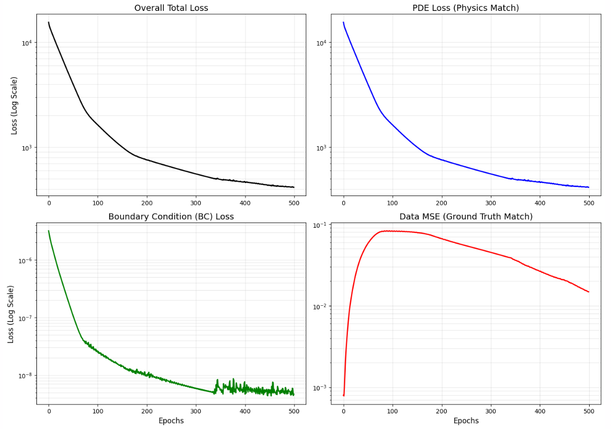
The plot is the same but the colors a bit more faded

#### With pde (target_magnitude * 1.0):
Post Training Phase
Relative L2 Data Error: 0.26%
Relative L2 Physics Error: 15.29%
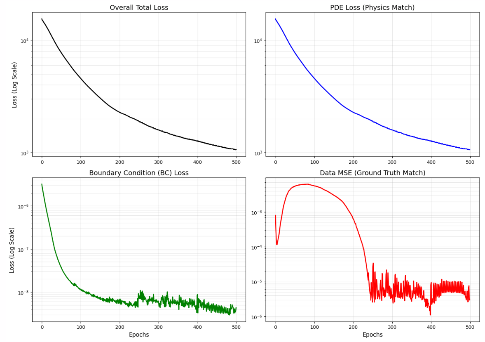
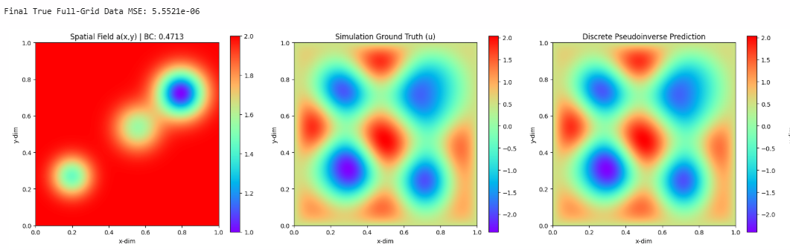

#### 3000 Epochs
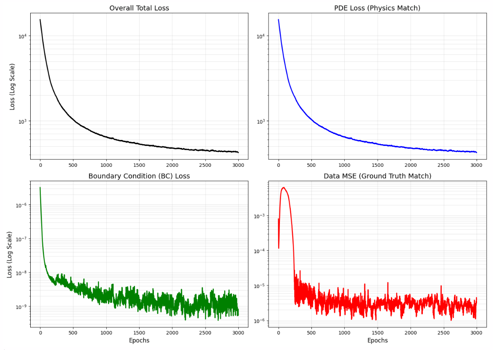
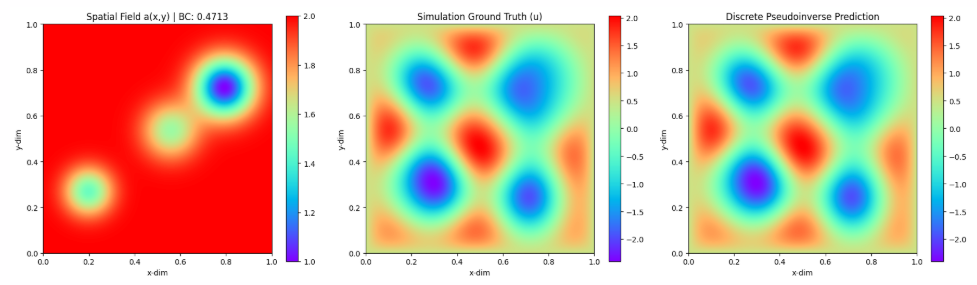

#### We try without dataloss:
Post Training Phase
Relative L2 Data Error: 36.41%
Relative L2 Physics Error: 14.48%
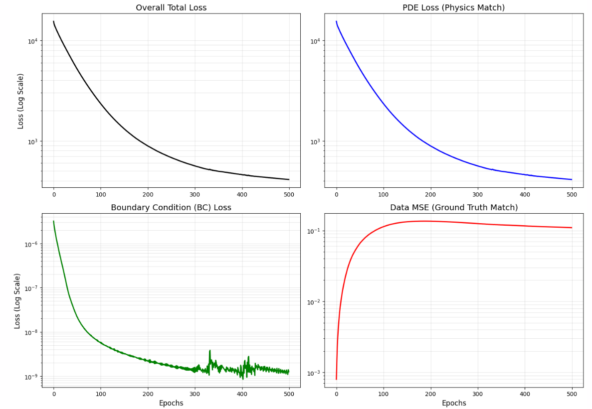
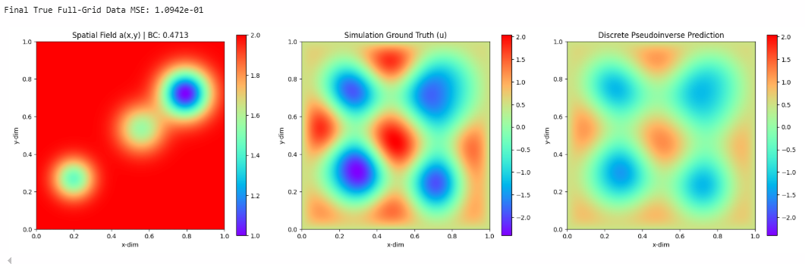

#### Trying again with paper's "incorrect" equation:
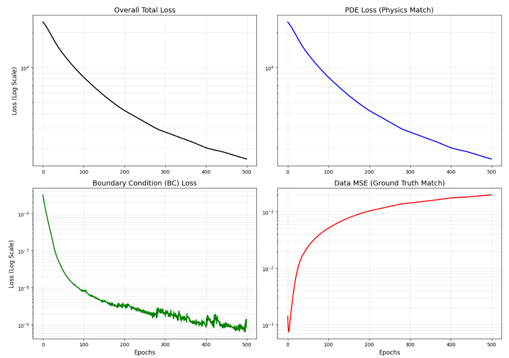
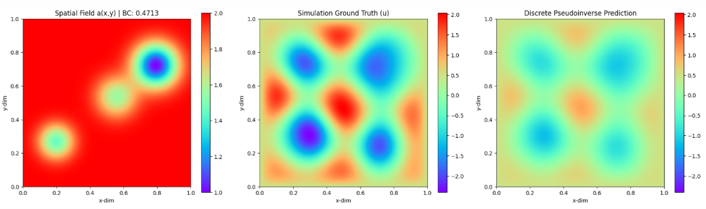

#### We try without dataloss with paper's "incorrect" equation:
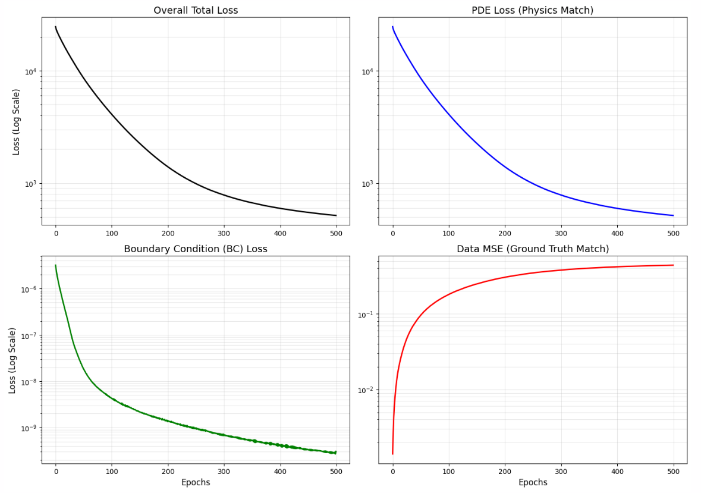
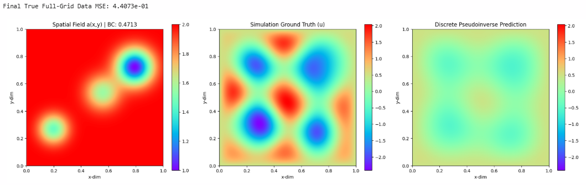

#### Wrong Equation Verification
For Sample_0
RAW SIMULATION PDE RESIDUAL 
Using omega_sq = 123.3701
Mean Absolute Error (MAE): 8.7743e+00
Mean Squared Error (MSE):  3.5659e+02
Maximum Point Error:       9.8974e+01
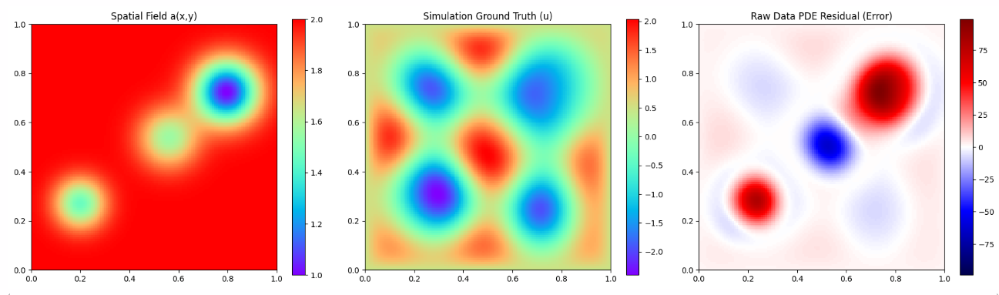

RAW SIMULATION PDE RESIDUAL
Using omega_sq = 61.6850
Mean Absolute Error (MAE): 8.3777e+01
Mean Squared Error (MSE):  1.0256e+04
Maximum Point Error:       2.4818e+02
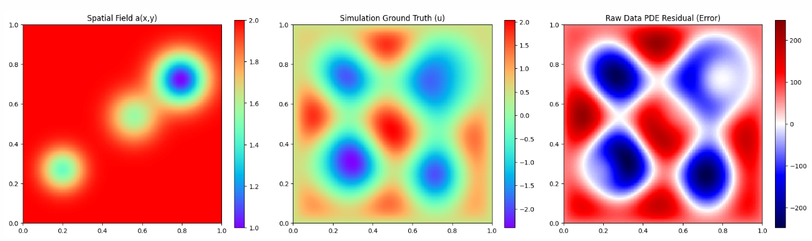

### Sunday
Reaction Term Magnitude:       1.2611e+02
5-Point Stencil Magnitude:     9.6660e+02
Exact AD (jacfwd) Magnitude:   1.0024e+03

#### With AD, full grid
Epoch 0   | True Data MSE: 1.6205e-03
            ├─ Raw Residuals  => PDE: 3.0554e+04 | BC: 3.2707e-06
            └─ True Grad Norms => PDE: 7.341e+05 | BC: 2.451e-04 | Data Anchor: 5.107e-01

Epoch 450 | True Data MSE: 5.9990e-06
            ├─ Raw Residuals  => PDE: 1.4225e+03 | BC: 4.1973e-09
            └─ True Grad Norms => PDE: 3.795e+04 | BC: 1.177e-05 | Data Anchor: 2.835e-02

#### With AD, full grid without boundary (126x126)
Epoch 0   | True Data MSE: 1.2507e-03
            ├─ Raw Residuals  => PDE: 2.6076e+04 | BC: 3.2545e-06
            └─ True Grad Norms => PDE: 6.247e+05 | BC: 2.417e-04 | Data Anchor: 4.562e-01

Epoch 450 | True Data MSE: 3.2734e-06
            ├─ Raw Residuals  => PDE: 1.3343e+03 | BC: 4.5006e-09
            └─ True Grad Norms => PDE: 4.559e+04 | BC: 1.346e-05 | Data Anchor: 8.366e-03

**Fixing the sampling to 100% exclude the boundary points make things better.**

#### No Freeze, with pde, bc and data loss
sigma = 3.0 
tik_reg_fixed = 1e-4 
matrix_bc_weight = 1e11
pde_loss_weight = 1e-6
bc_loss_weight = 1e4
data_loss_weight = 1

Epoch 0   | Tot Loss (scaled): 2.754e+00 | PDE(un): 1.002e+06 | BC(un): 1.046e-04 | Data(un): 7.067e-01
            └─ Grad Norms => Tot: 4.875e+01 | PDE: 1.514e+01 | BC: 3.901e+01 | Data: 6.111e+00
Epoch 990 | Tot Loss (scaled): 5.501e-04 | PDE(un): 5.354e+02 | BC(un): 3.302e-10 | Data(un): 1.134e-05
            └─ Grad Norms => Tot: 1.411e-02 | PDE: 1.252e-02 | BC: 8.209e-03 | Data: 8.893e-03

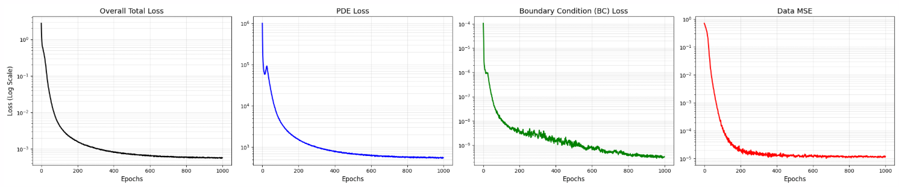
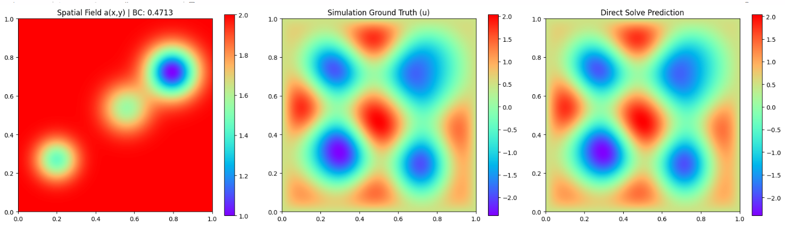

#### No Freeze, with pde and bc loss
sigma = 3.0 
tik_reg_fixed = 1e-4 
matrix_bc_weight = 1e11
pde_loss_weight = 1e-6
bc_loss_weight = 1e4
data_loss_weight = 0

Epoch 0   | Tot Loss (scaled): 2.048e+00 | PDE(un): 1.002e+06 | BC(un): 1.046e-04 | Data(un): 7.067e-01
            └─ Grad Norms => Tot: 4.791e+01 | PDE: 1.514e+01 | BC: 3.901e+01 | Data: 0.000e+00
Epoch 990 | Tot Loss (scaled): 1.344e-03 | PDE(un): 1.339e+03 | BC(un): 5.054e-10 | Data(un): 6.128e-01
            └─ Grad Norms => Tot: 6.911e-03 | PDE: 6.060e-03 | BC: 2.346e-03 | Data: 0.000e+00

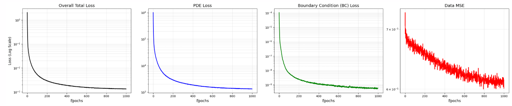
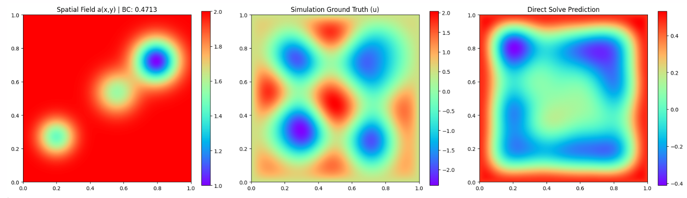

### Monday
#### Frozen weights then train without data loss
#### Sigma = 3
1000 epochs initial train with data loss and no pseudoinverse: e-03
Fine tune:
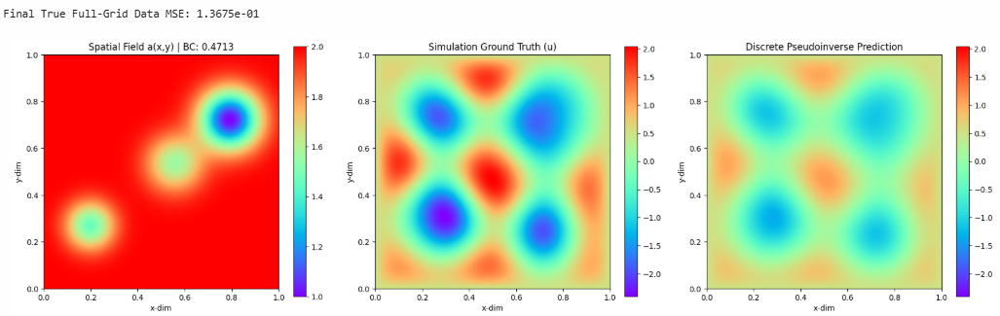
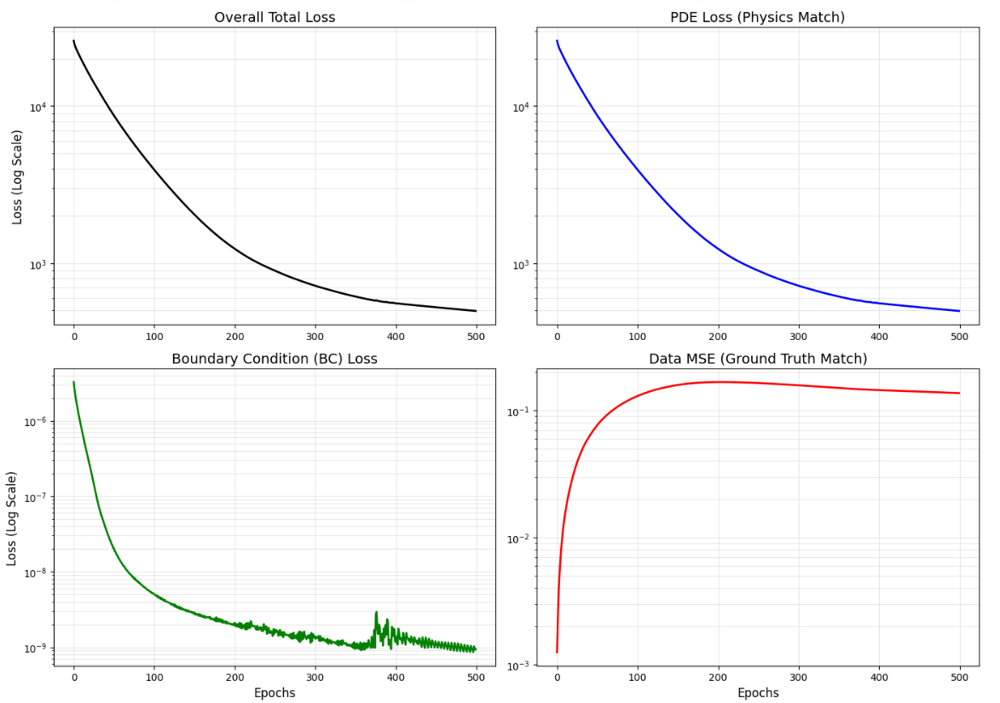

#### Sigma = 11
1000 epochs initial train with data loss and no pseudoinverse: e-08
Fine tune:
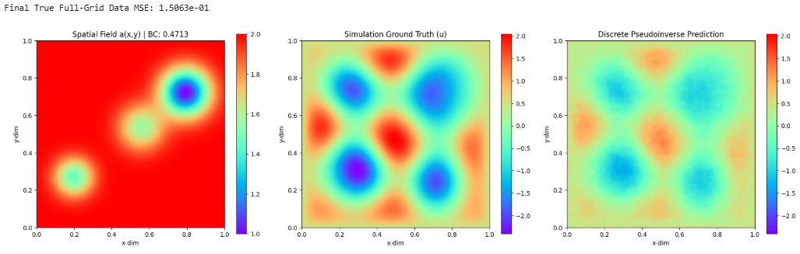
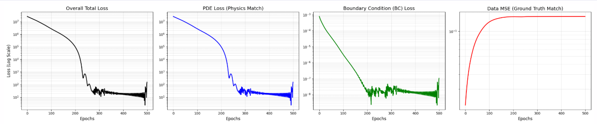

#### With lambda in loss function no gradnorm, frozen weights then tune:
sigma = 3.0 
tik_reg_fixed = 1e-4 
matrix_bc_weight = 1e11
pde_loss_weight = 1e-6
bc_loss_weight = 1e4
data_loss_weight = 1
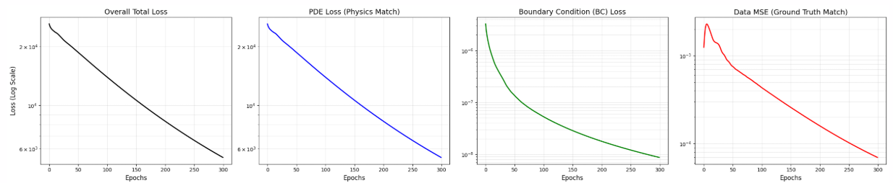

#### With lambda in loss function no gradnorm, frozen weights then tune:
sigma = 3.0 
tik_reg_fixed = 1e-4 
matrix_bc_weight = 1e11
pde_loss_weight = 1e-6
bc_loss_weight = 1e4
data_loss_weight = 0
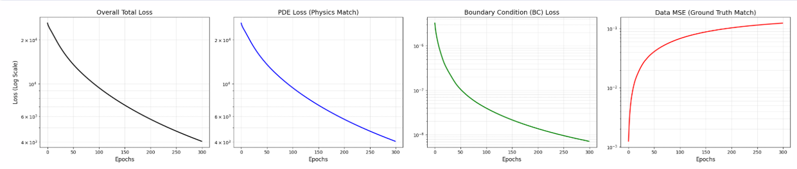