### Daily Report
* **Tuesday-Monday** - Try Darcy Flow Dataset

### Dataset
D.4 Darcy FlowWe experiment with the steady-state solution of 2D Darcy Flow over the unit square, whose viscosity term $a(x)$ is an input of the system. The solution of the steady-state is defined by the following equation:$$-\nabla(a(x)\nabla u(x)) = f(x), \quad x \in (0,1)^2 $$

$$u(x) = 0, \quad x \in \partial(0,1)^2 $$

In this paper, the force term $f$ is set as a constant value $\beta$, changing the scale of the solution $u(x)$. Instead of directly solving Equation 13, we obtained the solution by solving a temporal evolution equation:

$$\partial_t u(x,t) - \nabla(a(x)\nabla u(x,t)) = f(x), \quad x \in (0,1)^2$$

with random field initial condition, until reaching a steady state. The numerical calculation was performed the same as the case of the 1D Diffusion-Reaction equation.

#### Some extra stats
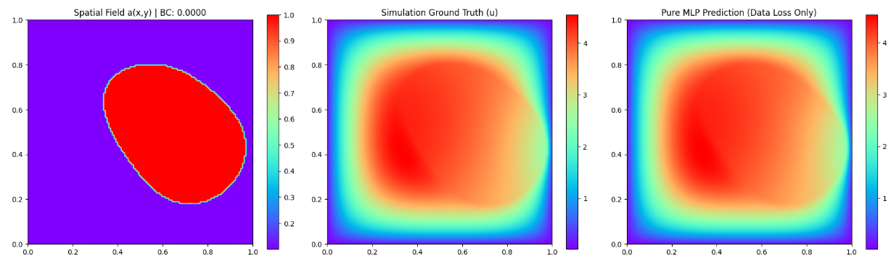
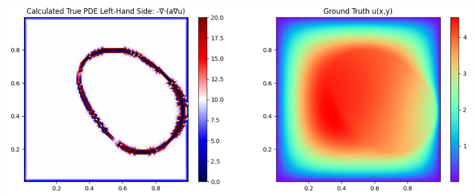
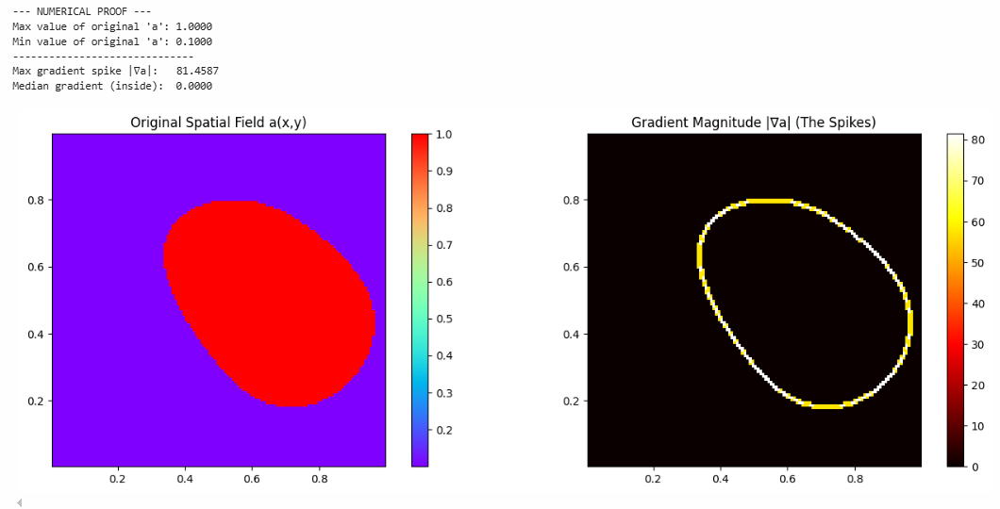

## Results
### Wednesday
Both using sigma 0.7, freeze weights (data loss)> then change to pseudoinverse grid search. No tuning.
Smoothing the a(x,y) boundary, then masking out the points with gradient > 0.01. (So a ring is masked out and not sampled)

#### Freeze Weights Setup: No concat mlp 
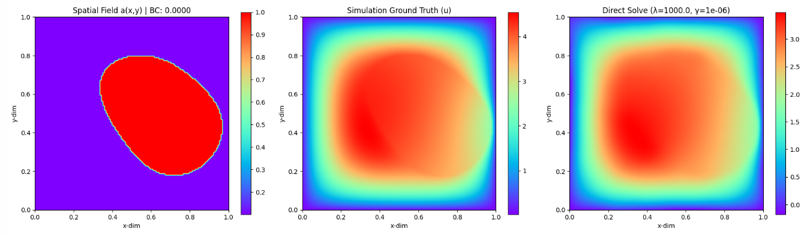

#### Freeze Weights Setup: Concat mlp
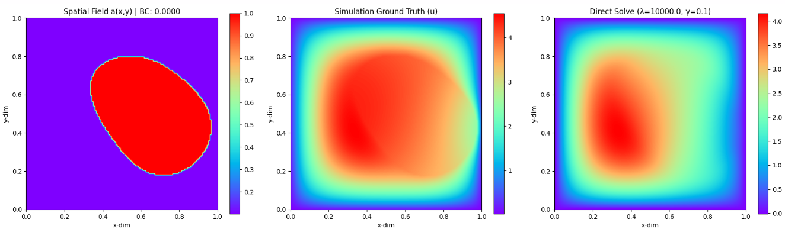

#### Main pipeline
With smoothing and not sampling the ring.

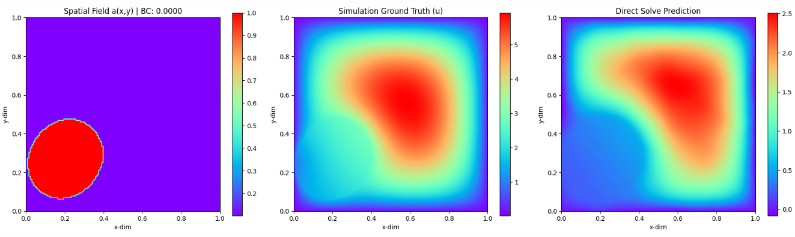

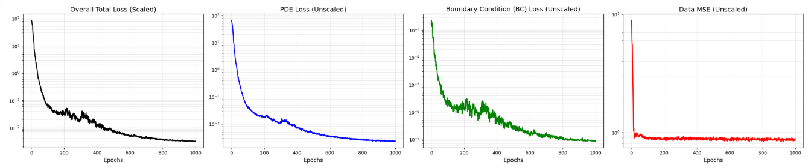

### Thursday
With smoothing and sampling the ring (aka everything).
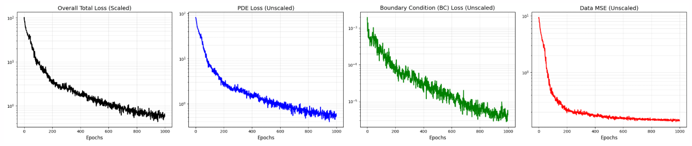
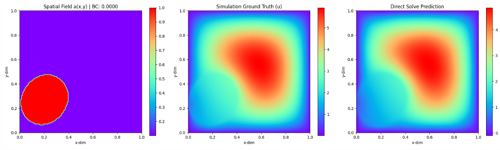

below 300 epoch only
No smoothing and sampling ring

No smoothing and no sampling ring
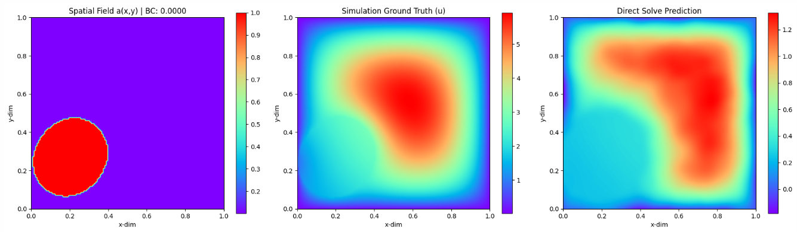
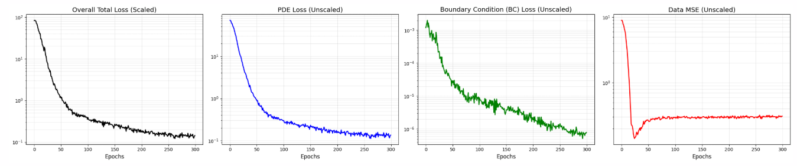

**Hence, we proceed with normal sampling and smoothing. We find that 1e2 is a great spot for the bc scaling factor as shown below. However, the magnitude is still a little low.**

**We increase the gaussian smoothing sigma from 1 to 2, leading to pde loss dropping from e-01 to e-02. The magnitude improved but still lower, hence data mse did not really improve. Also, the ring became a littly blurrier around the circle. compared to when the sigma is 1.**
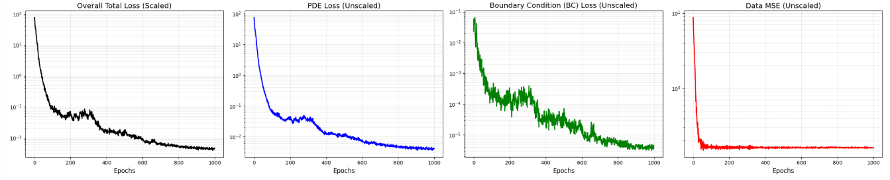
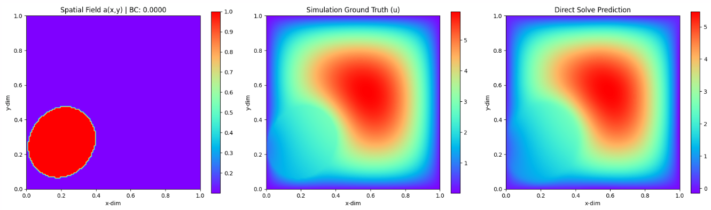

We try gaussian_filter sigma 1.5 is just less blurry. logically around the middle of 1 to 2 blurriness. Not much changes. Main problem still amplitude.

### Friday
Need to figure out how to get the amplitude good. Tried many different hyperparameters but not improving.
Let's try the concat version.
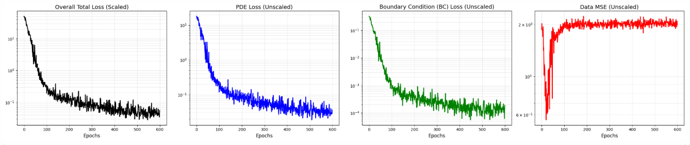
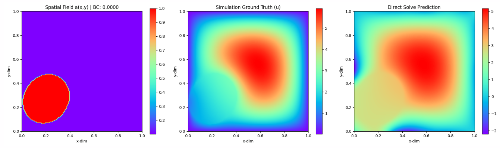

### Saturday
After trying a lot of variations, it appears that the amplitude problem is still there. 
Because the smoothing of the a(x,y) changes the underlying domain, it likely is the cause of the lower amplitude. Testing with other samples, such as one with way lower amplitude in the simulation data shows the same results:

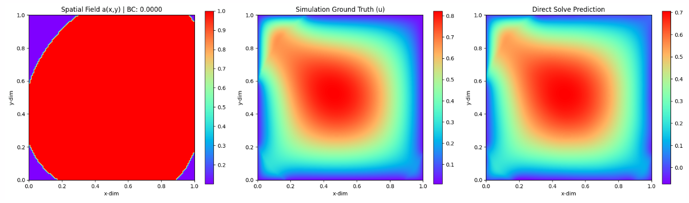

Relative L2 Error: 1.6889e-01 (or 16.89%)

### Monday
We want to confirm if the smear is the true reason for the lack of amplitude.
So, we increase the number of points in the solve and/or reduce the smear, the amplitude should increase.

#### sigma 0.5, 2x grid resolution
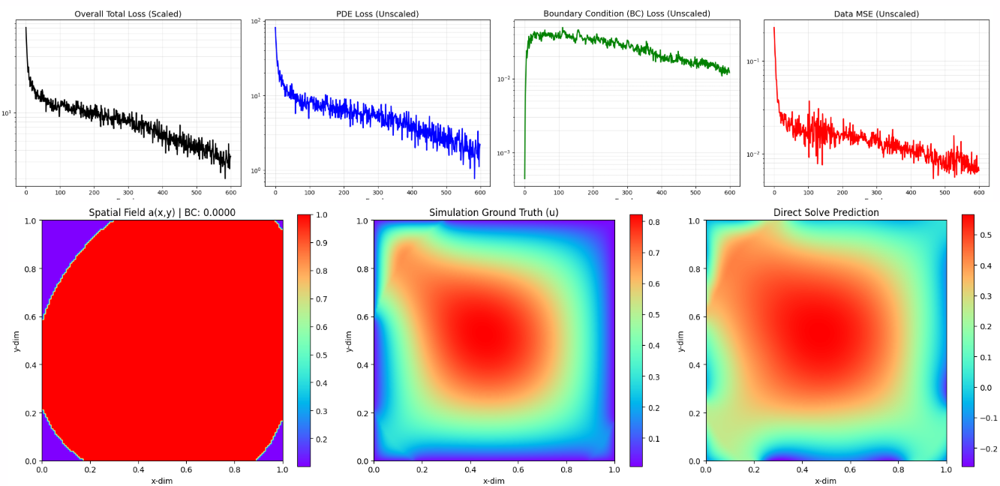

#### sigma 1, 2x grid resolution
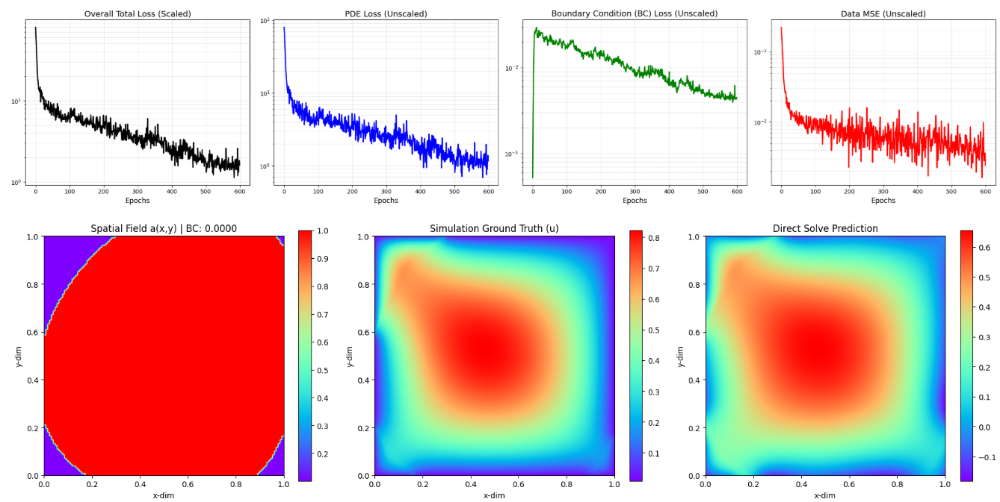

#### sigma 2, 2x grid resolution (like original)
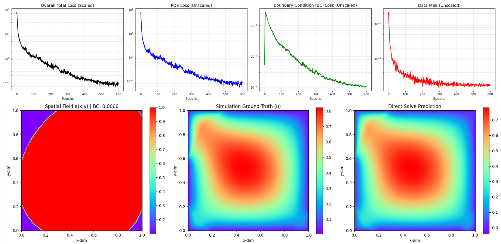

Results improved a lot.
Relative L2 Error: 8.3596e-02 (or 8.36%)

Another example:

2000 points sampled:
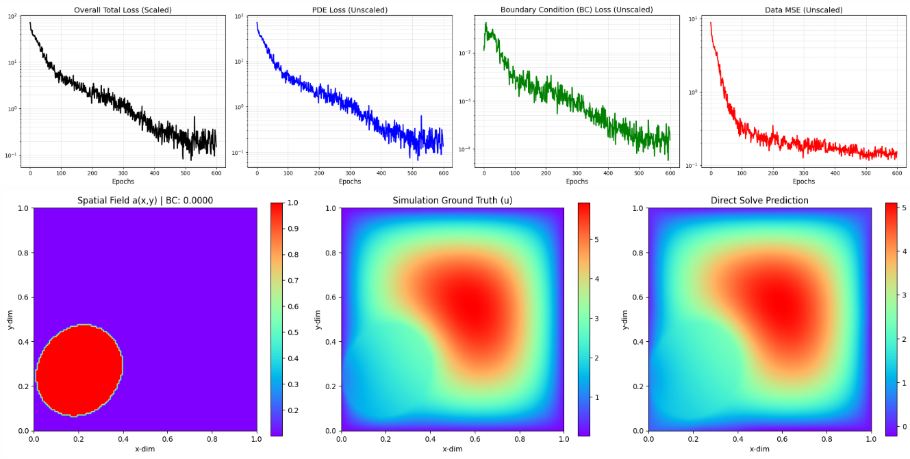

Relative L2 Error: 1.5764e-01 (or 15.76%)

10000 points sample:
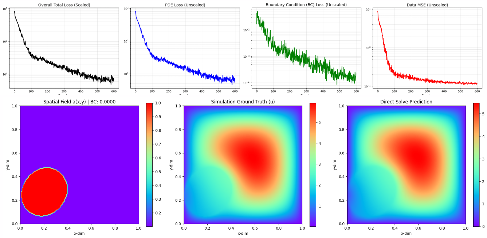

Relative L2 Error: 8.9654e-02 (or 8.97%)

#### Fixed a crucial bug regarding treating the given dataset boundary as boundary points
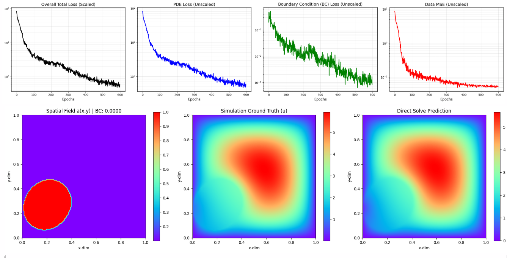

2x grid resolution
Relative L2 Error: 7.1185e-02 (or 7.12%)

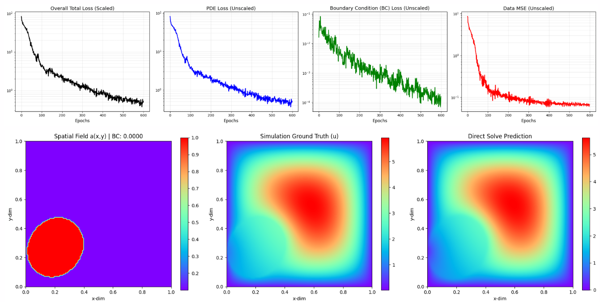

1x grid resolution
Relative L2 Error: 8.1897e-02 (or 8.19%)

#### Entire dataset for $\beta$ = 10
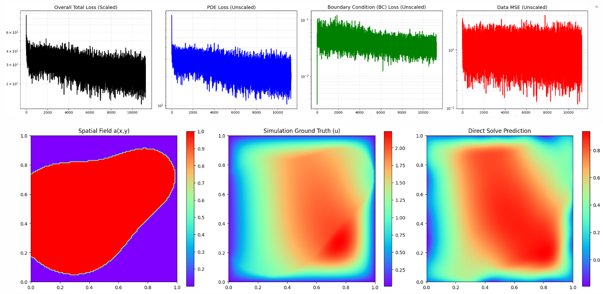

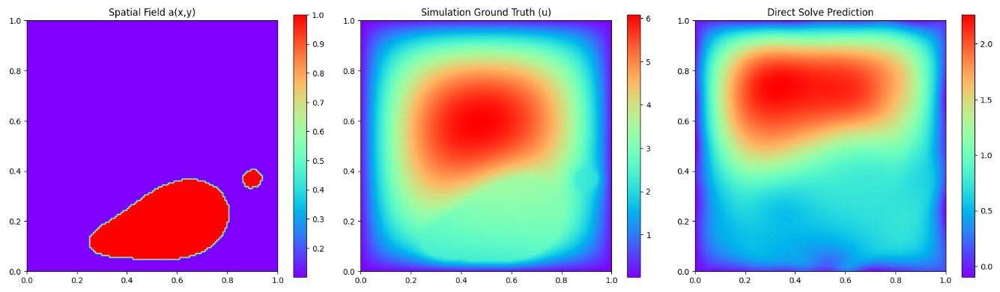

Epoch per step

### Tuesday
#### Try concat version with single sample
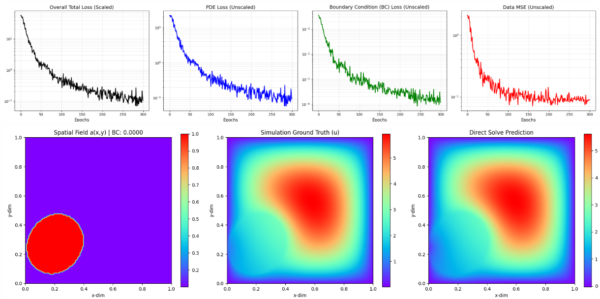

Relative L2 Error: 7.9302e-02 (or 7.93%)

#### Main full dataset pipeline but with single sample sanity check
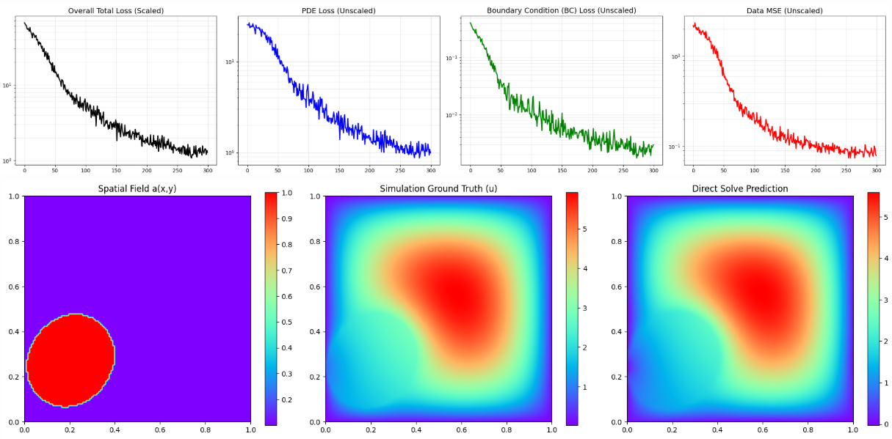

Relative L2 Error: 9.3880e-02 (or 9.39%)

#### With 90 samples 1024 features
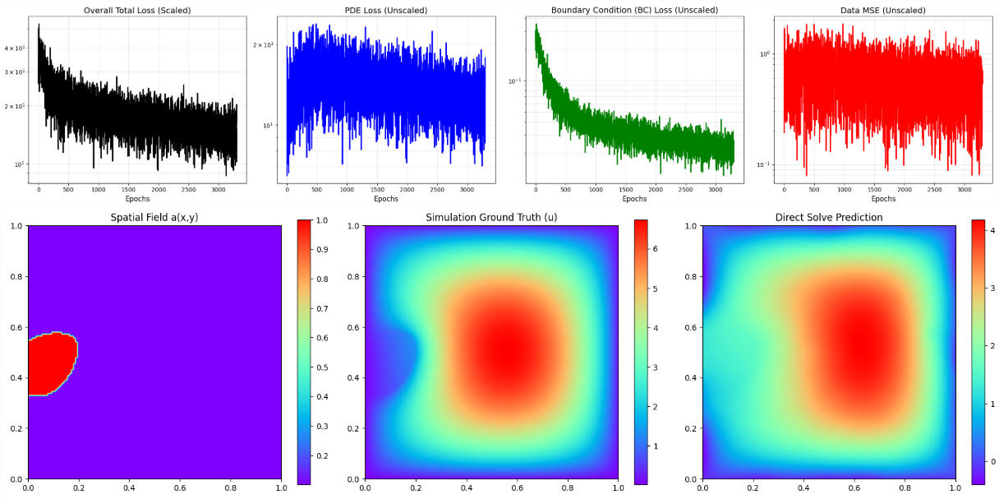

Relative L2 Error: 3.8423e-01 (or 38.42%) for sample 0.
Needs more features.