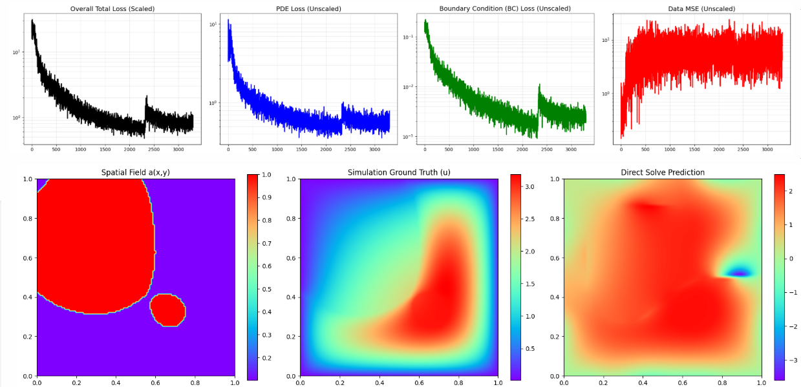
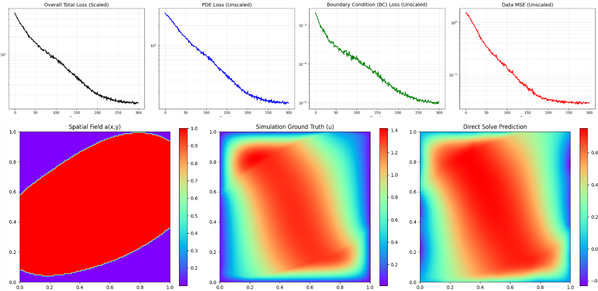
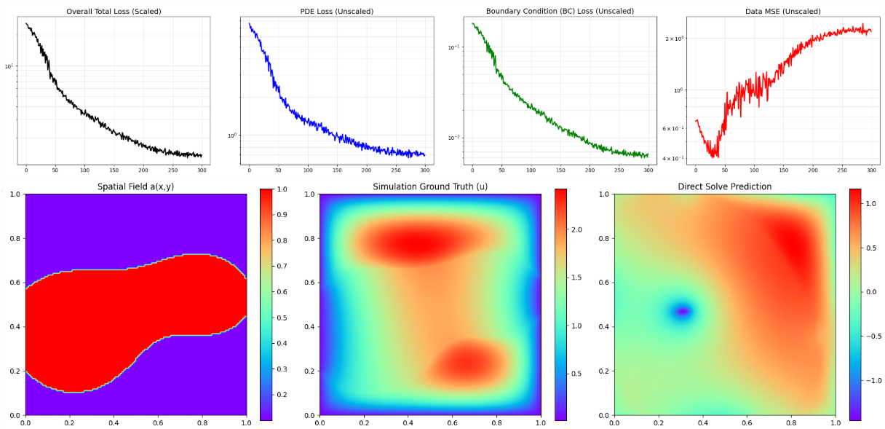
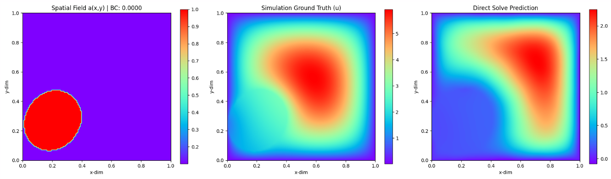
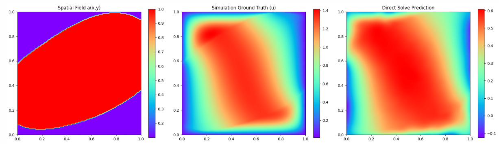
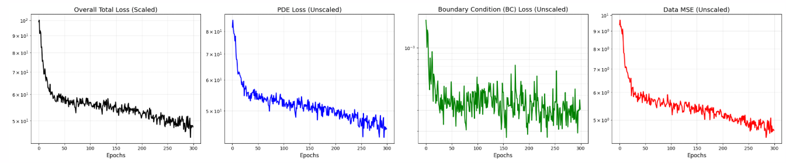
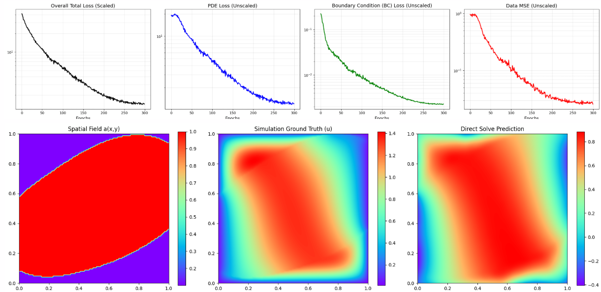

### Daily Report
* **Wednesday** - Full sample model isnt working properly

### Results
### Wednesday
#### 100 Samples, 300 Epochs, 5000 Points sampled during training, 2048 features, concat.

#### 10 Samples, 300 Epochs, 5000 Points sampled during training, 2048 features, concat.

#### 10 Samples, 300 Epochs, 5000 Points sampled during training, M=512, 512,512,512,512 features, no concat.
We found that the network has the capacity to memorize the 10 samples, but when presented a new sample, it does badly.

#### 10 Samples, 300 Epochs, 5000 Points sampled during training, M=1024, 512,512,512,512 features, no concat.

