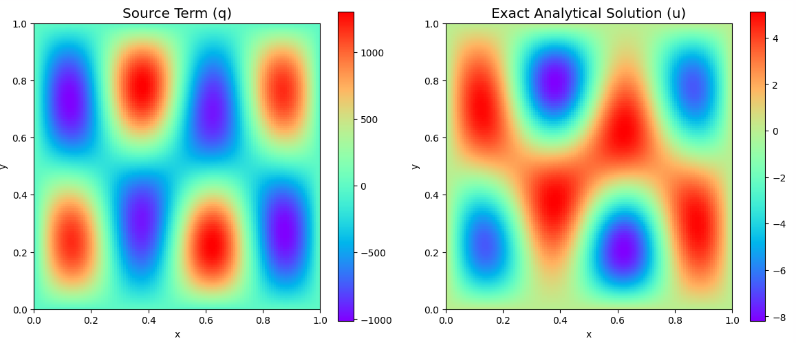
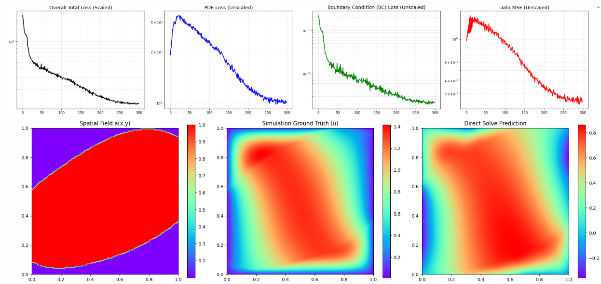
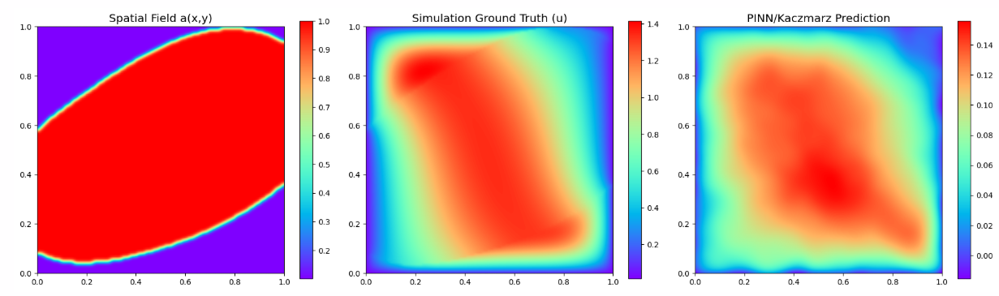
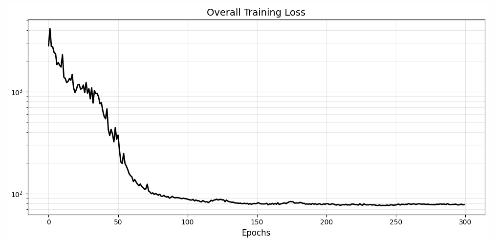
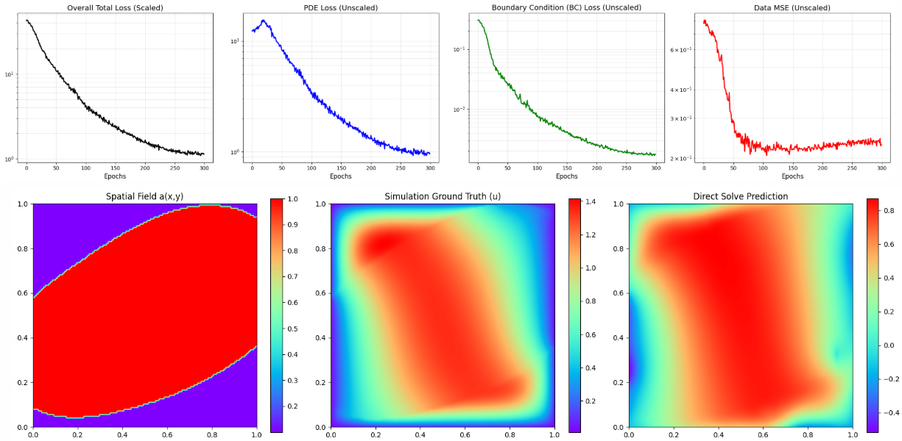
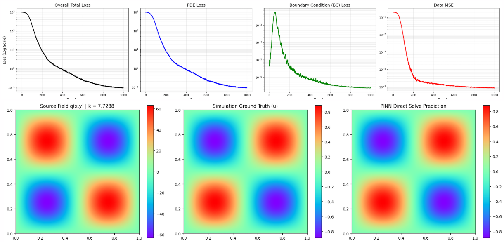

### Daily Report
* **Wednesday** - Full sample model isnt working properly
* **Thursday** - Because the results still look bad, we implement sketch and project to try to get more points sampled in. If still don't work good, then try to generate and make analytical helmholtz work first.
* **Friday** - Generate helmholtz analytical and train

#### Analytical Helmholtz Data Generation
Nodal grid, not cell center. Dirichlet Boundary points in the dataset. 10K samples.

The NetCDF file has **two** variables called *solution* with dimensionality
  - 10000 (number of samples)
  - 128 (x-dim)
  - 128 (y-dim)
and *source* with dimensionality:
  - 10000 (number of samples)
  - 128 (x-dim)
  - 128 (y-dim)

The dataset consists of 10,000 unique, exact solutions to the 2D Helmholtz equation evaluated on a $128 \times 128$ nodal grid within the domain $x, y \in [0, 1]$.

A fixed maximum number of sinusoidal wave modes ($N_{max}$) is defined. For each sample, the wave number ($k$), integer frequencies ($f_1, f_2$), and continuous amplitudes ($A_i$) are randomized. To vary the complexity of the superimposed wave without altering array dimensions, a random subset of amplitudes is masked to zero ($A_i = 0$).

**Exact Solution ($u$):**
$$ u(x, y) = \sum_{i=1}^{N_{max}} A_i \sin(f_{1,i} \pi x) \sin(f_{2,i} \pi y) $$

**Analytical Forcing Term ($q$):**
$$ q(x, y) = \sum_{i=1}^{N_{max}} A_i \left( k - (f_{1,i} \pi)^2 - (f_{2,i} \pi)^2 \right) \sin(f_{1,i} \pi x) \sin(f_{2,i} \pi y) $$

Example sample:

### Results
### Wednesday
#### 100 Samples, 300 Epochs, 5000 Points sampled during training, 2048 features, concat.

#### 10 Samples, 300 Epochs, 5000 Points sampled during training, 2048 features, concat.

#### 10 Samples, 300 Epochs, 5000 Points sampled during training, M=512, 512,512,512,512 features, no concat.
We found that the network has the capacity to memorize the 10 samples, but when presented a new sample, it does badly.

#### 10 Samples, 300 Epochs, 5000 Points sampled during training, M=1024, 1024,1024,1024,1024 features, no concat.

#### 10 Samples, 300 Epochs, 5000 Points sampled during training, M=1024, 1024,1024,1024,1024 features, no concat.

#### 10 Samples, 300 Epochs, 5000 Points sampled during training, M=1024, 1024,1024,1024,1024 features, no concat. Bc scaling from 1e2 increase to 1e4

### Thursday
#### Sketch-And-Project 10 Samples, 300 Epochs, 10000 Points sampled during training, M=256, 128,128,128,128 features, concat. Bc scaling from 1e2 increase to 1e4
Does not work, stopped early. Train and val loss doesn't go down, with RFF appended still the same results.
Epoch 031 | Train Loss: 5.2852e+02 | Val MSE: 5.1597e-01 
Epoch 086 | Train Loss: 5.5725e+02 | Val MSE: 6.2188e-01

#### Sketch-And-Project 10 Samples, 100 Epochs, 10000 Points sampled during training, M=1024, 512,512,512,512 features, no concat.

### Friday
#### 10 Samples, 300 Epochs, 8000 Points sampled during training, M=1024, 1024,1024,1024,1024 features, no concat. Bc scaling 1e2
try xavier initialization

#### Saturday
#### Helmholtz Analytic Single Sample
sigma = 3.0 
tik_reg_fixed = 1e-4 
matrix_bc_weight = 1e11
pde_loss_weight = 1e-6
bc_loss_weight = 1e4
data_loss_weight = 0

#### Helmholtz Analytic Full Dataset Training...