### Daily Report
* **Monday** - Train 2 PDE model
* **Tuesday-Wednesday** - Debug darcy flow, try to model can memorize how many N samples in training dat
* **Thursday** - Debug darcy flow, see if network can memorize 128 samples with training loss and also predict on unseen samples
* **Friday** - Train layernorm to see if it helps get neurons to work, looks like a lot of neurons are being useless

### Training Setup
2 Dataloaders, each extracts a batch of 8, so in 1 step, there is 16 samples (8 + 8) being trained. The network takes in only (x,y). The network knows which equation it is evaluating by looking at the variable name by hardcoding.

#### Loss Function (scaled values)
$$L_{Total} = \sum_{i=1}^{8} Loss(\text{Poisson}_i) + \sum_{j=1}^{8} Loss(\text{Helmholtz}_j)$$
```
def combined_loss_eval(params, x_pde, y_pde, p_s, p_u, h_q, h_k, h_u, x_bc, y_bc):
    (p_pde_sc, p_bc_sc), aux_p = batched_poisson(params, x_pde, y_pde, p_s, x_bc, y_bc, p_u)
    (h_pde_sc, h_bc_sc), aux_h = batched_helmholtz(params, x_pde, y_pde, h_q, h_k, x_bc, y_bc, h_u)
```
```
(loss_pde * pde_loss_weight, loss_bc * bc_loss_weight), (loss_pde, loss_bc, loss_data)
```

### Monday
#### Helmholtz Analytic Full Dataset Concat
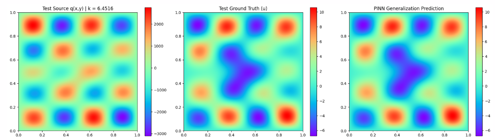

Single Sample:
Relative L2 Error : 1.440884e-06
MSE (Data) Loss   : 2.861223e-11
BC Loss           : 5.031030e-10
PDE Loss          : 2.437208e-05

#### Poisson Gauss + Helmholtz Analytic Combined
epochs = 5
M = 512 
chunk_size = 256 
hidden_layers = [256, 256, 256, 256]
sigma = 1.0 
tik_reg_fixed = 1e-6 
matrix_bc_weight = 1e4
pde_loss_weight = 1.0
bc_loss_weight = 1e4
spatial_batch_size = 5000

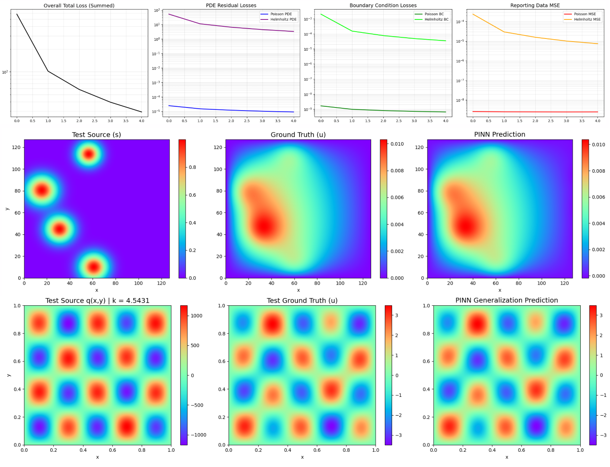

###### For the specific sample shown in the screenshot:
###### Poisson Gauss Sample Metrics 
Relative L2 Error : 1.0406e-02
Data MSE Loss     : 2.0512e-09
PDE Loss          : 1.2419e-05
BC Loss           : 3.4809e-09

##### Helmholtz Sample Metrics
Relative L2 Error : 2.3503e-03
Data MSE Loss     : 9.8314e-05
PDE Loss          : 1.6701e+01
BC Loss           : 8.8728e-04

### Tuesday
#### Run 1
n_train = 128
epochs = 100
M = 512
hidden_layers = [256,256,256,256] 
sigma = 1
tik_reg_fixed = 1e-6
matrix_bc_weight = 1e4
pde_loss_weight = 1.0
bc_loss_weight = 1e4
spatial_batch_size = 5000 

Epoch 001 | Train Loss: 6.9969e+01 | Val MSE: 2.6338e+00 | PDE(un): 4.737e+01 | BC(un): 2.260e-03
Epoch 011 | Train Loss: 5.9043e+01 | Val MSE: 2.4074e+00 | PDE(un): 4.984e+01 | BC(un): 9.200e-04
Epoch 021 | Train Loss: 4.5160e+01 | Val MSE: 2.2699e+00 | PDE(un): 3.636e+01 | BC(un): 8.799e-04
Epoch 031 | Train Loss: 4.7551e+01 | Val MSE: 2.2337e+00 | PDE(un): 3.886e+01 | BC(un): 8.687e-04
Epoch 041 | Train Loss: 4.1064e+01 | Val MSE: 2.3022e+00 | PDE(un): 3.524e+01 | BC(un): 5.823e-04
Epoch 051 | Train Loss: 3.5094e+01 | Val MSE: 2.0947e+00 | PDE(un): 3.112e+01 | BC(un): 3.969e-04
Epoch 061 | Train Loss: 3.8738e+01 | Val MSE: 2.1359e+00 | PDE(un): 3.596e+01 | BC(un): 2.774e-04
Epoch 071 | Train Loss: 3.1890e+01 | Val MSE: 2.0842e+00 | PDE(un): 2.940e+01 | BC(un): 2.494e-04
Epoch 081 | Train Loss: 2.5940e+01 | Val MSE: 2.0933e+00 | PDE(un): 2.424e+01 | BC(un): 1.701e-04
Epoch 091 | Train Loss: 3.1367e+01 | Val MSE: 2.0937e+00 | PDE(un): 2.796e+01 | BC(un): 3.405e-04

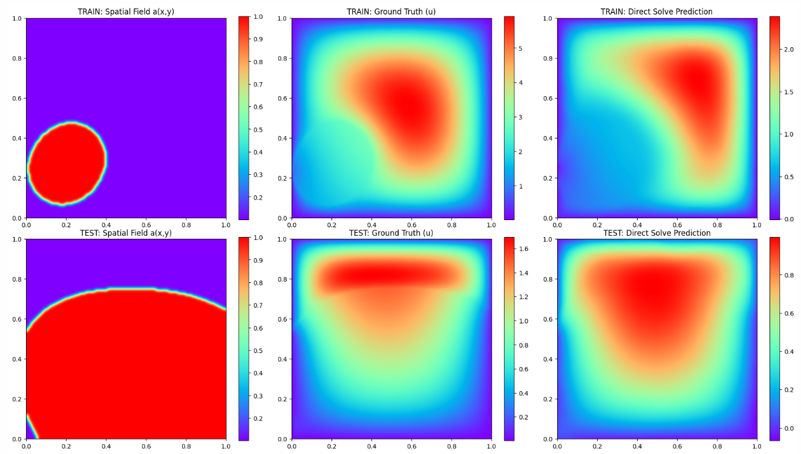

#### Run 2
n_train = 128
epochs = 10
M = 1024
hidden_layers = [512,512,512,512] 
sigma = 1
tik_reg_fixed = 1e-6
matrix_bc_weight = 1e4
pde_loss_weight = 1.0
bc_loss_weight = 5e3
spatial_batch_size = 5000 
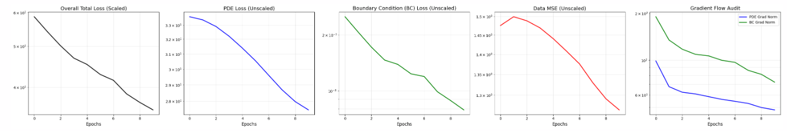

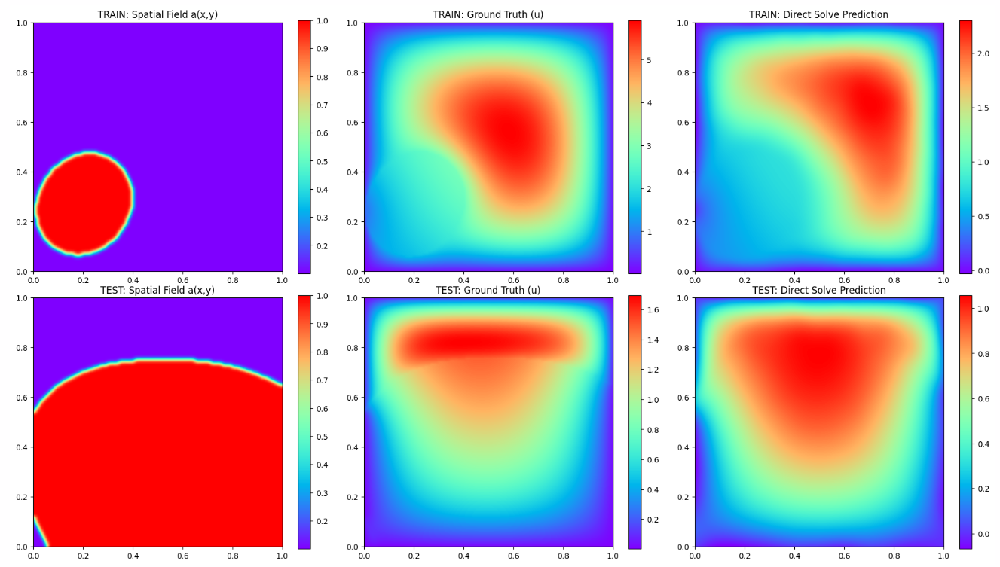


Epoch 0   | Tot Loss (scaled): 4.418e+01 | PDE(un): 3.190e+01 | BC(un): 2.456e-03 | Data(un): 1.416e+00
            └─ Grad Norms => Tot: 1.179e+02 | PDE: 8.365e+01 | BC: 8.734e+01
Epoch 10  | Tot Loss (scaled): 3.568e+01 | PDE(un): 2.817e+01 | BC(un): 1.502e-03 | Data(un): 1.346e+00
            └─ Grad Norms => Tot: 6.763e+01 | PDE: 4.752e+01 | BC: 5.077e+01

#### Run 3
n_train = 128
epochs = 30
M = 1024
hidden_layers = [512,512,512,512] 
sigma = 1
tik_reg_fixed = 1e-6
matrix_bc_weight = 1e2
pde_loss_weight = 1.0
bc_loss_weight = 1e2
spatial_batch_size = 5000 

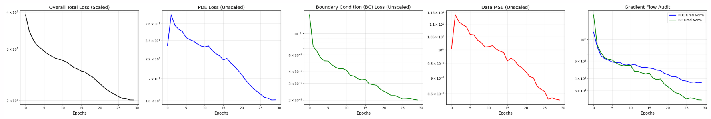

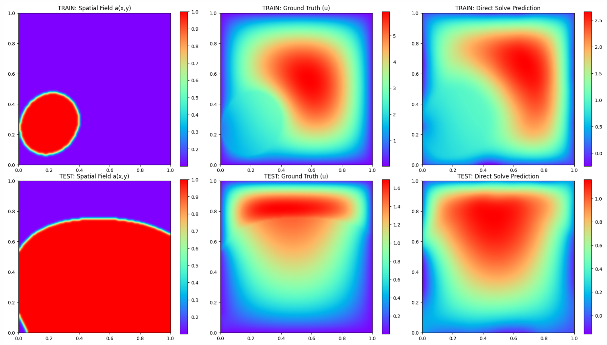


Epoch 0   | Tot Loss (scaled): 3.914e+01 | PDE(un): 2.342e+01 | BC(un): 1.572e-01 | Data(un): 1.005e+00
            └─ Grad Norms => Tot: 1.646e+02 | PDE: 1.185e+02 | BC: 1.780e+02
Epoch 10  | Tot Loss (scaled): 2.737e+01 | PDE(un): 2.327e+01 | BC(un): 4.100e-02 | Data(un): 1.012e+00
            └─ Grad Norms => Tot: 5.407e+01 | PDE: 5.435e+01 | BC: 5.389e+01
Epoch 20  | Tot Loss (scaled): 2.284e+01 | PDE(un): 2.037e+01 | BC(un): 2.477e-02 | Data(un): 9.205e-01
            └─ Grad Norms => Tot: 3.987e+01 | PDE: 4.365e+01 | BC: 3.282e+01

<!-- Condition Number of (A^T A + lambda I): 2.4814e+06
L2 Norm of predicted weights (w): 4.3085e-01 -->

#### Run 4
n_train = 1
epochs = 300
M = 512
hidden_layers = [256,256,256,256]
sigma = 1
tik_reg_fixed = 1e-6
matrix_bc_weight = 1e2
pde_loss_weight = 1.0
bc_loss_weight = 1e2
spatial_batch_size = 5000 

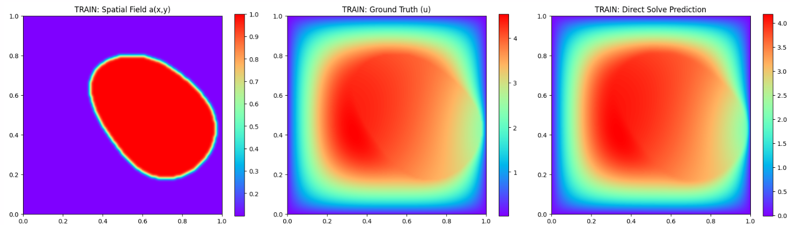
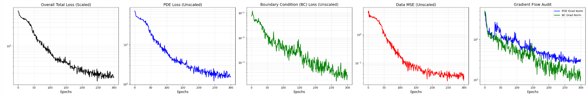


--- Test 1: Matrix Health Check ---
<!-- Condition Number of (A^T A + lambda I): 7.2740e+04
L2 Norm of predicted weights (w): 4.5392e-01 -->\

#### Run 5
n_train = 2
epochs = 300
M = 512
hidden_layers = [256,256,256,256]
sigma = 1
tik_reg_fixed = 1e-6
matrix_bc_weight = 1e2
pde_loss_weight = 1.0
bc_loss_weight = 1e2
spatial_batch_size = 5000 

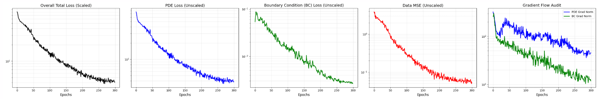
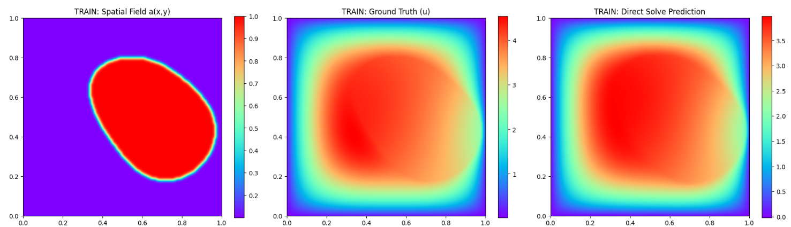


<!-- Condition Number of (A^T A + lambda I): 9.7342e+04
L2 Norm of predicted weights (w): 4.9609e-01 -->

#### Run 6
n_train = 4
epochs = 300
M = 512
hidden_layers = [256,256,256,256]
sigma = 1
tik_reg_fixed = 1e-6
matrix_bc_weight = 1e2
pde_loss_weight = 1.0
bc_loss_weight = 1e2
spatial_batch_size = 5000 


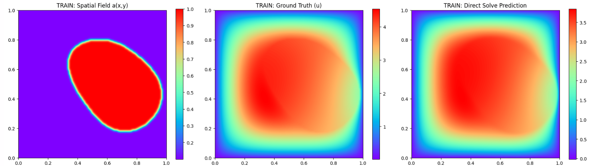

<!-- Condition Number of (A^T A + lambda I): 1.0727e+05
L2 Norm of predicted weights (w): 3.3352e-01 -->

#### Run 7
n_train = 4
epochs = 1000
M = 512
hidden_layers = [512,512,512,512]
sigma = 1
tik_reg_fixed = 1e-6
matrix_bc_weight = 1e2
pde_loss_weight = 1.0
bc_loss_weight = 1e2
spatial_batch_size = 5000 


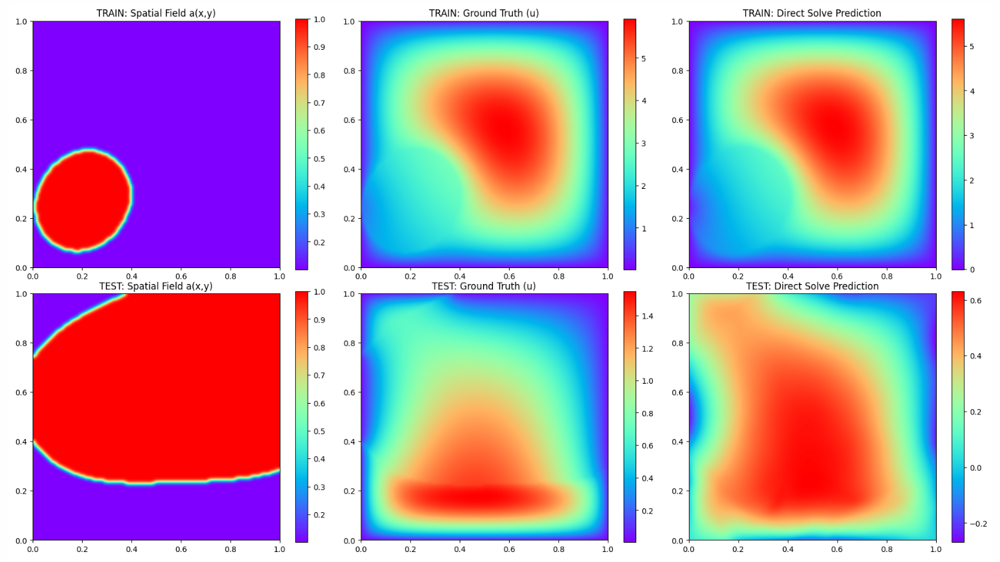

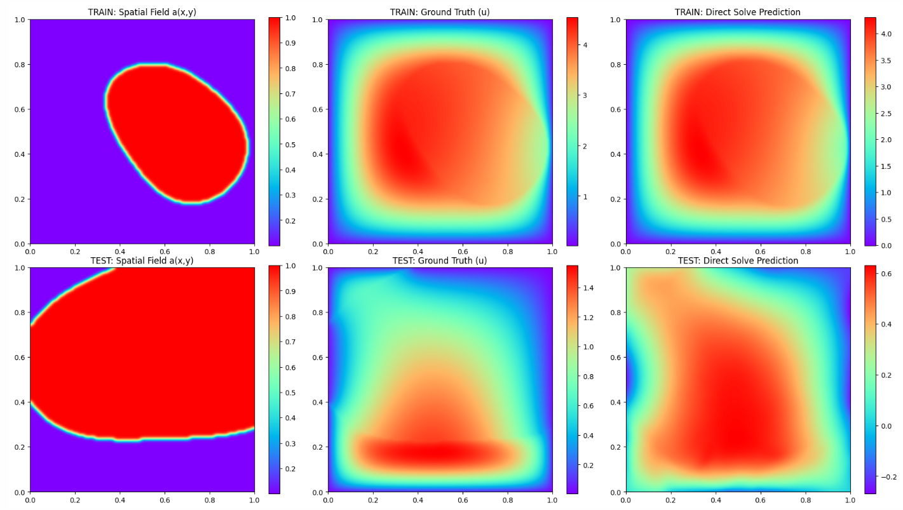
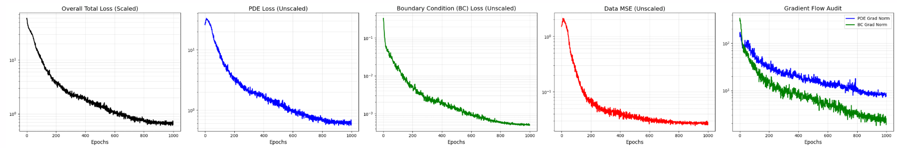


<!-- Condition Number of (A^T A + lambda I): 2.8416e+05
L2 Norm of predicted weights (w): 3.2086e-01 -->

TRAIN Relative L2 Error: 5.4168e-02 (or 5.42%)
TEST  Relative L2 Error: 5.6698e-01 (or 56.70%)

### Wednesday
#### Poisson Gauss and Helmholtz 10000 Samples
epochs = 5
M = 512 
chunk_size = 256 
hidden_layers = [256, 256, 256, 256]
sigma = 1.0 
tik_reg_fixed = 1e-6 
matrix_bc_weight = 1e4
pde_loss_weight = 1.0
bc_loss_weight = 1e4
spatial_batch_size = 5000

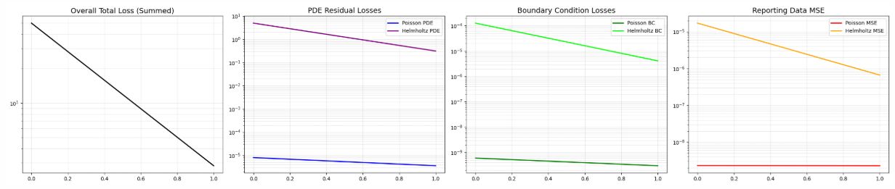


--- Poisson Sample Metrics ---
Relative L2 Error : 1.3480e-02
Data MSE Loss     : 1.1028e-09
PDE Loss          : 2.5479e-06
BC Loss           : 3.1928e-10

--- Helmholtz Sample Metrics ---
Relative L2 Error : 6.5737e-04
Data MSE Loss     : 3.0855e-06
PDE Loss          : 5.3679e-01
BC Loss           : 3.2749e-05

#### Darcy Flow Concat Run 8
n_train = 4
epochs = 1000
M = 512
hidden_layers = [256,256,256,256] 
sigma = 1
tik_reg_fixed = 1e-6
matrix_bc_weight = 1e2
pde_loss_weight = 1.0
bc_loss_weight = 1e2
spatial_batch_size = 5000 

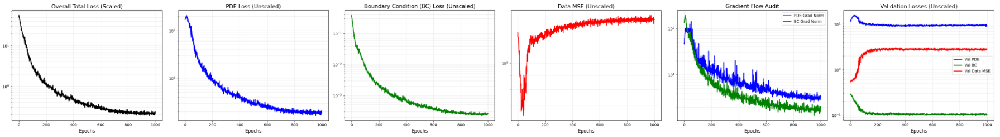


Condition Number of (A^T A + lambda I): 2.1803e+08
L2 Norm of predicted weights (w): 5.2734e-01

#### Darcy Flow Concat Run 9 (run 3 was 30 epochs)
n_train = 128
epochs = 600
M = 1024
hidden_layers = [512,512,512,512] 
sigma = 1
tik_reg_fixed = 1e-6
matrix_bc_weight = 1e2
pde_loss_weight = 1.0
bc_loss_weight = 1e2
spatial_batch_size = 5000 


Epoch 0   | Tot(s): 3.914e+01 | Tr PDE: 2.343e+01 | Tr BC: 1.571e-01 | Tr Data: 1.005e+00
            └─ Val PDE: 2.193e+01 | Val BC: 8.767e-02 | Val Data: 1.041e+00
            └─ Grad Norms => Tot: 1.646e+02 | PDE: 1.185e+02 | BC: 1.781e+02
Epoch 10  | Tot(s): 2.848e+01 | Tr PDE: 2.424e+01 | Tr BC: 4.237e-02 | Tr Data: 1.048e+00
            └─ Val PDE: 2.214e+01 | Val BC: 4.962e-02 | Val Data: 1.140e+00
            └─ Grad Norms => Tot: 5.747e+01 | PDE: 5.721e+01 | BC: 5.477e+01
Epoch 20  | Tot(s): 2.879e+01 | Tr PDE: 2.461e+01 | Tr BC: 4.181e-02 | Tr Data: 1.032e+00
            └─ Val PDE: 2.246e+01 | Val BC: 4.563e-02 | Val Data: 1.132e+00
            └─ Grad Norms => Tot: 6.089e+01 | PDE: 6.171e+01 | BC: 5.469e+01
Epoch 30  | Tot(s): 2.905e+01 | Tr PDE: 2.496e+01 | Tr BC: 4.087e-02 | Tr Data: 1.057e+00
            └─ Val PDE: 2.203e+01 | Val BC: 5.342e-02 | Val Data: 1.097e+00
            └─ Grad Norms => Tot: 6.157e+01 | PDE: 6.461e+01 | BC: 5.485e+01
Epoch 40  | Tot(s): 2.984e+01 | Tr PDE: 2.574e+01 | Tr BC: 4.098e-02 | Tr Data: 1.085e+00
            └─ Val PDE: 2.279e+01 | Val BC: 5.621e-02 | Val Data: 1.159e+00
            └─ Grad Norms => Tot: 6.674e+01 | PDE: 6.957e+01 | BC: 5.977e+01
Epoch 50  | Tot(s): 2.999e+01 | Tr PDE: 2.606e+01 | Tr BC: 3.931e-02 | Tr Data: 1.101e+00
            └─ Val PDE: 2.348e+01 | Val BC: 4.233e-02 | Val Data: 1.199e+00
            └─ Grad Norms => Tot: 6.731e+01 | PDE: 7.080e+01 | BC: 5.815e+01
Epoch 60  | Tot(s): 3.153e+01 | Tr PDE: 2.694e+01 | Tr BC: 4.590e-02 | Tr Data: 1.113e+00
            └─ Val PDE: 2.451e+01 | Val BC: 4.631e-02 | Val Data: 1.196e+00
            └─ Grad Norms => Tot: 7.068e+01 | PDE: 7.323e+01 | BC: 6.134e+01
Epoch 70  | Tot(s): 3.045e+01 | Tr PDE: 2.638e+01 | Tr BC: 4.072e-02 | Tr Data: 1.100e+00
            └─ Val PDE: 2.257e+01 | Val BC: 5.280e-02 | Val Data: 1.178e+00
            └─ Grad Norms => Tot: 6.835e+01 | PDE: 7.186e+01 | BC: 6.128e+01
Epoch 80  | Tot(s): 3.003e+01 | Tr PDE: 2.612e+01 | Tr BC: 3.915e-02 | Tr Data: 1.093e+00
            └─ Val PDE: 2.351e+01 | Val BC: 4.447e-02 | Val Data: 1.214e+00
            └─ Grad Norms => Tot: 6.723e+01 | PDE: 7.120e+01 | BC: 5.740e+01
Epoch 90  | Tot(s): 3.020e+01 | Tr PDE: 2.625e+01 | Tr BC: 3.953e-02 | Tr Data: 1.100e+00
            └─ Val PDE: 2.317e+01 | Val BC: 4.888e-02 | Val Data: 1.146e+00
            └─ Grad Norms => Tot: 6.988e+01 | PDE: 7.465e+01 | BC: 5.981e+01
Epoch 100 | Tot(s): 2.933e+01 | Tr PDE: 2.555e+01 | Tr BC: 3.780e-02 | Tr Data: 1.097e+00
            └─ Val PDE: 2.320e+01 | Val BC: 4.042e-02 | Val Data: 1.242e+00
            └─ Grad Norms => Tot: 6.589e+01 | PDE: 7.308e+01 | BC: 5.719e+01
Epoch 110 | Tot(s): 3.005e+01 | Tr PDE: 2.576e+01 | Tr BC: 4.292e-02 | Tr Data: 1.120e+00
            └─ Val PDE: 2.198e+01 | Val BC: 4.632e-02 | Val Data: 1.150e+00
            └─ Grad Norms => Tot: 7.064e+01 | PDE: 7.678e+01 | BC: 6.653e+01
Epoch 120 | Tot(s): 2.960e+01 | Tr PDE: 2.566e+01 | Tr BC: 3.938e-02 | Tr Data: 1.151e+00
            └─ Val PDE: 2.227e+01 | Val BC: 4.700e-02 | Val Data: 1.202e+00
            └─ Grad Norms => Tot: 6.961e+01 | PDE: 8.142e+01 | BC: 6.699e+01
Epoch 130 | Tot(s): 2.926e+01 | Tr PDE: 2.556e+01 | Tr BC: 3.706e-02 | Tr Data: 1.141e+00
            └─ Val PDE: 2.225e+01 | Val BC: 4.704e-02 | Val Data: 1.268e+00
            └─ Grad Norms => Tot: 6.938e+01 | PDE: 8.113e+01 | BC: 6.303e+01
Epoch 140 | Tot(s): 2.879e+01 | Tr PDE: 2.480e+01 | Tr BC: 3.988e-02 | Tr Data: 1.116e+00
            └─ Val PDE: 2.272e+01 | Val BC: 4.648e-02 | Val Data: 1.198e+00
            └─ Grad Norms => Tot: 6.942e+01 | PDE: 8.144e+01 | BC: 6.896e+01
Epoch 150 | Tot(s): 2.874e+01 | Tr PDE: 2.477e+01 | Tr BC: 3.974e-02 | Tr Data: 1.130e+00
            └─ Val PDE: 2.255e+01 | Val BC: 4.440e-02 | Val Data: 1.215e+00
            └─ Grad Norms => Tot: 7.373e+01 | PDE: 8.835e+01 | BC: 7.606e+01
Epoch 160 | Tot(s): 2.858e+01 | Tr PDE: 2.488e+01 | Tr BC: 3.695e-02 | Tr Data: 1.129e+00
            └─ Val PDE: 2.156e+01 | Val BC: 5.059e-02 | Val Data: 1.177e+00
            └─ Grad Norms => Tot: 7.335e+01 | PDE: 8.676e+01 | BC: 7.144e+01
Epoch 170 | Tot(s): 2.849e+01 | Tr PDE: 2.446e+01 | Tr BC: 4.035e-02 | Tr Data: 1.120e+00
            └─ Val PDE: 2.339e+01 | Val BC: 2.821e-02 | Val Data: 1.294e+00
            └─ Grad Norms => Tot: 7.807e+01 | PDE: 9.504e+01 | BC: 8.526e+01
Epoch 180 | Tot(s): 2.782e+01 | Tr PDE: 2.406e+01 | Tr BC: 3.756e-02 | Tr Data: 1.100e+00
            └─ Val PDE: 2.039e+01 | Val BC: 5.674e-02 | Val Data: 1.200e+00
            └─ Grad Norms => Tot: 7.559e+01 | PDE: 8.890e+01 | BC: 7.840e+01
Epoch 190 | Tot(s): 2.818e+01 | Tr PDE: 2.462e+01 | Tr BC: 3.560e-02 | Tr Data: 1.135e+00
            └─ Val PDE: 2.117e+01 | Val BC: 5.130e-02 | Val Data: 1.177e+00
            └─ Grad Norms => Tot: 7.490e+01 | PDE: 9.309e+01 | BC: 7.239e+01
Epoch 200 | Tot(s): 2.757e+01 | Tr PDE: 2.395e+01 | Tr BC: 3.622e-02 | Tr Data: 1.116e+00
            └─ Val PDE: 2.115e+01 | Val BC: 4.555e-02 | Val Data: 1.263e+00
            └─ Grad Norms => Tot: 7.766e+01 | PDE: 9.314e+01 | BC: 7.801e+01
Epoch 210 | Tot(s): 2.651e+01 | Tr PDE: 2.287e+01 | Tr BC: 3.641e-02 | Tr Data: 1.079e+00
            └─ Val PDE: 2.055e+01 | Val BC: 3.817e-02 | Val Data: 1.177e+00
            └─ Grad Norms => Tot: 6.934e+01 | PDE: 8.827e+01 | BC: 7.919e+01
Epoch 220 | Tot(s): 2.643e+01 | Tr PDE: 2.269e+01 | Tr BC: 3.747e-02 | Tr Data: 1.079e+00
            └─ Val PDE: 2.113e+01 | Val BC: 3.598e-02 | Val Data: 1.216e+00
            └─ Grad Norms => Tot: 7.199e+01 | PDE: 9.349e+01 | BC: 8.555e+01
Epoch 230 | Tot(s): 2.608e+01 | Tr PDE: 2.268e+01 | Tr BC: 3.401e-02 | Tr Data: 1.100e+00
            └─ Val PDE: 2.181e+01 | Val BC: 2.804e-02 | Val Data: 1.246e+00
            └─ Grad Norms => Tot: 7.261e+01 | PDE: 9.145e+01 | BC: 7.977e+01
Epoch 240 | Tot(s): 2.555e+01 | Tr PDE: 2.230e+01 | Tr BC: 3.248e-02 | Tr Data: 1.088e+00
            └─ Val PDE: 2.140e+01 | Val BC: 2.836e-02 | Val Data: 1.251e+00
            └─ Grad Norms => Tot: 6.858e+01 | PDE: 8.976e+01 | BC: 7.843e+01
Epoch 250 | Tot(s): 2.572e+01 | Tr PDE: 2.277e+01 | Tr BC: 2.949e-02 | Tr Data: 1.091e+00
            └─ Val PDE: 1.998e+01 | Val BC: 3.397e-02 | Val Data: 1.197e+00
            └─ Grad Norms => Tot: 7.461e+01 | PDE: 9.360e+01 | BC: 7.102e+01
Epoch 260 | Tot(s): 2.590e+01 | Tr PDE: 2.258e+01 | Tr BC: 3.325e-02 | Tr Data: 1.087e+00
            └─ Val PDE: 1.917e+01 | Val BC: 5.133e-02 | Val Data: 1.110e+00
            └─ Grad Norms => Tot: 7.160e+01 | PDE: 9.007e+01 | BC: 7.782e+01
Epoch 270 | Tot(s): 2.577e+01 | Tr PDE: 2.240e+01 | Tr BC: 3.373e-02 | Tr Data: 1.086e+00
            └─ Val PDE: 2.024e+01 | Val BC: 3.176e-02 | Val Data: 1.221e+00
            └─ Grad Norms => Tot: 7.142e+01 | PDE: 9.218e+01 | BC: 8.050e+01
Epoch 280 | Tot(s): 2.495e+01 | Tr PDE: 2.195e+01 | Tr BC: 3.001e-02 | Tr Data: 1.067e+00
            └─ Val PDE: 2.009e+01 | Val BC: 3.408e-02 | Val Data: 1.266e+00
            └─ Grad Norms => Tot: 6.570e+01 | PDE: 8.549e+01 | BC: 7.381e+01
Epoch 290 | Tot(s): 2.490e+01 | Tr PDE: 2.133e+01 | Tr BC: 3.576e-02 | Tr Data: 1.044e+00
            └─ Val PDE: 2.107e+01 | Val BC: 2.955e-02 | Val Data: 1.296e+00
            └─ Grad Norms => Tot: 6.894e+01 | PDE: 8.636e+01 | BC: 8.246e+01
Epoch 300 | Tot(s): 2.459e+01 | Tr PDE: 2.140e+01 | Tr BC: 3.185e-02 | Tr Data: 1.044e+00
            └─ Val PDE: 2.011e+01 | Val BC: 3.481e-02 | Val Data: 1.230e+00
            └─ Grad Norms => Tot: 7.044e+01 | PDE: 8.949e+01 | BC: 8.364e+01
Epoch 310 | Tot(s): 2.220e+01 | Tr PDE: 1.883e+01 | Tr BC: 3.367e-02 | Tr Data: 2.590e+00
            └─ Val PDE: 1.664e+01 | Val BC: 3.762e-02 | Val Data: 3.915e+00
            └─ Grad Norms => Tot: 9.840e+01 | PDE: 9.379e+01 | BC: 8.883e+01
Epoch 320 | Tot(s): 2.076e+01 | Tr PDE: 1.759e+01 | Tr BC: 3.166e-02 | Tr Data: 3.274e+00
            └─ Val PDE: 1.567e+01 | Val BC: 3.324e-02 | Val Data: 5.153e+00
            └─ Grad Norms => Tot: 8.430e+01 | PDE: 8.457e+01 | BC: 8.269e+01
Epoch 330 | Tot(s): 2.008e+01 | Tr PDE: 1.694e+01 | Tr BC: 3.137e-02 | Tr Data: 4.071e+00
            └─ Val PDE: 1.505e+01 | Val BC: 3.187e-02 | Val Data: 7.151e+00
            └─ Grad Norms => Tot: 9.001e+01 | PDE: 8.880e+01 | BC: 9.080e+01
Epoch 340 | Tot(s): 1.874e+01 | Tr PDE: 1.624e+01 | Tr BC: 2.504e-02 | Tr Data: 5.032e+00
            └─ Val PDE: 1.381e+01 | Val BC: 3.150e-02 | Val Data: 8.187e+00
            └─ Grad Norms => Tot: 7.597e+01 | PDE: 8.038e+01 | BC: 7.813e+01
Epoch 350 | Tot(s): 1.823e+01 | Tr PDE: 1.573e+01 | Tr BC: 2.500e-02 | Tr Data: 6.134e+00
            └─ Val PDE: 1.314e+01 | Val BC: 2.188e-02 | Val Data: 9.006e+00
            └─ Grad Norms => Tot: 7.703e+01 | PDE: 7.794e+01 | BC: 7.606e+01
Epoch 360 | Tot(s): 1.763e+01 | Tr PDE: 1.550e+01 | Tr BC: 2.135e-02 | Tr Data: 6.387e+00
            └─ Val PDE: 1.311e+01 | Val BC: 2.392e-02 | Val Data: 7.853e+00
            └─ Grad Norms => Tot: 7.306e+01 | PDE: 7.475e+01 | BC: 6.811e+01
Epoch 370 | Tot(s): 1.743e+01 | Tr PDE: 1.513e+01 | Tr BC: 2.303e-02 | Tr Data: 7.596e+00
            └─ Val PDE: 1.297e+01 | Val BC: 2.395e-02 | Val Data: 1.138e+01
            └─ Grad Norms => Tot: 7.700e+01 | PDE: 7.998e+01 | BC: 7.585e+01

#### Darcy Flow Concat Run 10
n_train = 64
epochs = 300
M = 1024
hidden_layers = [512,512,512,512] 
sigma = 1
tik_reg_fixed = 1e-6
matrix_bc_weight = 1e2
pde_loss_weight = 1.0
bc_loss_weight = 1e2
spatial_batch_size = 5000 

Epoch 0   | Tot(s): 4.407e+01 | Tr PDE: 2.400e+01 | Tr BC: 2.007e-01 | Tr Data: 1.083e+00
            └─ Val PDE: 2.058e+01 | Val BC: 1.548e-01 | Val Data: 9.080e-01
            └─ Grad Norms => Tot: 2.072e+02 | PDE: 1.410e+02 | BC: 2.302e+02
Epoch 10  | Tot(s): 2.941e+01 | Tr PDE: 2.497e+01 | Tr BC: 4.444e-02 | Tr Data: 1.144e+00
            └─ Val PDE: 2.151e+01 | Val BC: 6.162e-02 | Val Data: 8.438e-01
            └─ Grad Norms => Tot: 5.669e+01 | PDE: 5.713e+01 | BC: 5.506e+01
Epoch 20  | Tot(s): 2.855e+01 | Tr PDE: 2.489e+01 | Tr BC: 3.666e-02 | Tr Data: 1.132e+00
            └─ Val PDE: 2.095e+01 | Val BC: 5.081e-02 | Val Data: 8.528e-01
            └─ Grad Norms => Tot: 5.566e+01 | PDE: 5.844e+01 | BC: 4.936e+01
Epoch 30  | Tot(s): 2.731e+01 | Tr PDE: 2.355e+01 | Tr BC: 3.764e-02 | Tr Data: 1.259e+00
            └─ Val PDE: 2.176e+01 | Val BC: 4.338e-02 | Val Data: 1.032e+00
            └─ Grad Norms => Tot: 8.019e+01 | PDE: 7.632e+01 | BC: 5.640e+01
Epoch 40  | Tot(s): 2.254e+01 | Tr PDE: 1.978e+01 | Tr BC: 2.760e-02 | Tr Data: 1.592e+00
            └─ Val PDE: 1.947e+01 | Val BC: 3.800e-02 | Val Data: 1.586e+00
            └─ Grad Norms => Tot: 5.714e+01 | PDE: 5.600e+01 | BC: 4.346e+01
Epoch 50  | Tot(s): 2.155e+01 | Tr PDE: 1.864e+01 | Tr BC: 2.910e-02 | Tr Data: 1.839e+00
            └─ Val PDE: 1.801e+01 | Val BC: 3.704e-02 | Val Data: 1.793e+00
            └─ Grad Norms => Tot: 6.186e+01 | PDE: 5.862e+01 | BC: 4.705e+01
Epoch 60  | Tot(s): 1.954e+01 | Tr PDE: 1.702e+01 | Tr BC: 2.512e-02 | Tr Data: 2.309e+00
            └─ Val PDE: 1.705e+01 | Val BC: 3.119e-02 | Val Data: 2.003e+00
            └─ Grad Norms => Tot: 5.609e+01 | PDE: 5.417e+01 | BC: 4.089e+01
Epoch 70  | Tot(s): 1.710e+01 | Tr PDE: 1.517e+01 | Tr BC: 1.929e-02 | Tr Data: 2.761e+00
            └─ Val PDE: 1.613e+01 | Val BC: 2.827e-02 | Val Data: 2.291e+00
            └─ Grad Norms => Tot: 5.650e+01 | PDE: 5.325e+01 | BC: 3.556e+01
Epoch 80  | Tot(s): 1.492e+01 | Tr PDE: 1.315e+01 | Tr BC: 1.765e-02 | Tr Data: 3.432e+00
            └─ Val PDE: 1.510e+01 | Val BC: 1.839e-02 | Val Data: 2.546e+00
            └─ Grad Norms => Tot: 4.786e+01 | PDE: 4.708e+01 | BC: 3.057e+01
Epoch 90  | Tot(s): 1.314e+01 | Tr PDE: 1.136e+01 | Tr BC: 1.787e-02 | Tr Data: 4.073e+00
            └─ Val PDE: 1.370e+01 | Val BC: 2.123e-02 | Val Data: 2.664e+00
            └─ Grad Norms => Tot: 4.778e+01 | PDE: 4.474e+01 | BC: 3.335e+01
Epoch 100 | Tot(s): 1.105e+01 | Tr PDE: 9.752e+00 | Tr BC: 1.296e-02 | Tr Data: 5.246e+00
            └─ Val PDE: 1.242e+01 | Val BC: 1.548e-02 | Val Data: 2.791e+00
            └─ Grad Norms => Tot: 3.893e+01 | PDE: 3.787e+01 | BC: 2.429e+01
Epoch 110 | Tot(s): 1.050e+01 | Tr PDE: 9.267e+00 | Tr BC: 1.233e-02 | Tr Data: 5.310e+00
            └─ Val PDE: 1.192e+01 | Val BC: 1.624e-02 | Val Data: 2.793e+00
            └─ Grad Norms => Tot: 4.075e+01 | PDE: 4.082e+01 | BC: 2.641e+01
Epoch 120 | Tot(s): 9.870e+00 | Tr PDE: 8.656e+00 | Tr BC: 1.214e-02 | Tr Data: 7.459e+00
            └─ Val PDE: 1.186e+01 | Val BC: 1.642e-02 | Val Data: 2.927e+00
            └─ Grad Norms => Tot: 3.454e+01 | PDE: 3.434e+01 | BC: 2.429e+01
Epoch 130 | Tot(s): 9.442e+00 | Tr PDE: 8.345e+00 | Tr BC: 1.097e-02 | Tr Data: 7.832e+00
            └─ Val PDE: 1.106e+01 | Val BC: 1.684e-02 | Val Data: 3.666e+00
            └─ Grad Norms => Tot: 3.271e+01 | PDE: 3.105e+01 | BC: 2.287e+01
Epoch 140 | Tot(s): 8.713e+00 | Tr PDE: 7.700e+00 | Tr BC: 1.012e-02 | Tr Data: 8.457e+00
            └─ Val PDE: 1.132e+01 | Val BC: 1.370e-02 | Val Data: 4.059e+00
            └─ Grad Norms => Tot: 2.864e+01 | PDE: 2.762e+01 | BC: 1.999e+01
Epoch 150 | Tot(s): 8.083e+00 | Tr PDE: 7.199e+00 | Tr BC: 8.844e-03 | Tr Data: 1.101e+01
            └─ Val PDE: 1.086e+01 | Val BC: 1.075e-02 | Val Data: 4.291e+00
            └─ Grad Norms => Tot: 2.597e+01 | PDE: 2.548e+01 | BC: 1.663e+01
Epoch 160 | Tot(s): 7.707e+00 | Tr PDE: 6.913e+00 | Tr BC: 7.935e-03 | Tr Data: 1.215e+01
            └─ Val PDE: 1.072e+01 | Val BC: 1.161e-02 | Val Data: 4.718e+00
            └─ Grad Norms => Tot: 2.553e+01 | PDE: 2.539e+01 | BC: 1.562e+01
Epoch 170 | Tot(s): 7.110e+00 | Tr PDE: 6.389e+00 | Tr BC: 7.207e-03 | Tr Data: 1.498e+01
            └─ Val PDE: 1.057e+01 | Val BC: 9.873e-03 | Val Data: 4.720e+00
            └─ Grad Norms => Tot: 2.287e+01 | PDE: 2.141e+01 | BC: 1.504e+01
Epoch 180 | Tot(s): 4.505e+01 | Tr PDE: 4.083e+01 | Tr BC: 4.214e-02 | Tr Data: 2.261e+00
            └─ Val PDE: 4.971e+01 | Val BC: 4.488e-02 | Val Data: 2.145e+00
            └─ Grad Norms => Tot: 1.438e+02 | PDE: 1.384e+02 | BC: 7.882e+01
Epoch 190 | Tot(s): 4.355e+01 | Tr PDE: 4.054e+01 | Tr BC: 3.005e-02 | Tr Data: 2.217e+00
            └─ Val PDE: 4.072e+01 | Val BC: 2.869e-02 | Val Data: 1.984e+00
            └─ Grad Norms => Tot: 9.338e+01 | PDE: 9.607e+01 | BC: 4.946e+01
Epoch 200 | Tot(s): 3.693e+01 | Tr PDE: 3.421e+01 | Tr BC: 2.721e-02 | Tr Data: 2.093e+00
            └─ Val PDE: 3.565e+01 | Val BC: 2.971e-02 | Val Data: 1.847e+00
            └─ Grad Norms => Tot: 9.568e+01 | PDE: 1.000e+02 | BC: 4.854e+01
Epoch 210 | Tot(s): 3.379e+01 | Tr PDE: 3.103e+01 | Tr BC: 2.764e-02 | Tr Data: 2.053e+00
            └─ Val PDE: 3.328e+01 | Val BC: 3.188e-02 | Val Data: 1.834e+00
            └─ Grad Norms => Tot: 9.520e+01 | PDE: 1.001e+02 | BC: 4.827e+01
Epoch 220 | Tot(s): 3.128e+01 | Tr PDE: 2.857e+01 | Tr BC: 2.718e-02 | Tr Data: 2.043e+00
            └─ Val PDE: 3.117e+01 | Val BC: 3.164e-02 | Val Data: 1.834e+00
            └─ Grad Norms => Tot: 9.956e+01 | PDE: 1.048e+02 | BC: 4.866e+01
Epoch 230 | Tot(s): 2.974e+01 | Tr PDE: 2.702e+01 | Tr BC: 2.720e-02 | Tr Data: 2.044e+00
            └─ Val PDE: 2.874e+01 | Val BC: 3.287e-02 | Val Data: 1.808e+00
            └─ Grad Norms => Tot: 9.739e+01 | PDE: 1.021e+02 | BC: 4.854e+01
Epoch 240 | Tot(s): 2.867e+01 | Tr PDE: 2.596e+01 | Tr BC: 2.714e-02 | Tr Data: 2.033e+00
            └─ Val PDE: 2.819e+01 | Val BC: 3.278e-02 | Val Data: 1.802e+00
            └─ Grad Norms => Tot: 9.073e+01 | PDE: 9.735e+01 | BC: 4.666e+01
Epoch 250 | Tot(s): 2.811e+01 | Tr PDE: 2.541e+01 | Tr BC: 2.707e-02 | Tr Data: 2.036e+00
            └─ Val PDE: 2.796e+01 | Val BC: 3.331e-02 | Val Data: 1.855e+00
            └─ Grad Norms => Tot: 9.221e+01 | PDE: 9.833e+01 | BC: 4.828e+01
Epoch 260 | Tot(s): 2.747e+01 | Tr PDE: 2.479e+01 | Tr BC: 2.678e-02 | Tr Data: 2.046e+00
            └─ Val PDE: 2.712e+01 | Val BC: 3.131e-02 | Val Data: 1.819e+00
            └─ Grad Norms => Tot: 8.720e+01 | PDE: 9.545e+01 | BC: 5.201e+01
Epoch 270 | Tot(s): 2.716e+01 | Tr PDE: 2.446e+01 | Tr BC: 2.703e-02 | Tr Data: 2.035e+00
            └─ Val PDE: 2.702e+01 | Val BC: 3.321e-02 | Val Data: 1.805e+00
            └─ Grad Norms => Tot: 8.729e+01 | PDE: 9.390e+01 | BC: 4.981e+01
Epoch 280 | Tot(s): 2.709e+01 | Tr PDE: 2.441e+01 | Tr BC: 2.682e-02 | Tr Data: 2.050e+00
            └─ Val PDE: 2.645e+01 | Val BC: 3.250e-02 | Val Data: 1.825e+00
            └─ Grad Norms => Tot: 8.695e+01 | PDE: 9.562e+01 | BC: 5.129e+01
Training Hanged...

### Thursday
Stage 1 (Capacity Check): Can the MLP backbone $H_\theta(x,y)$ memorize 128 ground-truth solutions simultaneously using a pure Data Loss?  
Stage 2 (Zero-Shot PDE Solve): Can the data-pretrained network solve unseen samples via 1-shot linear solve without retraining?  
Stage 3 (Physics Fine-Tuning): Does switching to pure PDE + BC loss (differentiable direct solve) improve or degrade the representation?  


Stage 1: 
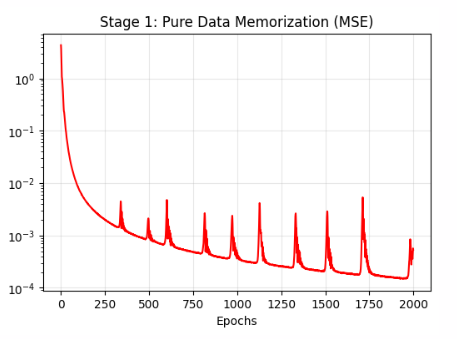
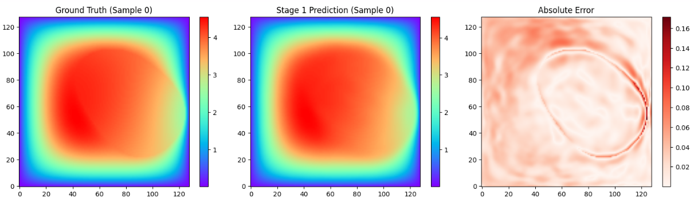


Epoch 0200 | Pure Data MSE (128 samples): 2.7274e-03
Epoch 0400 | Pure Data MSE (128 samples): 1.0822e-03
Epoch 0600 | Pure Data MSE (128 samples): 3.7802e-03
Epoch 0800 | Pure Data MSE (128 samples): 4.6443e-04
Epoch 1000 | Pure Data MSE (128 samples): 4.2259e-04
Epoch 1200 | Pure Data MSE (128 samples): 2.7451e-04
Epoch 1400 | Pure Data MSE (128 samples): 2.2774e-04
Epoch 1600 | Pure Data MSE (128 samples): 1.9255e-04
Epoch 1800 | Pure Data MSE (128 samples): 1.7085e-04
Epoch 2000 | Pure Data MSE (128 samples): 4.8493e-04

Stage 2:


--- STAGE 2: Evaluating 1-Shot Physics Solve on Frozen Data Backbone ---
Train Set 1-Shot PDE Solve Data MSE: 1.3321e+00
Test Set  1-Shot PDE Solve Data MSE: 1.1759e+00


Stage 3:
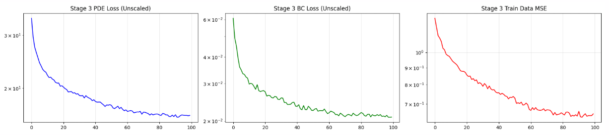


Epoch 010 | Train PDE: 2.258e+01 | Train BC: 3.178e-02 | Train Data MSE: 9.727e-01
Epoch 020 | Train PDE: 2.037e+01 | Train BC: 2.778e-02 | Train Data MSE: 8.707e-01
Epoch 030 | Train PDE: 1.916e+01 | Train BC: 2.521e-02 | Train Data MSE: 8.045e-01
Epoch 040 | Train PDE: 1.830e+01 | Train BC: 2.349e-02 | Train Data MSE: 7.559e-01
Epoch 050 | Train PDE: 1.763e+01 | Train BC: 2.245e-02 | Train Data MSE: 7.369e-01
Epoch 060 | Train PDE: 1.693e+01 | Train BC: 2.166e-02 | Train Data MSE: 6.740e-01
Epoch 070 | Train PDE: 1.638e+01 | Train BC: 2.116e-02 | Train Data MSE: 6.673e-01
Epoch 080 | Train PDE: 1.640e+01 | Train BC: 2.160e-02 | Train Data MSE: 6.584e-01
Epoch 090 | Train PDE: 1.608e+01 | Train BC: 2.116e-02 | Train Data MSE: 6.437e-01
Epoch 100 | Train PDE: 1.623e+01 | Train BC: 2.086e-02 | Train Data MSE: 6.534e-01


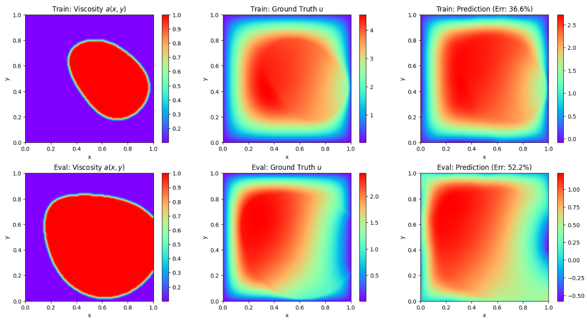

--- Running Final Evaluation: Train vs Eval Sample Comparison ---
Train Sample Relative L2 Error : 36.62%
Eval  Sample Relative L2 Error : 52.23%

### Friday
#### Run 7 with layernorm
n_train = 4
epochs = 1000
M = 512
hidden_layers = [512,512,512,512]
sigma = 1
tik_reg_fixed = 1e-6
matrix_bc_weight = 1e2
pde_loss_weight = 1.0
bc_loss_weight = 1e2
spatial_batch_size = 5000

Condition Number of (A^T A + lambda I): 1.3610e+18
L2 Norm of predicted weights (w): 3.8541e+00

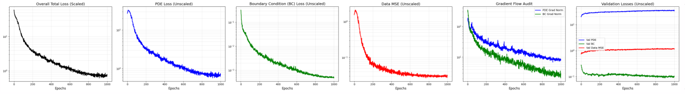
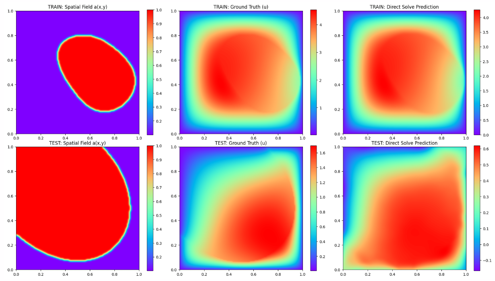


TRAIN Relative L2 Error: 6.6807e-02 (or 6.68%)
TEST  Relative L2 Error: 6.0851e-01 (or 60.85%)

<!-- 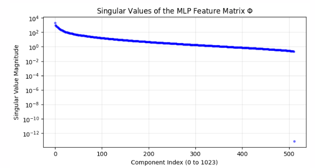 -->

### Weekend
Try with different sigma for pure data loss then freeze weights still lead to same results where the amplitude is bad (for 64 samples) and the prediction on unseen samples is bad.