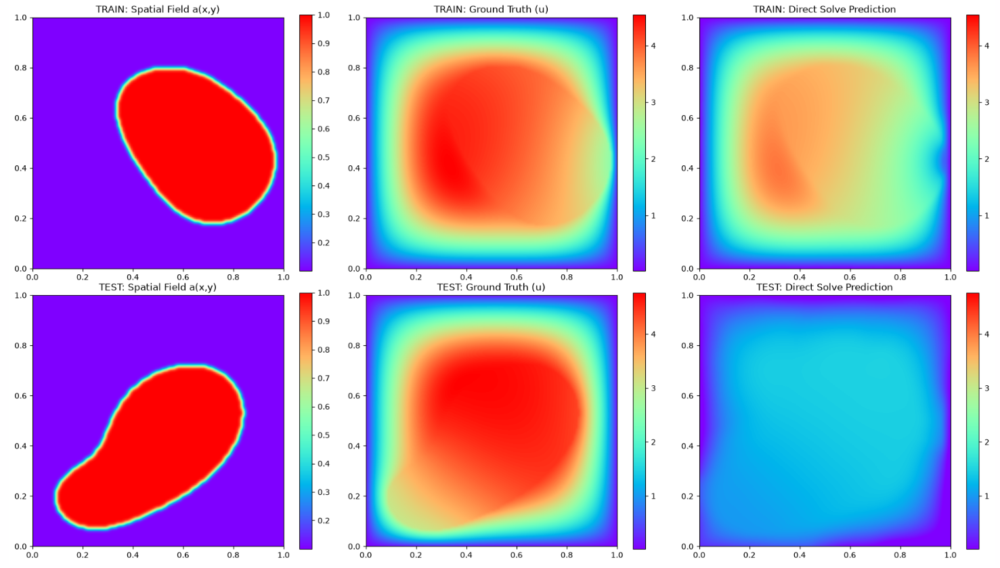
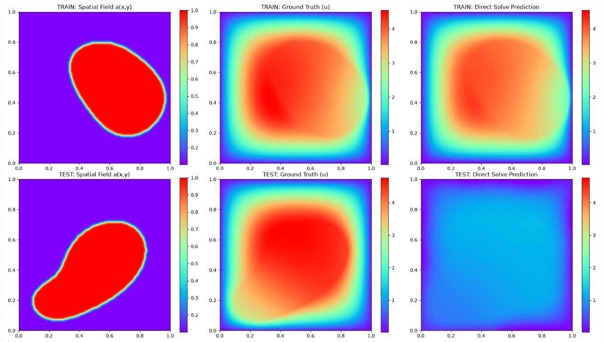

### Daily Report
* **Monday** - Try foundational model
* **Tuesday** - create sketch and project for multipde
* **Wednesday** - Final few local training to confirm code for modal.com if required, create main readme. 
* **Thursday** - 
* **Friday** - 

### Darcy Flow Failure Possible Reason
Model needs to be able to see a lot a lot more samples to be able to generalize to unseen a(x,y). But for it to train on more samples, the network need to be bigger / it needs a lot more features. With [512,512,512,512], it cannot even get the amplitude up for the training data when we have 128 samples.

Might be able to solve this problem if we pass in a(x,y), so the features generated is better aligned with the domain. But will become a bit complicated if we want to integrate it with other pdes.

### Wednesday
#### 8 Samples [512,512,512,512] still good amplitude for 1000 epochs

#### 16 samples batch of 8

#### 16 samples batch of 16

It appears that results are significantly better when the samples are not split as batches..... testing gradient accumulation then update once